2025年青岛市初中学业水平考试

数学试题

（考试时间：120分钟  满分：120分）

说明：

1．本试题分第Ⅰ卷和第Ⅱ卷两部分，共25题．第Ⅰ卷为选择题，共9小题，27分；第Ⅱ卷为填空题、作图题、解答题，共16小题，93分．

2．所有题目均在答题卡上作答，在试题上作答无效．

第Ⅰ卷（共27分）

一、选择题（本大题共9小题，每小题3分，共27分）

1. 的相反数为（   ）

A. B. 6C. D. 

【答案】B

【解析】

【分析】本题考查了相反数的定义．直接根据“只有符号不同的两个数是相反数”判断即可．

【详解】解：的相反数为．

故选：B．

2. 围棋是中华民族发明的博弈活动．下列用棋子摆放的图形中，既是轴对称图形，又是中心对称图形的是（   ）

A. 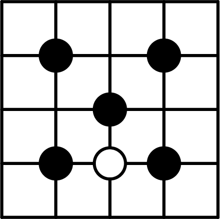B. C. D. 

【答案】D

【解析】

【分析】本题考查了中心对称图形和轴对称图形的识别．根据轴对称图形和中心对称图形的概念，对各选项分析判断即可得解．把一个图形绕某一点旋转，如果旋转后的图形能够与原来的图形重合，那么这个图形就叫做中心对称图形；如果一个图形沿一条直线折叠，直线两旁的部分能够互相重合，这个图形叫做轴对称图形．

【详解】解：A、是轴对称图形，但不是中心对称图形，本选项不符合题意；

B、是中心对称图形，但不是轴对称图形，本选项不符合题意；

C、不是中心对称图形，也不是轴对称图形，本选项不符合题意；

D、既是轴对称图形又是中心对称图形，本选项符合题意；

故选：D．

3. 2025年5月，我国在西昌卫星发射中心成功将行星探测工程天问二号探测器发射升空，天问二号探测器将对小行星2016HO3和主带彗星311P开启科学探测，其中一个目标所在轨道与太阳间距将达到亿公里．亿，将374000000用科学记数法表示为（   ）

A. B. C. D. 

【答案】B

【解析】

【分析】本题考查用科学记数法表示较大的数．科学记数法的表示形式为的形式，其中，n为整数．确定n的值时，要看把原数变成a时，小数点移动了多少位，n的绝对值与小数点移动的位数相同．

【详解】解：将374000000用科学记数法表示为．

故选：B．

4. 如图①，榫卯是古代中国建筑、家具及其它器械的主要结构方式．图②的左视图是（   ）

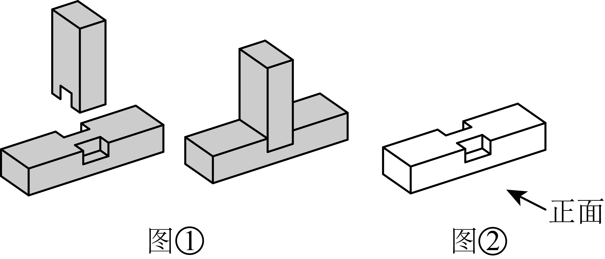

A. 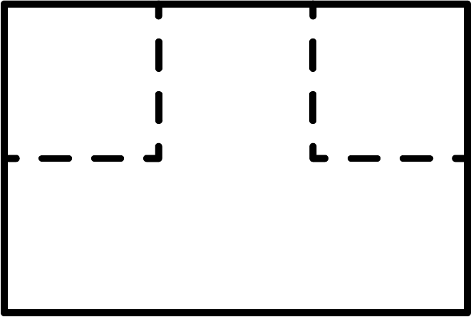B. C. D. 

【答案】A

【解析】

【分析】本题考查三视图．根据左视图是从左面观察到的图形，进行判断即可．

【详解】解：由题意得图②的左视图是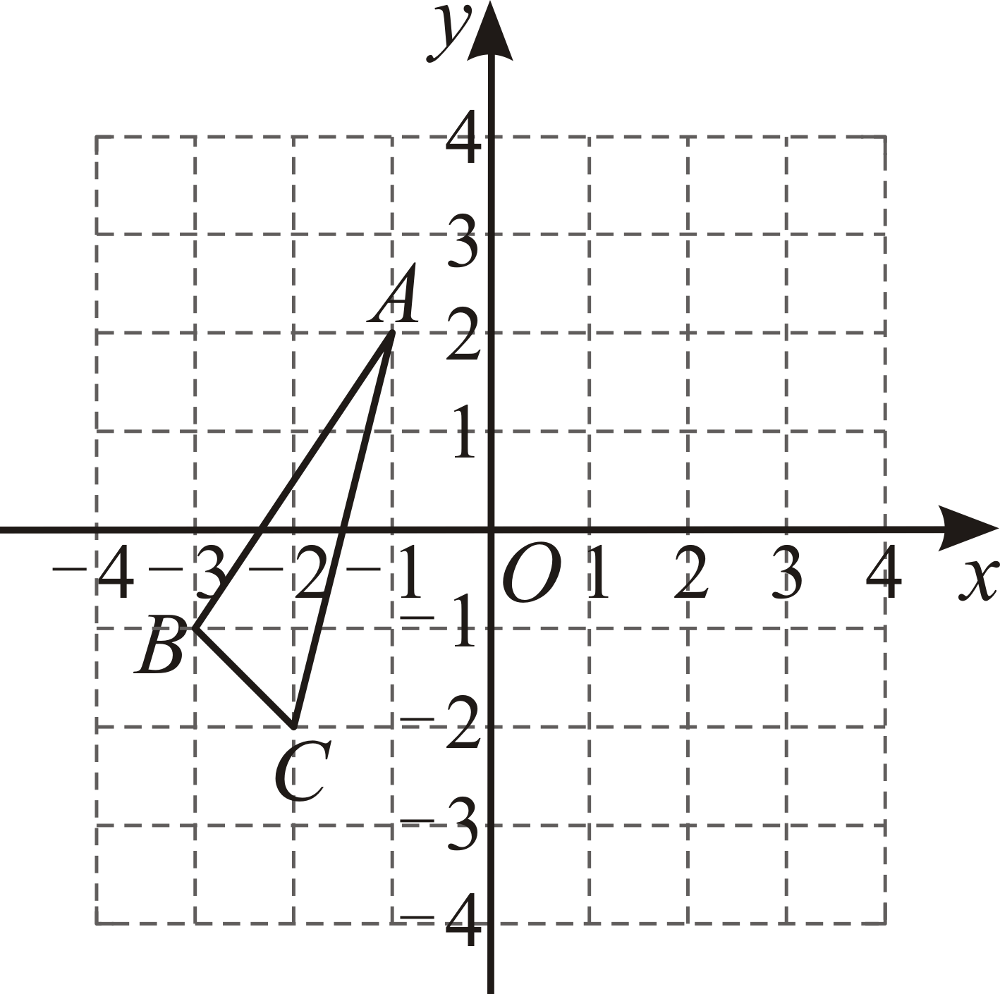．

故选：A．

5. 如图，在平面直角坐标系中，点A，B，C都在格点上，将关于y轴的对称图形绕原点O旋转，得到，则点A的对应点的坐标是（   ）

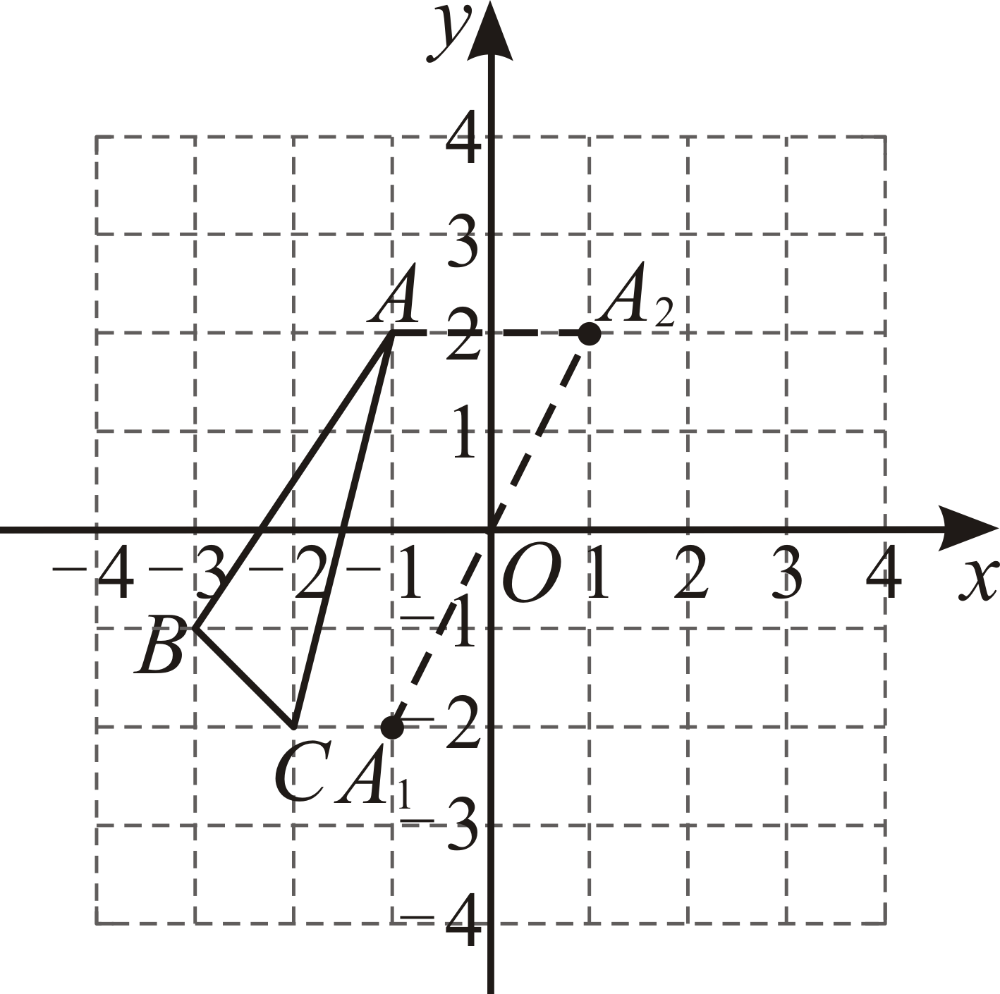

A. B. C. D. 

【答案】A

【解析】

【分析】本题考查了平面直角坐标系中点的变换，熟练掌握点的对称与旋转是解决本题的关键．

先根据图中的位置求出点A的坐标，再根据关于y轴的对称可求解点，再根据绕原点O旋转即可求解点的坐标．

【详解】解：在平面直角坐标系中，点，

∴点A关于y轴对称的点，

将点绕原点O旋转，

∴如图，点．

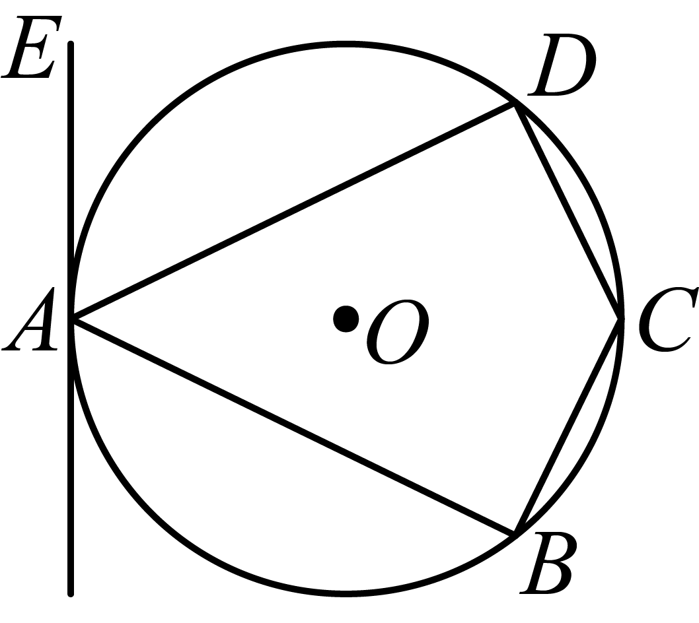

故选：A．

6. 下列计算正确的是（   ）

A. B. C. D. 

【答案】D

【解析】

【分析】本题考查了合并同类项、同底数幂的乘除法、积的乘方．根据合并同类项、同底数幂的乘除法、积的乘方运算法则逐项分析判断即可求解．

【详解】解：A、与不能合并，故该选项不符合题意；

B、，故该选项不符合题意；

C、，故该选项不符合题意；

D、，故该选项符合题意；

故选：D．

7. 如图，四边形是的内接四边形，，，直线与相切于点．若，则的度数为（   ）

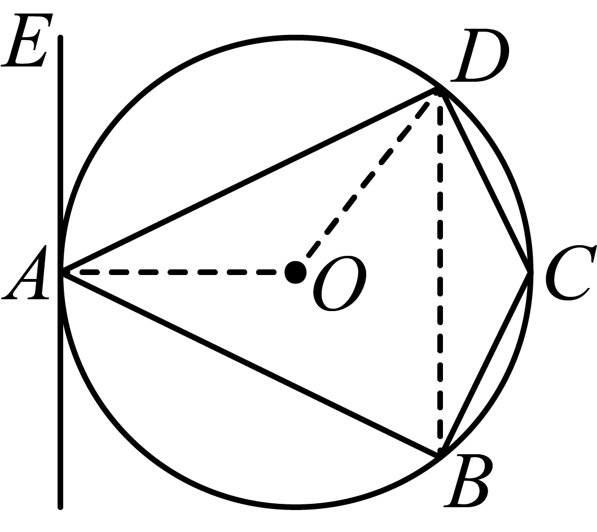

A. B. C. D. 

【答案】C

【解析】

【分析】本题考查了圆内接四边形的性质，以及切线定理，需熟练掌握“弦切角等于它所夹的弧所对的圆周角”得到的度数是解决本题的关键．

根据可求解的度数，再由可求解的度数，根据结合切线定理即可求解．

【详解】解：连接，，，如图，

∵，，

∴，

∵，

∴，

∵，

∴，即，

∴，

则有，

又∵直线为的切线，

∴，

则，

又∵，

∴，

在中，，

又∵，

∴．

故选：C ．

8. 如图，在三角形纸片中，，，将纸片沿着过点A的直线折叠，使点落在边上的点处，折痕交于点；再将纸片沿着过点的直线折叠，使点落在边上的点处，折痕交于点．下列结论成立的是（   ）

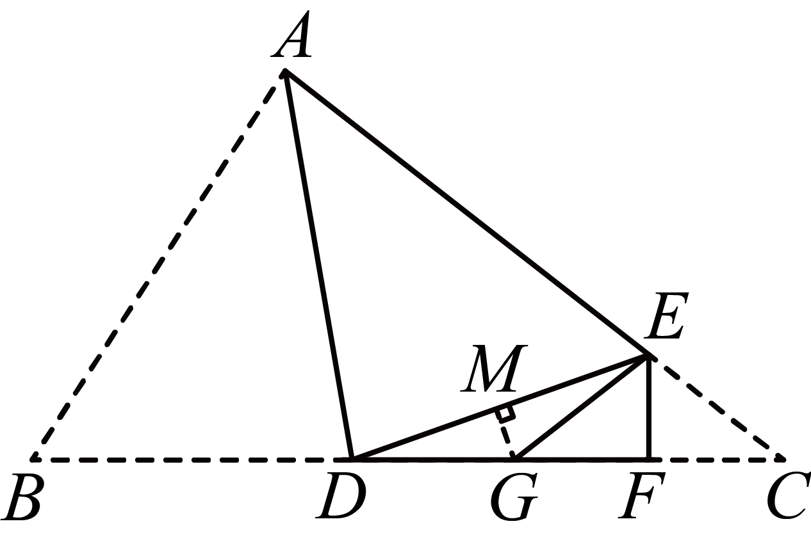

A. B. 

C. D. 

【答案】A

【解析】

【分析】本题考查了三角形的翻折问题，垂直的定义，等腰三角形的判定与性质以及直角三角形中正弦值的求解，在翻折过程中由边长和角度不变，可求解翻折前后的角度是解决本题的关键．根据是由翻折得到可求解的度数，由此判断C选项；根据翻折前后角度的求解，可求解与的度数，由“等角对等边”可判断A选项，求解的度数可判断B选项；假设结论成立，根据直角三角形中的正弦值求解边长即可判断D选项．

【详解】解：C选项，在中，，，

∴，

∵是由翻折得到，

∴，故C选项错误；

A选项，∵是由翻折得到，，

∴，

∴，

∴，

∵是由翻折得到，

∴，

∴，

在中，，

∵，

∴，故A选项正确；

B选项，∵，

即，

∴与不垂直，故B错误；

D选项，过点G作交于点M，如图，

假设，

∵是由翻折得到，

∴，

∵，

∴为等腰三角形，

∵，

∴，即，

∴，

在中，，

在中，，

∵，

∴，

又∵，与已知不符，故D选项错误．

故选：A．

9. 将二次函数的图象在轴下方的部分以轴为对称轴翻折到轴上方，得到如图所示的新函数图象，下列对新函数的描述正确的是（   ）

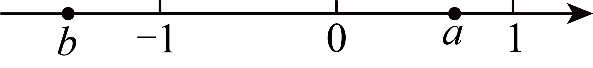

A. 图象与轴的交点坐标是B. 当时，函数取得最大值

C. 图象与轴两个交点之间的距离为D. 当时，的值随值的增大而增大

【答案】C

【解析】

【分析】本题考查了二次函数的图象与性质，以及图象的翻折变换，图象的翻折变化对函数图象的影响变化，正确分析变换前后点的坐标，函数的最值，以及增减性是解决本题的关键．

先求出二次函数翻折前图象与轴的交点坐标，即可求解翻折后图象与轴的交点坐标，判断A选项即可；根据图象可知函数的最大值，判断B选项即可；求解出二次函数与轴的交点坐标，求解距离判断C选项；根据函数图象即可判断D选项．

【详解】解：A选项，二次函数，

令，解得，

∴原二次函数与轴的交点坐标为，

翻折后新函数图象与轴的交点坐标是，A选项错误；

B选项，二次函数，

对称轴为，

将代入函数解析式可得，

∴原二次函数顶点坐标为，

翻折后新函数图象的对称轴不变，为，

在处，函数没有最大值，B选项错误；

C选项，二次函数，

令，则有，

即，解得，，

∴原二次函数与轴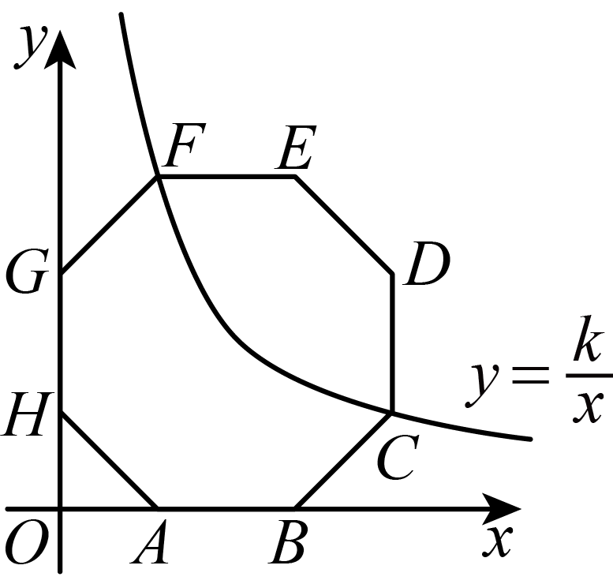交点坐标为，，

翻折后新函数图象与轴的交点坐标不变，为，，

∴图象与轴两个交点之间的距离为，C选项正确；

D选项，新函数图象的对称轴为，

由图象可知，函数在时，的值随值的增大而减小，

当时，的值随值的增大而增大，D选项错误．

故选：C ．

10. 因式分解________________．

【答案】

【解析】

【分析】本题考查的是综合提公因式与公式法分解因式，先提公因式3，再利用平方差公式分解因式即可．

【详解】解：

．

故答案为：．

11. 为弘扬传统文化，培养学生的劳动意识，某校在端午节期间举行了包粽子活动，每个粽子的标准质量为．甲、乙两名同学各包了个粽子，每个粽子的质量（单位：）如下：

甲：，，，，；

乙：，，，，．

甲、乙两名同学包的粽子的质量比较稳定的是________（填“甲”或“乙”）．

【答案】甲

【解析】

【分析】本题考查了方差的意义，理解方差是用来衡量一组数据波动大小的量，方差越大，表明这组数据偏离平均数越大，即波动越大，数据越不稳定；反之，方差越小，表明这组数据分布比较集中，各数据偏离平均数越小，即波动越小，数据越稳定是解题的关键．

分别求出甲乙的方差，根据方差的意义求解即可．

【详解】解：甲的平均数为：，

∴；

乙的平均数为：，

∴，

∵，

∴甲、乙两名同学包的粽子的质量比较稳定的是甲，

故答案为：甲．

12. 实数，在数轴上对应点的位置如图所示，则________（填“”，“”或“”）．

【答案】

【解析】

【分析】本题考查了有理数的大小比较，绝对值，掌握a，b在数轴上对应点的位置得出a距离原点的距离比b距离原点的距离小是关键．

根据数轴判断出a距离原点的距离比b距离原点的距离小，即可得出答案．

【详解】解：由数轴可得，

∴，

故答案为：．

13. 如图，正八边形的顶点，，，在坐标轴上，顶点，，，在第一象限．点在反比例函数的图象上，若，则的值为________．

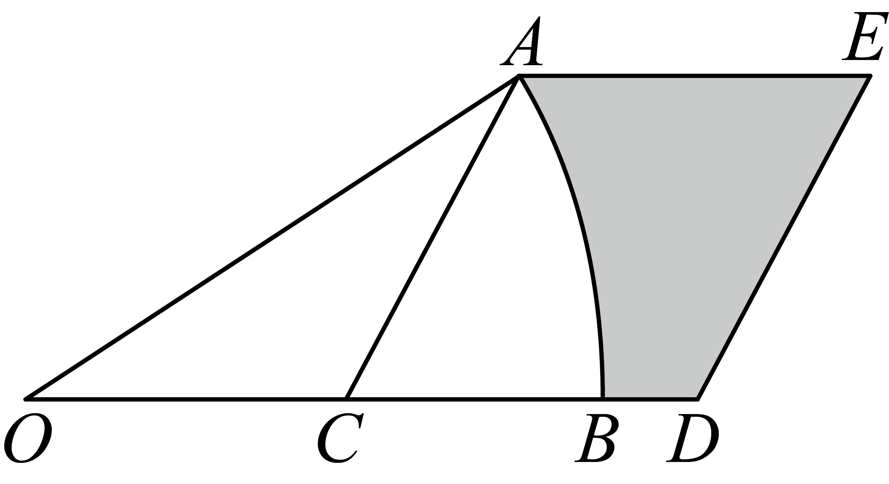

【答案】##

【解析】

【分析】本题考查了正多边形的性质，等腰直角三角形的性质以及反比例函数解析式的求解，求解出点F的纵坐标是解决本题的关键．

先根据正八边形的内角和可求解每个内角度数，可得为等腰直角三角形，根据正八边形的边长可求解的长度，同理可求与的长度，即可得到点F的坐标，代入反比例函数解析式即可求解．

【详解】解：过点F作轴交y轴于点M，如图，

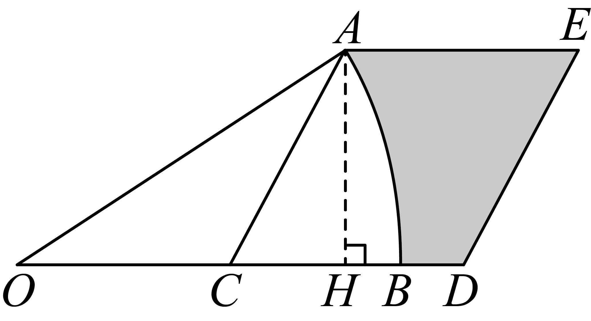

正八边形的内角和为，

∴每个内角为，

∴，

则为等腰直角三角形，

又∵正八边形的边长为，

∴，即，

可得，

同理可得为等腰直角三角形，

即，

∴可得，

∴点，

又∵点在反比例函数的图象上，

∴，解得．

故答案为： ．

14. 如图，在扇形中，，，点在上，且．延长到，使．以，为邻边作平行四边形，则图中阴影部分的面积为________（结果保留）．

【答案】

【解析】

【分析】本题考查扇形面积公式，平行四边形性质，含三角形的性质，正确将阴影面积进行组合是解决问题的关键．由题意，利用计算即可．

【详解】解：过A作，

∵，，

，

∵， 

∴，

，

，

，

设长度为，则，在中，由勾股定理得：

解得：，

，

，

则，，

，

．

故答案为：．

15. 如图，在正方形中，，分别为，的中点．连接并延长交于点，交的延长线于点，为的中点，连接，，．下列结论：①；②；③；④．正确的是________（填写序号）．

【答案】①④

【解析】

【分析】本题考查了正方形的性质，全等三角形的判定和性质，相似三角形的判定和性质，解直角三角形．证明，推出，再由直角三角形斜边中线的性质求得，推出，可得到，故①正确；证明，由正切函数的定义可判断②错误；由平行线的性质求得，即可求得，故③错误；证明，推出，再等量代换即可证明故④正确．

【详解】解：∵正方形，

∴，，

∵点为的中点，

∴，

∴，

∴，

∵点为的中点，

∴，

∴，

∴，

∴，故①正确；

∵正方形，

∴，即，

∴，

∵正方形，

∴，，

∵点为的中点，

∴，

∴，

∴，故②错误；

∵，

∴，

设正方形的边长为，

∴，，

∴，故③错误；

∵正方形，

∴，，

∵点，分别为，的中点，

∴，

∴，

∴，

∵，

∴，

∵，

∴，

∴，

∵点为的中点，

∴，

∴，

∵，，

∴，

∴，

∵，

∴，

∴，故④正确；

故答案为：①④．

16. 已知：如图，是内部一点．求作：等腰，使点，分别在射线，上，且底边经过点．

【答案】见解析

【解析】

【分析】本题考查了尺规作——角平分线，过一点作已知直线的垂线，全等三角形的判定与性质，等腰三角形的定义，熟练掌握知识点是解题的关键．

先作的平分线，再过点作角平分线的垂线，与射线的交点即为点，根据角平分线以及垂线的定义可得，则，故等腰即为所作．

【详解】解：如图，等腰即为所作：

17. （1）计算：；

（2）解不等式组：并写出它的整数解．

【答案】（1）7；（2）；

【解析】

【分析】本题考查了二次根式的混合运算，以及一元一次不等式组的求解，需熟练掌握二次根式的化简并正确计算，根据不等式组的解集写出整数解是解决本题的关键．

（1）先将与化简，再进行二次根式的运算；

（2）分别求解一元一次不等式的解，即可求出不等式组的解集，再由解集求出整数解即可．

【详解】（1）解：

；

（2）解：不等式组为，

则有，解得，

则有，解得，

∴不等式组的解集为，

则整数解为．

18. 京剧以其独特的艺术魅力和深厚的文化底蕴闻名于世，京剧的角色有生、旦、净、丑等．现有4张不透明卡片，正面分别印有“生”、“旦”、“净”、“丑”四种角色的卡通人物，卡片除正面图案外其余都相同．将这4张卡片背面朝上洗匀，先随机抽取一张，再从剩下的3张中随机抽取一张．利用画树状图或列表的方法表示所有可能出现的结果，并求抽取到的两张卡片中有“生”的概率．

【答案】

【解析】

【分析】本题主要考查了树状图或列表法求解概率，正确画出树状图或列出表格是解题的关键．

先画出树状图得到所有等可能性的结果数， 再找到符合题意的结果数，最后依据概率计算公式求解即可．

【详解】解：画树状图如下：

由树状图可知一共有12种等可能性的结果数，其中抽取到的两张卡片中有“生”的结果数有6种，

∴抽取到的两张卡片中有“生”的概率是．

19. 某校举行科技节，科技小组为了解学生使用智能软件的情况开展了统计活动．

【收集数据】

科技小组设计了如下调查问卷，在全校随机抽取部分学生进行调查，收集得到“问题1”和“问题2”的数据．（被调查学生两个问题全部按要求作答并提交）

<table border="1">
  <thead>
    <tr>
      <th>调查问卷</th>
    </tr>
  </thead>
  <tbody>
    <tr>
      <td>问题1：你使用智能软件的主要目的是（   ）．（单选） A．学习管理 B．健康 C．时间管理 D．其他 问题2：你每周使用智能软件的时间是____分钟．</td>
    </tr>
  </tbody>
</table>

【整理和表示数据】

第一步：将“问题1”的数据进行整理后，绘制成如下的人数统计表；

第二步：将“问题2”中每周使用智能软件的时间（分钟）整理分成4组：①，②，③，④，并绘制成如下的频数直方图．

学生使用智能软件主要目的的人数统计表

<table border="1">
  <thead>
    <tr>
      <th>目的</th>
      <th>人数累计</th>
      <th>人数</th>
    </tr>
  </thead>
  <tbody>
    <tr>
      <td>A</td>
      <td>正正正正正正</td>
      <td>30</td>
    </tr>
    <tr>
      <td>B</td>
      <td>正正丅</td>
      <td>12</td>
    </tr>
    <tr>
      <td>C</td>
      <td>正正正</td>
      <td>15</td>
    </tr>
    <tr>
      <td>D</td>
      <td>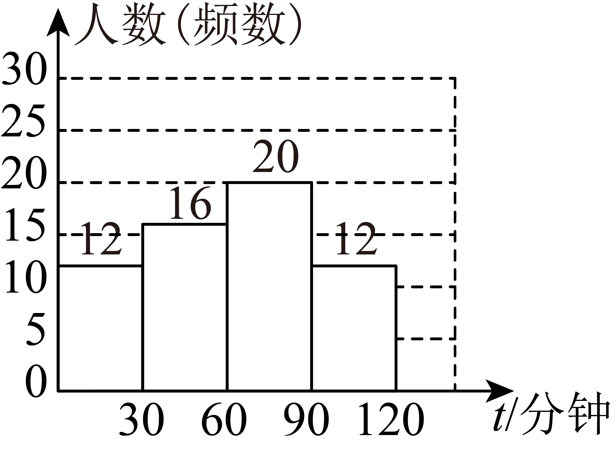</td>
      <td>3</td>
    </tr>
  </tbody>
</table>

学生每周使用智能软件时间的频数直方图

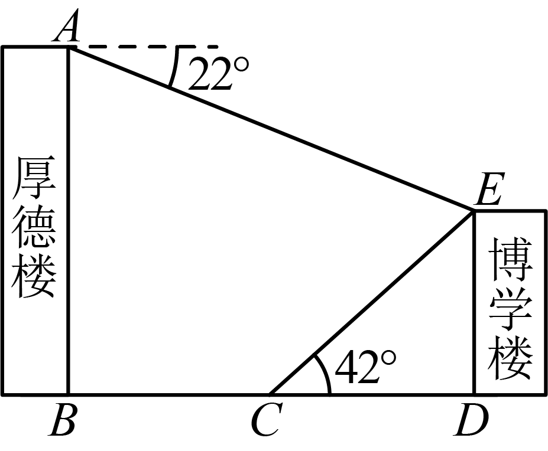

（1）若将“问题1”的数据绘制成扇形统计图，则目的“B”对应的扇形圆心角的度数为____°；

（2）补全频数直方图；

【分析数据，解答问题】

（3）已知“”这组的数据是：60，60，62，62，63，65，65，65，70，70，75，75，75，75，75，80，80，80，80，85．被调查的全部学生每周使用智能软件时间的中位数为____分钟；

（4）全校共有1200名学生，请你估计使用智能软件主要用于“学习管理”的人数．

【答案】（1）72；（2）作图见解析；（3）61；（4）600人

【解析】

【分析】本题考查了频数分布表和频数分布直方图，求中位数，求扇形统计图的圆心角，用样本估计总体等知识点，正确理解题意，读懂统计图是解题的关键．

（1）由目的“B”的人数除以总数求出占比，再乘以即可；

（2）用总人数减去其余三组的人数求出使用智能软件的时间在这一组的人数，即可补全频数分布直方图；

（3）由中位数定义求解；

（4）用样本估计总体的方法解即可．

【详解】（1）解：由题意得，目的“B”对应的扇形圆心角的度数为：，

故答案为：；

（2）解：由（1）知总人数为（人），

∴每周使用智能软件的时间在这一组的人数为：，

∴补全频数分布直方图为：

（3）由于每周使用智能软件的时间在和人数分别为，而总人数为人，则中位数为第人使用智能软件的时间的平均数，由“”这组的数据可得第人使用智能软件的时间为分钟，

∴中位数为，

故答案为：61；

（4）（人），

答：估计使用智能软件主要用于“学习管理”的人数为人．

20. 学校综合实践小组测量博学楼的高度．如图，点，，，，在同一平面内，点，，在同一水平线上，一组成员从19米高的厚德楼顶部测得博学楼的顶部的俯角为，另一组成员沿方向从厚德楼底部点向博学楼走15米到达点，在点测得博学楼顶部的仰角为，求博学楼的高度．（参考数据：，，，，，）

【答案】博学楼的高度为9米

【解析】

【分析】本题考查了解直角三角形的实际应用，正确构造直角三角形是解题的关键．

过点作于点，则可得四边形是矩形，解中，得到，设，则，，解，得到，求解，再代入即可．

【详解】解：过点作于点，由题意得，，，，，

∵，

∴四边形是矩形，

∴，

在中，∵，

∴，

∴设，

则，，

在中，∵，

∴，

解得：，

∴，

答：博学楼的高度为9米．

21. 某公司成功研发了一款新型产品，接到了首批订单，产品数量为2100件．公司有甲、乙两个生产车间，甲车间每天生产的数量是乙车间的1.5倍．先由甲、乙两个车间共同完成1500件，剩余产品再由乙车间单独完成，前后共用10天完成这批订单．

（1）求甲、乙两个车间每天分别能生产多少件产品；

（2）首批订单完成后，公司将继续生产30天该产品，每天只能安排一个车间生产，如果安排甲车间生产的天数不多于乙车间的2倍，要使这30天的生产总量最大，那么应如何安排甲、乙两个车间的生产天数？

【答案】（1）甲车间每天能生产件产品乙车；间每天能生产件产品    

（2）安排甲车间生产天，则乙车间生产天

【解析】

【分析】本题考查了分式方程和一元一次不等式以及一次函数的实际应用，正确理解题意是解题的关键．

（1）设乙车间每天能生产件产品，则甲车间每天能生产件产品，分别表示出甲、乙两个车间合作完成的时间和乙车间单独完成的时间，再根据“前后共用10天完成这批订单”建立分式方程求解；

（2）设安排甲车间生产天，则乙车间生产天，先根据“安排甲车间生产的天数不多于乙车间的2倍”得到关于的一元一次不等式，再设生产总量为，建立关于的一次函数关系式，再由一次函数的性质求解．

【小问1详解】

解：设乙车间每天能生产件产品，则甲车间每天能生产件产品，

由题意得：，

解得：，

经检验：是原方程的解，且符合题意，

则（件），

答：甲车间每天能生产件产品，乙车间每天能生产件产品

【小问2详解】

解：设安排甲车间生产天，则乙车间生产天，

由题意得：，

解得：，

设生产总量为，由题意得：

，

∵，

∴随着的增大而增大，

∴当时，最大，即这30天的生产总量最大，

∴，

∴安排甲车间生产天，则乙车间生产天．

22. 如图，在中，为的中点，为延长线上一点，连接，，过点作交的延长线于点，连接．

（1）求证：；

（2）已知____（从以下两个条件中选择一个作为已知，填写序号），请判断四边形的形状，并证明你的结论．

条件①：；

条件②：．

（注：如果选择条件①条件②分别进行解答，按第一个解答计分）（第22题）

【答案】（1）证明见解析    

（2）条件①，四边形为矩形；条件②，四边形为菱形，证明见解析

【解析】

【分析】本题考查了全等三角形的判定与性质，平行四边形的判定与性质，菱形和矩形的判定，熟练掌握各四边形的判定与性质是解题的关键．

（1）根据平行得到，，再由，即可由证明全等；

（2）先证明四边形为平行四边形，再根据选择的条件结合菱形和矩形判定证明即可．

【小问1详解】

证明：∵，

∴，，

∵为的中点，

∴，

∴

【小问2详解】

解：选择条件①，四边形为矩形，理由如下：

∵

∴，

∵，

∴四边形为平行四边形，

∵四边形是平行四边形，

∴，

∵，

∴，

∵，

∴，

∴，

∴四边形为矩形；

选择条件②，四边形为菱形，理由如下：

∵

∴，

∵，

∴四边形为平行四边形，

∵四边形是平行四边形，

∴，

∵，

∴，

∴四边形为菱形．

23. 【定义新运算】

对正实数，，定义运算“”，满足．

例如：当时，．

（1）当时，请计算：__________；

【探究运算律】

对正实数，，运算“”是否满足交换律？

，

，

．

运算“”满足交换律．

（2）对正实数，，，运算“”是否满足结合律？请说明理由；

【应用新运算】

（3）如图，正方形是由四个全等的直角三角形和中间的小正方形拼成，，，且．若正方形与正方形的面积分别为26和16，则的值为__________．

【答案】（1）a；（2）满足，理由见解析；（3）

【解析】

【分析】本题考查了新定义运算，涉及完全平方公式变形求值，全等三角形的性质，勾股定理，分式的混合运算，熟练掌握知识点，正确理解题意是解题的关键．

（1）直接按照新定义计算即可；

（2）按照新定义结合分式混合运算法则分别计算等号左边和右边，进行验证即可；

（3）由勾股定理得到，由全等三角形的性质得到，则，然后展开求出，再由完全平方公式变形得到，求出，最后按照新定义结合运算法则计算即可．

【详解】（1）解：由新定义得，；

（2）解：对正实数，，，运算“”满足结合律，理由如下：

左边：，

右边：，

∴左边右边，

∴对正实数，，，运算“”满足结合律；

（3）由题意得，，

∴，

∵，，且，正方形的面积为26，

∴，

∵四个直角三角形全等，

∴，

∴，

∵正方形的面积为16，

∴，

∴，

∴，

∴，

∴，

∴（舍负），

∴，

故答案为：．

24. 小磊和小明练习打网球．在一次击球过程中，小磊从点正上方1.8米的点将球击出．

信息一：在如图所示的平面直角坐标系中，为原点，在轴上，球的运动路线可以看作是二次函数（，为常数）图象的一部分，其中（米）是球的高度，（米）是球和原点的水平距离，图象经过点，．

信息二：球和原点的水平距离（米）与时间（秒）（）之间近似满足一次函数关系，部分数据如下：

<table border="1">
  <thead>
    <tr>
      <th>（秒）</th>
      <th>0</th>
      <th></th>
      <th></th>
      <th>…</th>
    </tr>
  </thead>
  <tbody>
    <tr>
      <td>（米）</td>
      <td>0</td>
      <td>4</td>
      <td>6</td>
      <td>…</td>
    </tr>
  </tbody>
</table>

（1）求与的函数关系式；

（2）网球被击出后经过多长时间达到最大高度？最大高度是多少？

（3）当为秒时，小明将球击回、球在第一象限的运动路线可以看作是二次函数（，为常数）图象的一部分，其中（米）是球的高度，（米）是球和原点的水平距离．当网球所在点的横坐标为，纵坐标大于等于时，的取值范围为________（直接写出结果）．

【答案】（1）    

（2）网球被击出后经过秒达到最大高度，最大高度是米    

（3）

【解析】

【分析】本题考查了二次函数与一次函数的实际应用，正确理解题意是解题的关键．

（1）代入点，得到二元一次方程组求解即可；

（2）先求出球和原点的水平距离（米）与时间（秒）的关系式为，再由二次函数的性质求解；

（3）先求出击球点位置为，再将代入，求出，根据时，，得到不等式，再解一元一次不等式即可．

【小问1详解】

解：∵图象经过点，，

，

解得：，

∴与的函数关系式为；

【小问2详解】

解：由表格可知，

∴设球和原点的水平距离（米）与时间（秒）的关系式为：，

代入得：，

解得：，

∴，

对于，，

∴开口向下，

∵对称轴为：直线

∴当时，，

此时，

解得：，

∴网球被击出后经过秒达到最大高度，最大高度是米；

【小问3详解】

解：由题意得，当时，，

∴，

∴击球点位置为，

将代入，

则，

∴，

∴，

∵时，，

∴，

解得：，

故答案为：．

25. 如图①，在中，，，，将沿方向平移，得到，过点作，交的延长线于点，为的中点．点从点出发，沿方向匀速运动，速度为；同时，点从点出发，沿方向匀速运动，速度为．连接，，．设运动时间为（）．

解答下列问题：

（1）当时，求的值；

（2）如图②，当时，设的面积为（），求与之间的函数关系式；

（3）当时，是否存在某一时刻，使是直角三角形？若存在，求出的值；若不存在，请说明理由．

【答案】（1）；    

（2）；    

（3）的值为或．

【解析】

【分析】（1）由题意得，当时，，求得，再利用三角函数定义求解即可；

（2）作于点，作于点，同（1）利用三角函数的定义求得，，再根据，利用三角形的面积公式代入数据求解即可；

（3）分两种情况讨论，当时，作于点，交延长线于点，证明，构造一元二次方程，利用公式法求解即可；当时， 作于点，证明，构造一元二次方程，利用公式法求解即可．

【小问1详解】

解：由题意得，，

∵中，，，，

∴，

由平移的性质得，，，，，

∵为的中点，

∴，

∵，，

∴，即，

∵，

∴，

∴，

∴，即，

解得；

【小问2详解】

解：当时，∴点在线段上，作于点，作于点，

∵，，

∴，，

∵，

∴，即，

∴，

同理，即，

∴，

∵，

∴，

∵

；

∴；

【小问3详解】

解：存在，理由如下，

由题意，

当时，作于点，交延长线于点，

同理，，，

∴，，

在中，，

∵，

∴，，

∴，，

∴，，

∴，

∵，

∴，

∴，

∴，即，

整理得，

解得，

∵，

∴；

当时， 作于点， 

∵，

∴，

∴，即，

∴，，

∵，

∴，

∴，

∴，即，

整理得，

解得，

∵，

∴；

综上，的值为或．

【点睛】本题考查了平移的性质，相似三角形的判定和性质，解直角三角形，公式法解一元二次方程，正确构造辅助线，分类讨论是解题的关键．