青海省2025年初中学业水平考试

数学

（本试卷满分120分，考试时间120分钟）

注意事项：

1．本试卷为试题卷，请将答案写在答题卡上，否则无效．

2．答卷前请将密封线内的项目填写清楚．

一、选择题（本大题共8小题，每小题3分，共24分．在每小题给出的四个选项中，只有一项符合要求）．

1. 的值为（    ）

A. B. 2C. D. 

【答案】B

【解析】

【分析】本题考查相反数的概念，涉及多重符号的化简，根据相反数的定义可得答案.

【详解】解：∵，

∴的值是，

故选：B

2. 下列图形是轴对称图形的是（    ）

A. 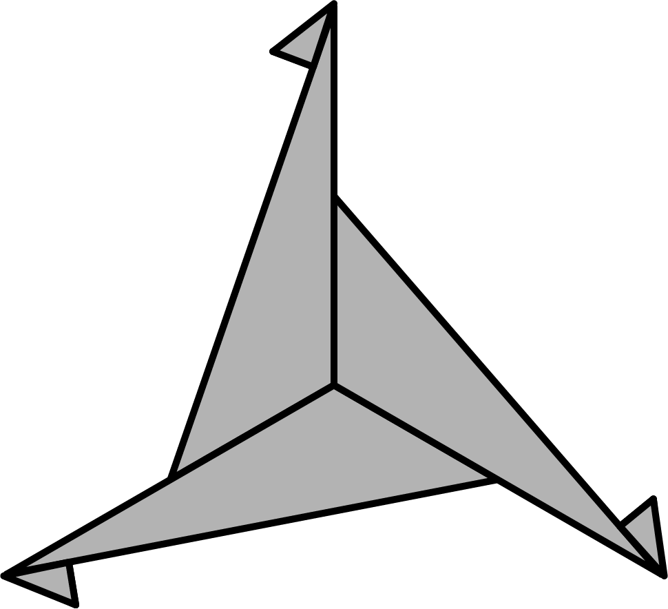B. 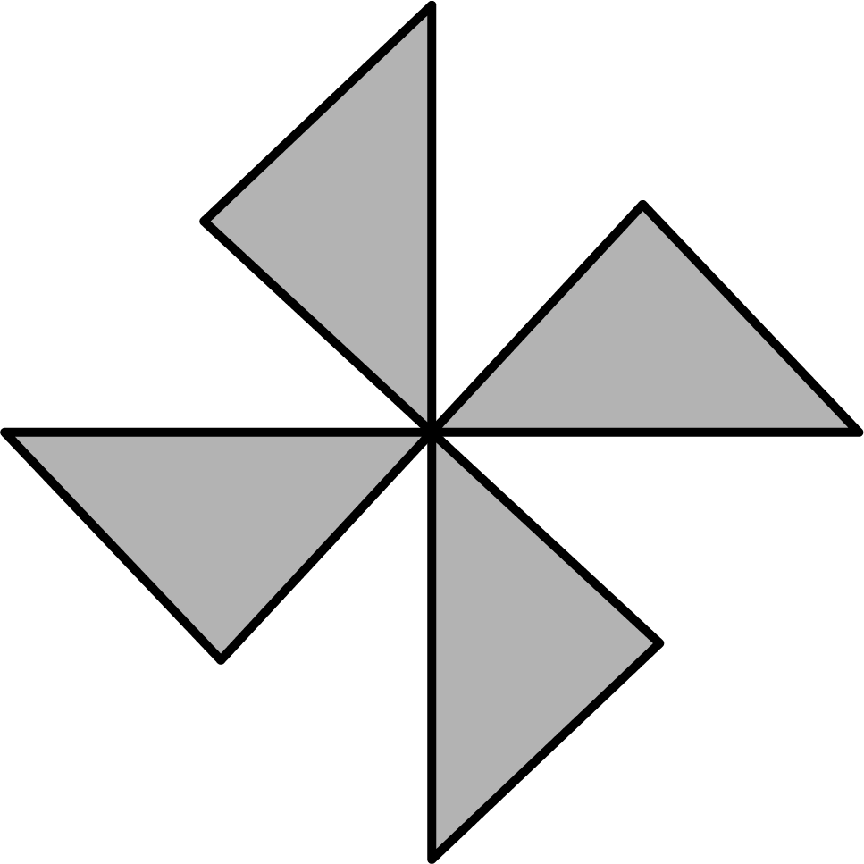

C. 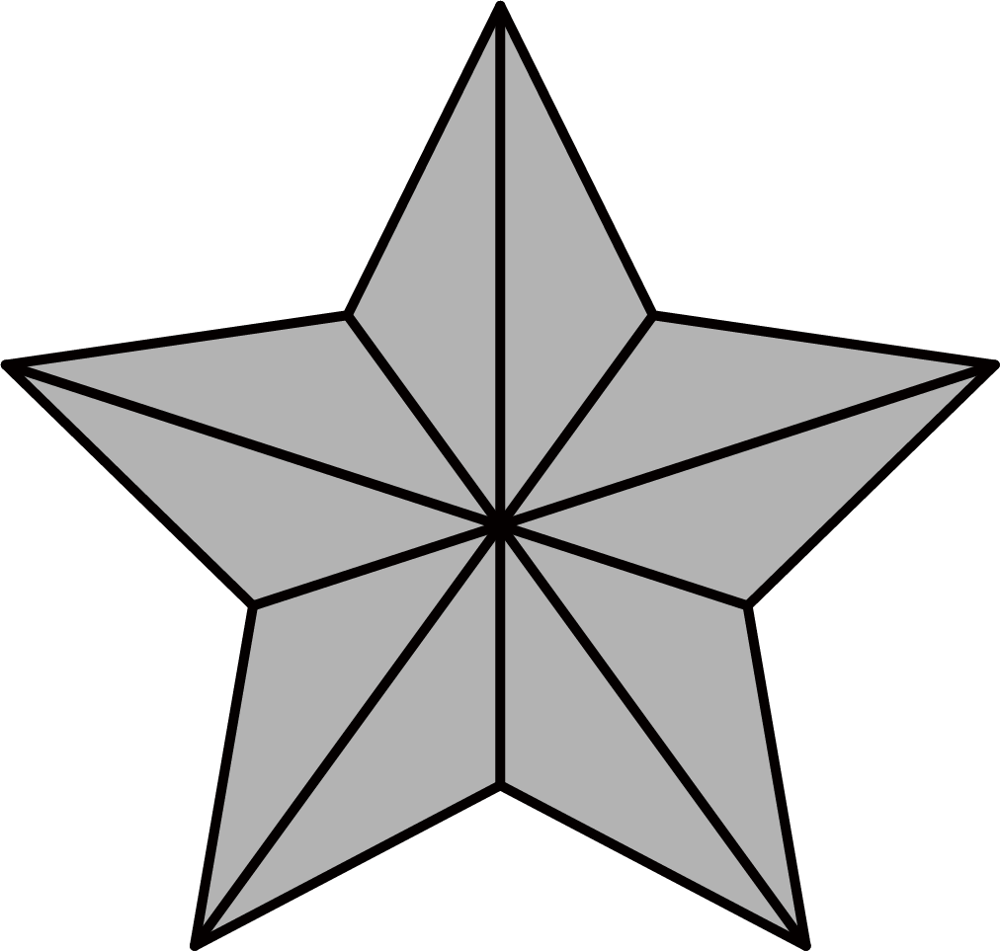D. 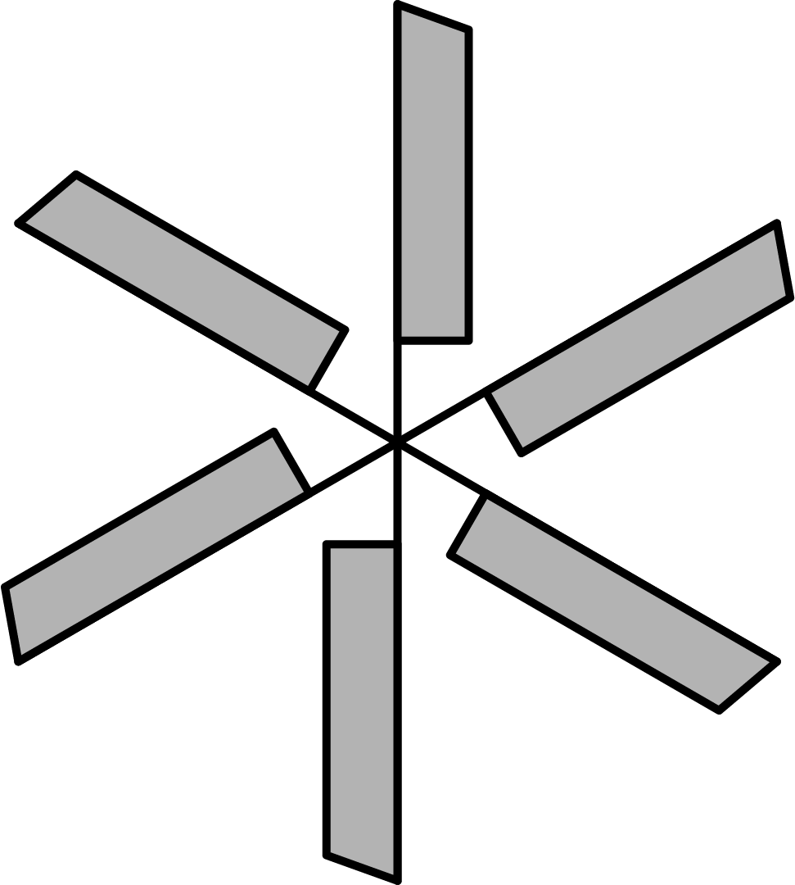

【答案】C

【解析】

【分析】本题考查了轴对称图形的定义，根据沿着某条直线折叠，两边的图形能够重合的图形是轴对称图形，进行逐项判断即可．

【详解】解：A、该图形不是轴对称图形，故该选项不符合题意；

B、该图形不是轴对称图形，故该选项不符合题意；

C、该图形是轴对称图形，故该选项符合题意；

D、该图形不是轴对称图形，故该选项不符合题意；

故选：C．

3. 年月日，全球首次“人机共跑”半程马拉松在北京开跑．本次比赛全程约公里，这意味着采用双足步态的人形机器人要完成约万次精密关节运动．将数据“”用科学记数法表示为（    ）

A. B. 

C. D. 

【答案】A

【解析】

【分析】此题考查了科学记数法的表示方法，根据科学记数法的表示形式为的形式，其中，为整数即可求解，确定的值时，要看把原数变成时，小数点移动了多少位，的绝对值与小数点移动的位数相同，当原数绝对值时，是正整数；当原数的绝对值时，是负整数，解题的关键要正确确定的值以及的值．

【详解】解：，

故选：．

4. 工人师傅常用角尺平分一个任意角．做法如下：如图，是一个任意角，在边，上分别取，移动角尺，使角尺两边相同的刻度分别与点，重合，即，过角尺顶点的射线便是的平分线，这种做法的依据是（    ）

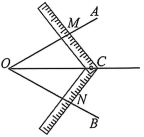

A.  B.  C. D.  

【答案】C

【解析】

【分析】本题主要考查了全等三角形的判定，由作图过程可得，，再加上公共边可利用定理判定．

【详解】解：在和中

，

∴，

∴，

故选：C．

5. 下列计算正确的是（    ）

A. B. 

C. D. 

【答案】D

【解析】

【详解】本题考查了整式的运算，根据合并同类项，同底数幂的乘除法，积的乘方运算法则逐一验证各选项即可，熟练掌握运算法则是解题的关键．

【分析】解：、，原选项运算错误，不符合题意；

、，原选项运算错误，不符合题意；

、，原选项运算错误，不符合题意；

、，原选项运算正确，符合题意

故选：．

6. 我国明代数学著作《算法统宗》中有这样一个问题：“隔墙听得客分银，不知人数不知银，七两分之多四两，九两分之少半斤．试问各位善算者，多少人分多少银？”译文：“隔着墙壁听见客人在分银两，不知道有多少人，多少银两．若每人分两，则还多两；若每人分两，则还差两．请问：有多少客人？分多少银两？”设客人为人，银两为两．根据题意可列方程组为（    ）

A. B. 

C. D. 

【答案】D

【解析】

【分析】本题考查了二元一次方程组的应用，设客人为人，银两为两，根据题意列出方程即可，读懂题意，找出等量关系，列出方程组是解题的关键．

【详解】解：设客人为人，银两为两，

根据题意得，

故选：．

7. 如图，是的直径，，则的度数是（    ）

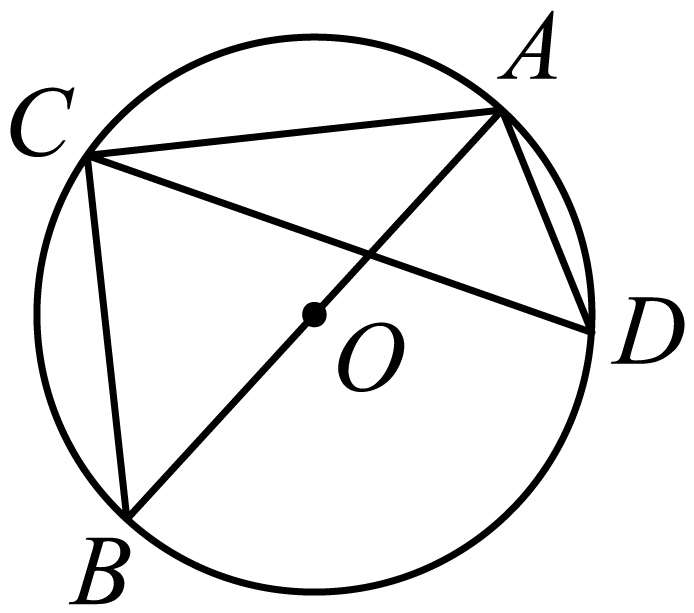

A. B. C. D. 

【答案】B

【解析】

【分析】本题主要考查了同弧或等弧所对的圆周角相等，直径对的圆周角是直角，熟练掌握同弧或等弧所对的圆周角相等是解题的关键．根据是的直径得出，即可求解．

【详解】解：∵是的直径，

∴，

∴，

∵，

∴，

∴，

故选：B．

8. 如图，甲、乙两车从地出发前往地，在整个行程中，汽车离开地的路程与时刻之间的对应关系如图所示，下列结论错误的是（    ）

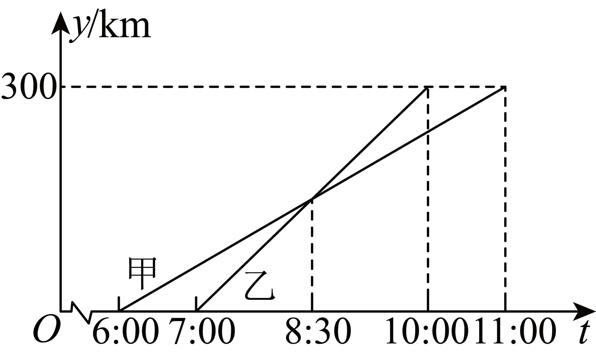

A. 乙车先到达地B. 、两地相距

C. 甲车的平均速度为D. 在时，乙车追上甲车

【答案】C

【解析】

【分析】本题考查从函数图象获取信息的能力，根据函数图象中的数据，可以先计算出甲、乙两车的速度，然后再根据图象中的数据，逐一判断各个选项中的说法是否正确即可．

【详解】解：由图象可知，A，B两城相距，甲车先出发，乙车先到达B城，

故选项A、B不符合题意；

甲的速度为：，

乙的速度为：，

故选项C错误，符合题意；

由交点的横坐标可知，乙车在追上甲车．

故D不符合题意．

故选：C．

二、填空题（本大题共8小题，每小题3分，共24分）．

9. 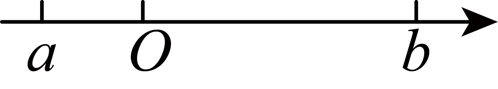算术平方根是______．

【答案】

【解析】

【分析】本题考查了算术平方根的定义，根据算术平方根的定义解答即可，掌握算术平方根的定义是解题的关键．

【详解】解：∵，

∴的算术平方根是，

故答案为：．

10. 实数，在数轴上对应点的位置如图所示，则______．（填“”“”或“”）

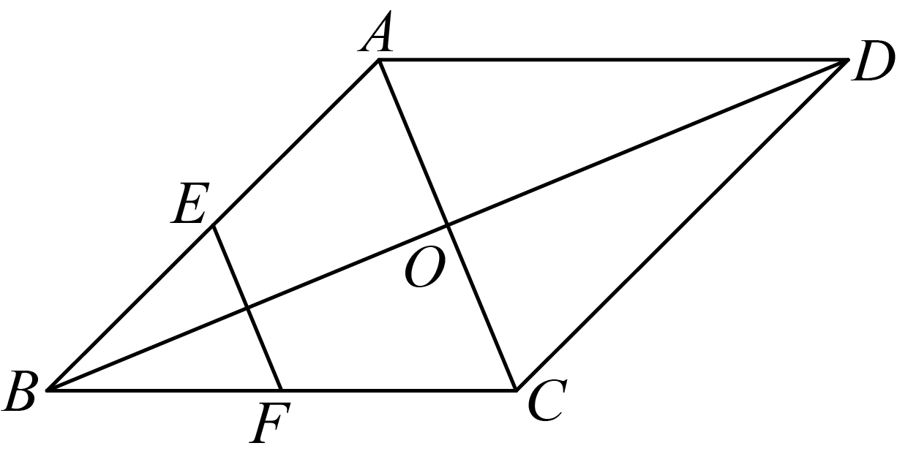

【答案】

【解析】

【分析】本题主要考查了根据点在数轴上的位置判断式子的正负，根据实数在数轴上对应点的位置，判定出符号以及绝对值的大小，即可进行判断即可，解题的关键是根据实数在数轴上的位置，正确判断出实数的符号和绝对值的大小．

【详解】解：由实数在数轴上对应点的位置可知：，，且，

∴，

∴，

故答案为：．

11. 七名同学一分钟排球垫球个数分别为，，，，，，，这组数据的众数是______．

【答案】

【解析】

【分析】本题考查了众数的定义，根据出现次数最多的数是众数解答即可，掌握众数的定义是解题的关键．

【详解】解：∵这组数据中出现次，出现的次数最多，

∴这组数据的众数是，

故答案为：．

12. 若是一元二次方程的一个根，则的值为______．

【答案】

【解析】

【分析】此题考查了一元二次方程的解，把代入方程即可求解，熟练掌握一元二次方程的解是解题的关键．

【详解】解：将代入原方程得：，

解得：，

故答案为：．

13. 在平面直角坐标系中，点在第三象限，则的取值范围是__________．

【答案】

【解析】

【分析】本题主要考查了平面直角坐标系中第三象限的点的坐标的符号特点，根据平面直角坐标系中第三象限内的点的横坐标小于0，纵坐标小于0，列出关于a的不等式组，求解即可．

【详解】解：点在第三象限，

，

解得，

即的取值范围是，

故答案为：．

14. 如图，在菱形中，，，分别为，的中点，且，则菱形的面积为______．

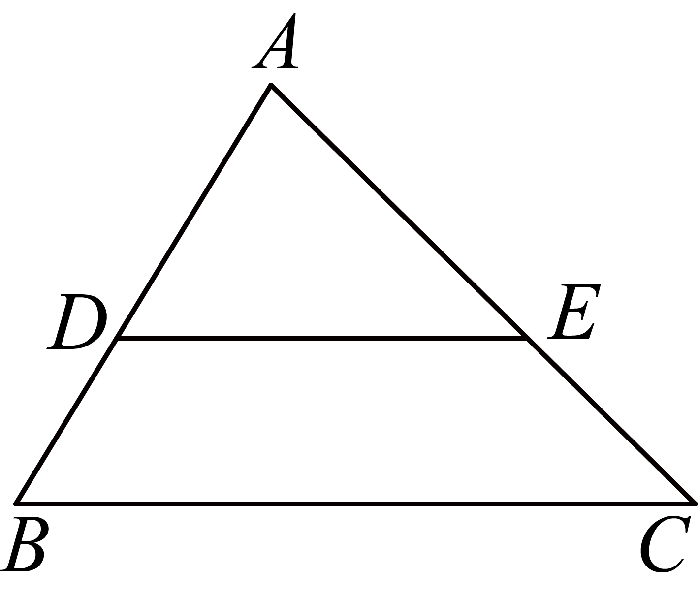

【答案】

【解析】

【分析】本题主要考查了菱形的性质，三角形中位线定理，由，分别为，的中点，得，所以，然后根据菱形的面积为即可求解，掌握相关知识的应用是解题的关键．

【详解】解：∵，分别为，的中点，

∴，

∴，

∵四边形是菱形，

∴菱形的面积为，

故答案为：．

15. 如图，在中，，且，，则的值是______．

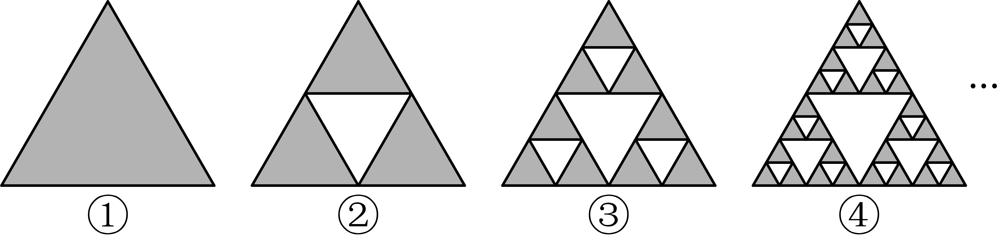

【答案】

【解析】

【分析】本题考查了相似三角形的判定与性质，由，可得，根据相似三角形性质得，然后把，代入即可求解，掌握相似三角形的判定与性质是解题的关键．

【详解】解：∵，

∴，

∴，

∵，，，

∴，

故答案为：．

16. 下图是谢尔宾斯基地毯图案的形成过程．按此规律下去，第⑥个图形中黑色三角形的个数是__________．

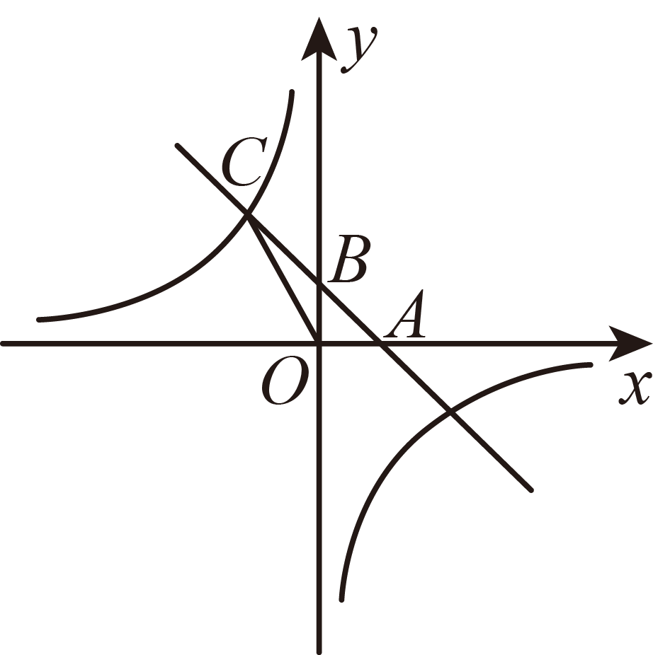

【答案】或243（两个答案均可得分）

【解析】

【分析】本题考查了图形的变化类问题，找到图形的变化规律，即可得出答案．

【详解】解：∵第1个图案中有个，

第2个图案中有个，

第3个图案中有个，

第4个图案中有个，

…，

按此规律，第⑥个图案中有个涂有阴影的三角形．

故答案为：或243．

三、解答题（本大题共9小题，共72分．解答应写出必要的文字说明，证明过程或演算步骤）．

17. 计算：

【答案】

【解析】

【分析】本题考查了含特殊角的三角函数值的混合运算，零指数幂，二次根式的运算等知识点，熟练掌握运算法则是解题的关键．

分别化简二次根式，计算零指数幂，绝对值，代入特殊角的三角函数值并相乘，最后再进行加减计算．

【详解】解：

．

18. 先化简，再从，，中选一个合适的数代入求值．

【答案】，时，值为，时，值为

【解析】

【分析】本题考查了分式的化简求值，分式有意义的条件，熟练掌握分式的混合运算法则是解此题的关键．

括号内先通分，再将除法转化为乘法，约分即可化简，再代入合适的值进行计算即可．

【详解】解：

 

 

由于，

∴

把代入

原式

；

把代入

原式

．

19. 如图，直线与轴交于点，与轴交于点，与反比例函数（为常数）的图象在第二象限交于点．

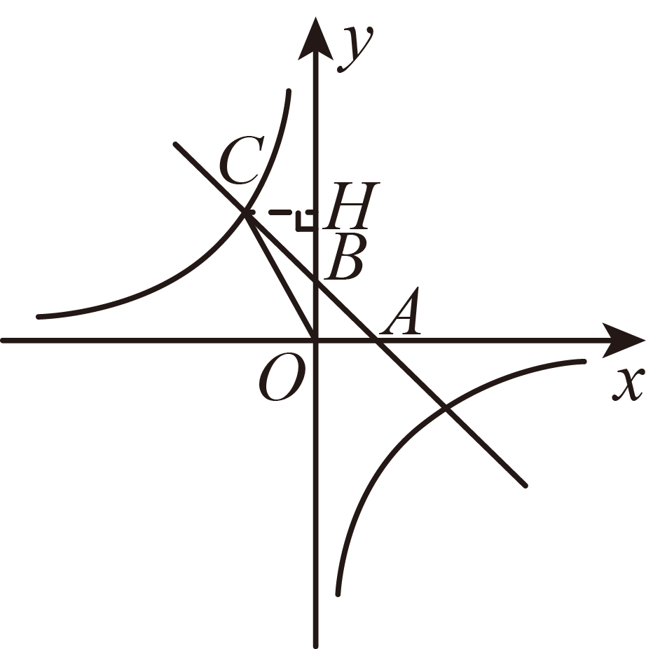

（1）求反比例函数的解析式；

（2）求的面积．

【答案】（1）；    

（2）．

【解析】

【分析】此题考查了一次函数与反比例函数的交点问题，待定系数法求函数解析式，三角形的面积求法，熟练掌握知识点的应用是解题的关键．

（）先由点代入求出点的坐标为，然后代入即可求解；

（）过点作轴于点，然后求出，，再由即可求解．

【小问1详解】

解：把点代入中得，

∴，

∴一次函数解析式为，

把点代入中，

得，

∴点的坐标为，

把代入中，

得，，

∴反比例函数解析式为；

【小问2详解】

解：过点作轴于点，

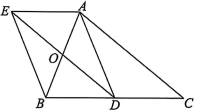

∵，

∴，

把代入得，，

∴，

∴，

∴．

20. 如图，在中，点O，D分别是边，的中点，过点A作交的延长线于点E，连接，．

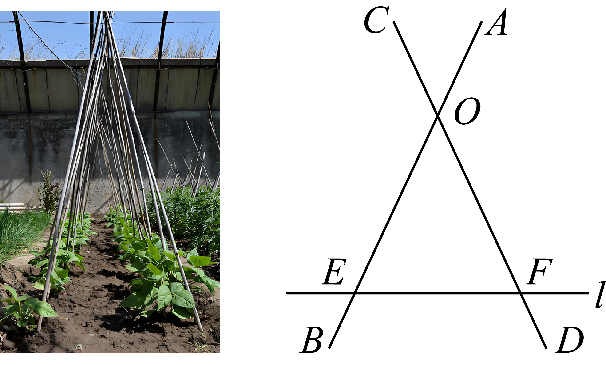

（1）求证：四边形是平行四边形；

（2）若，试判断四边形的形状，并证明．

【答案】（1）见解析    （2）当时，四边形是矩形，理由见解析

【解析】

【分析】本题考查的是平行四边形的判定与性质，矩形的判定，全等三角形的判定与性质；

（1）先证明，可得，结合可得结论；

（2）由，点是边上的中点，可得即，结合由（1）得四边形是平行四边形，从而可得结论.

【小问1详解】

证明：∵点为的中点

∴，

∵

∴，，

在和中

∴，

∴

∵

∴四边形是平行四边形；

【小问2详解】

证明：当时，四边形是矩形，

理由如下：

∵ ，点是边上的中点，

∴ 即，

∵ 由（1）得四边形是平行四边形，

∴ 四边形是矩形.

21. 数学实践

【问题背景】

中国传统农业智慧遇上现代数学模型．“豇豆不上架，产量少一半”的农谚流传至今，现代科学揭示了其秘密：当支架与地面形成夹角时，既能在早春聚热防冻害，又能在盛夏分散强光，就像给豇豆装了智能遮阳篷．

【问题呈现】

用两根竹竿交叉，斜插入地面，交叉点在何处会使支架与地面形成夹角？

【模型建立】

环节一：数据收集

两根竹竿长度均为1.8米，插入地下的部分为0.3米，竹竿与地面接触点间距为0.6米且与地面所形成的夹角均为．

环节二：数学抽象

如图：已知线段与交于点，，与直线分别交于点，，，，，，求的长度．（结果精确到0.1，参考数据：，，）

【模型求解】

【问题总结】

交叉点距顶端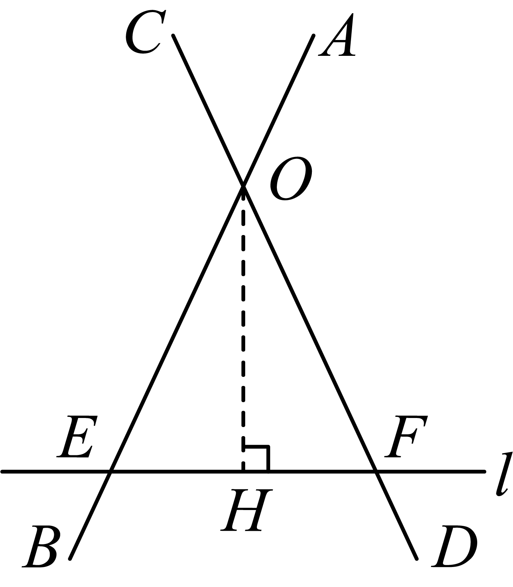长度即为______时，支架与地面形成夹角，这样更贴合作物的生长规律．

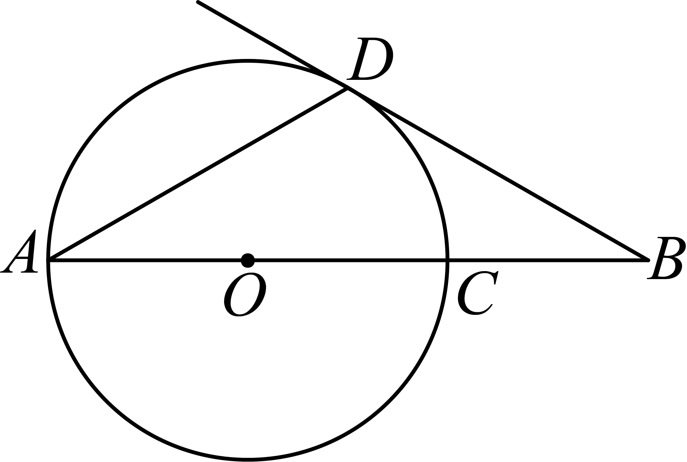

【答案】，

【解析】

【分析】本题考查的是解直角三角形的应用，如图，过作于，根据等腰三角形的性质可得，结合可得答案；最后由即可得到答案.

【详解】解：数学抽象：如图，过作于，

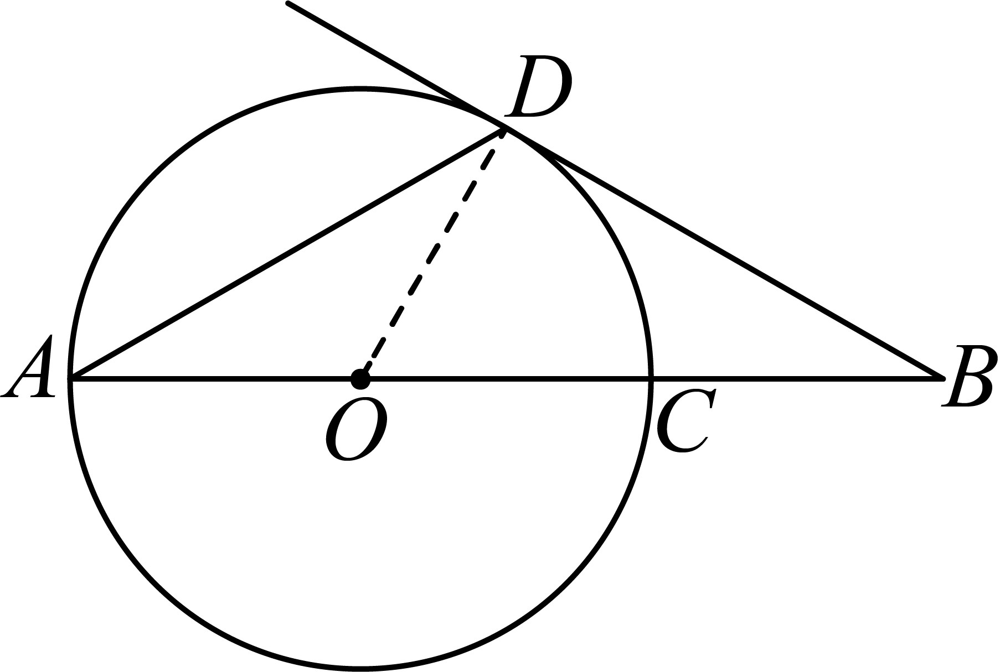

∵，

∴，

∵，

∴，

∴，

∴，

问题总结：∵，，

∴.

22. 如图，线段经过圆心，交于点，，为的弦，连接，．

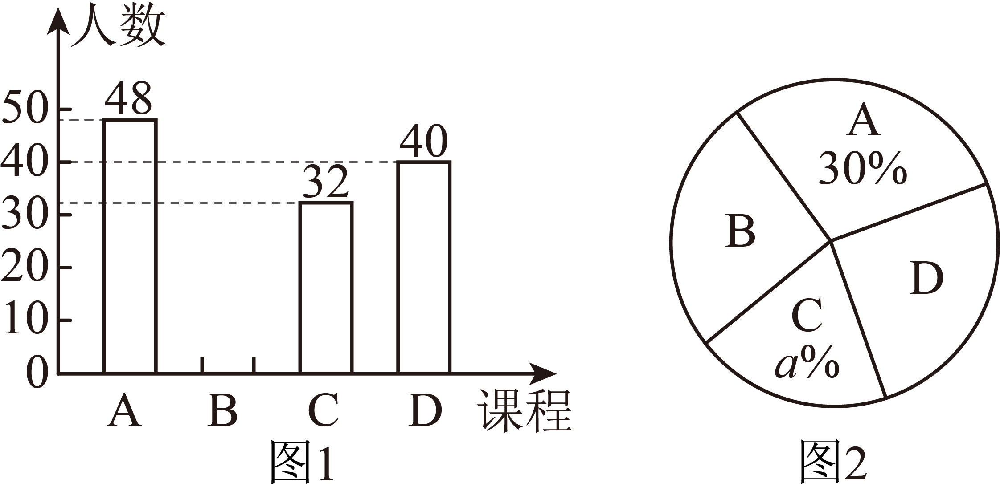

（1）求证：直线是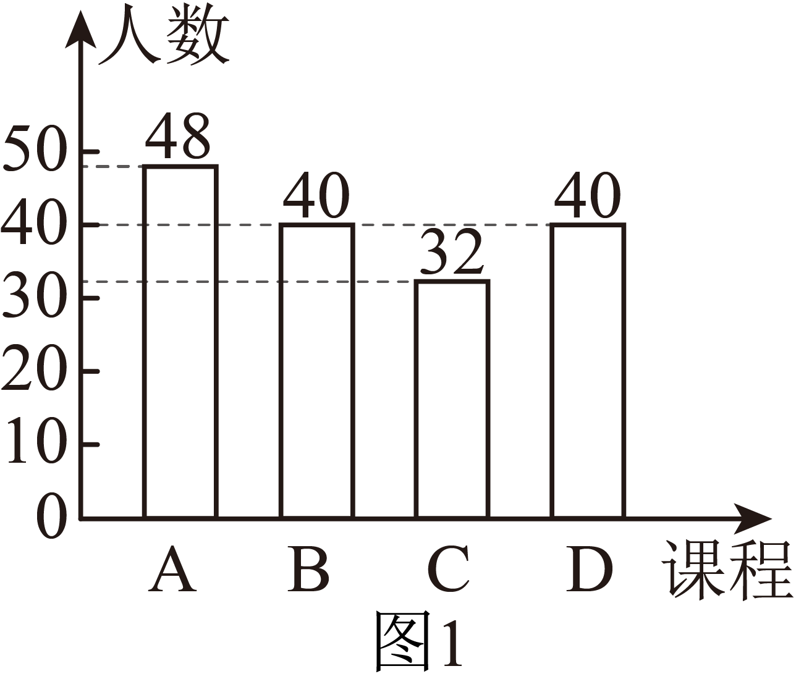切线；

（2）已知，求的长（结果保留）．

【答案】（1）见解析    （2）

【解析】

【分析】本题主要考查了切线的判定，弧长公式，含30度角的直角三角形的性质．

（1）先由三角形内角和定理得出，再根据得，进而可得，再根据切线的判定可得出结论；

（2）根据含30度角的直角三角形的性质得，设，则，求出，再得，然后根据弧长公式求解即可．

【小问1详解】

证明：连接，

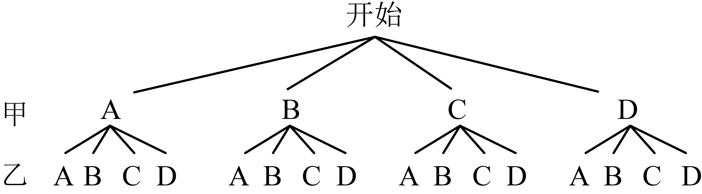

∵，

∴， 

∵，

∴，

∴，

∴， 

且是的半径，

∴直线是的切线；

【小问2详解】

解：在中，，

∴，

设，

∴，

解得，

∵，

∴的长为：．

23. 为了让学生体验青海民俗文化，某学校开设了特色艺术实践课程，课程分别是：．五谷画，．彩陶，．剪纸，．排灯．现学校要了解学生最感兴趣的课程情况，从全校学生中随机抽取部分学生进行调查（每位学生必选且只能选一个课程），根据调查结果，绘制了如下两幅不完整的统计图：根据提供的信息，解答下列问题：

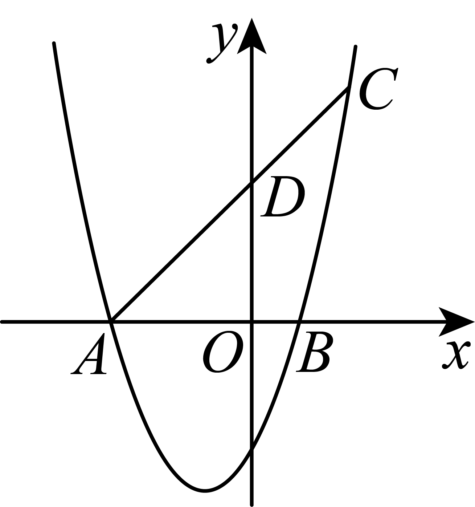

（1）此次被调查的学生总人数为__________；扇形统计图中__________；

（2）补全条形统计图；

（3）该校有人，请你估计该校对课程感兴趣的学生有多少名？

（4）甲、乙两名同学从、、、四个课程中任选一个，用树状图或列表法求两人恰好选到同一个课程的概率．

【答案】（1），；    

（2）补全条形统计图见解析；    

（3）人；    

（4）．

【解析】

【分析】本题考查了条形统计图和扇形统计图的综合运用，列表法或画树状图法求概率，熟练掌握概率的求法，从不同的统计图中得到必要的信息是解题的关键．

（）根据对课程感兴趣的学生人数除以所占百分比即可求出此次被调查的学生总人数，然后通过对课程感兴趣的学生人数除以总人数再乘以即可求出的值；

（）由（）总人数减去人数，即可得到抽取部分学生对课程感兴趣的学生人数，然后补全条形统计图即可；

（）用乘以对课程感兴趣的学生所占百分比即可求解；

（）由题意列表或画树状图，然后通过概率公式即可求解．

【小问1详解】

此次被调查的学生总人数为（人），

∴，

∴，

故答案为：，；

【小问2详解】

抽取部分学生对课程感兴趣的学生有（人），

补全条形统计图如图，

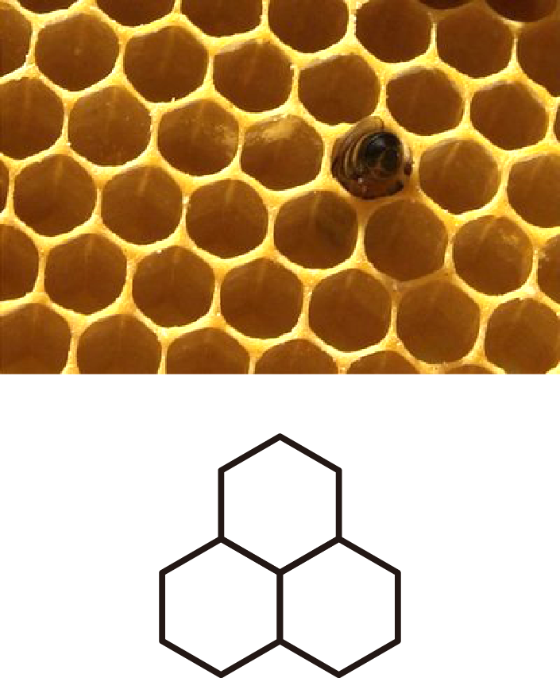【小问3详解】

解：人，

答：估计该校对感兴趣的学生有人；

【小问4详解】

情况：列表格，

<table border="1">
  <thead>
    <tr>
      <th>甲 乙</th>
      <th></th>
      <th></th>
      <th></th>
      <th></th>
    </tr>
  </thead>
  <tbody>
    <tr>
      <td></td>
      <td></td>
      <td></td>
      <td></td>
      <td></td>
    </tr>
    <tr>
      <td></td>
      <td></td>
      <td></td>
      <td></td>
      <td></td>
    </tr>
    <tr>
      <td></td>
      <td></td>
      <td></td>
      <td></td>
      <td></td>
    </tr>
    <tr>
      <td></td>
      <td></td>
      <td></td>
      <td></td>
      <td></td>
    </tr>
  </tbody>
</table>

如树状图所示，共有种等可能结果，而出现甲、乙两人恰好选到同一课程的有种：，，，，

∴；

情况：画树状图，

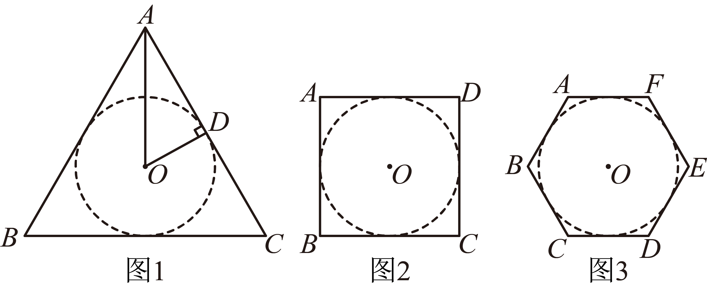

如树状图所示，共有种等可能结果，而出现甲、乙两人恰好选到同一课程的有种：，，，，

∴．

24. 在平面直角坐标系中，抛物线与x轴交于A，B两点，点B的坐标为，点在抛物线上．

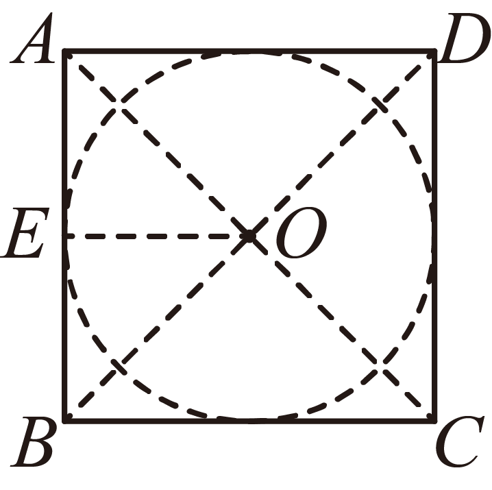

（1）求抛物线的解析式；

（2）①求点A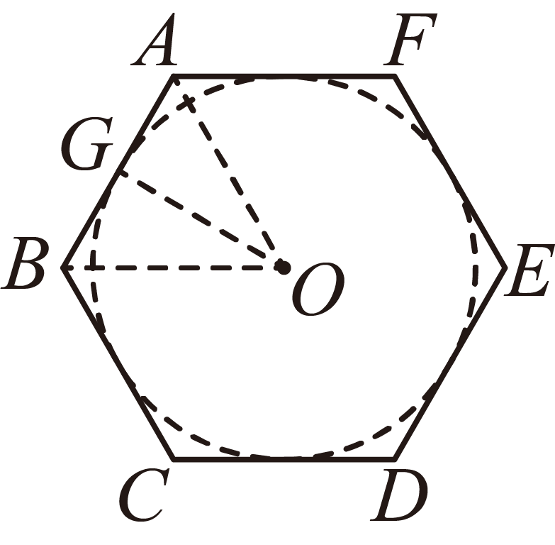坐标；

②当时，根据图象直接写出x的取值范围________；

（3）连接交y轴于点D，在y轴上是否存在点P，使是以为直角边的直角三角形，若存在，请直接写出所有符合条件的点P坐标，若不存在，请说明理由．

【答案】（1）    

（2）①，②    

（3）存在，，

【解析】

【分析】本题考查了二次函数综合题，需要综合运用抛物线与x轴的交点，待定系数法求二次函数解析式，勾股定理等．

（1）将、代入得方程组，解方程组即可；

（2）①令，则，解方程即可求出点A的坐标；

②根据图象可知，当时，即抛物线在轴下方的部分，根据A，B两点的坐标即可得出结论；

（3）设点P的坐标为，先由两点间的距离公式得，，，再分两种情况讨论：当为斜边时，则；

当为斜边时，则；分别解方程即可．

【小问1详解】

解：将、代入得，

，

解得，

∴抛物线的解析式为；

【小问2详解】

解：①令，则，

解得或，

∴点A的坐标为；

②根据图象可知，当时，x的取值范围为，

故答案为：；

【小问3详解】

解：设点P的坐标为，

∵，，

∴，，，

∵是以为直角边的直角三角形，

∴分以下两种情况讨论：

当为斜边时，则，

∴，

解得，

∴；

当为斜边时，则，

∴，

解得，

∴．

综上所述，存在符合条件的P点，，．

25. 活动与探究

解码蜜蜂的“家”——为什么蜂房是正六边形的？

蜜蜂的“集体宿舍”是由多个正六边形密铺在一起的，这些密铺的正六边形使得蜂房之间没有空隙，一点儿也不浪费空间．这是数学中的密铺（或镶嵌）问题．平面图形的密铺（或镶嵌）是指用形状、大小完全相同的一种或多种平面图形进行拼接，使彼此之间不留空隙、不重叠地铺成一片．

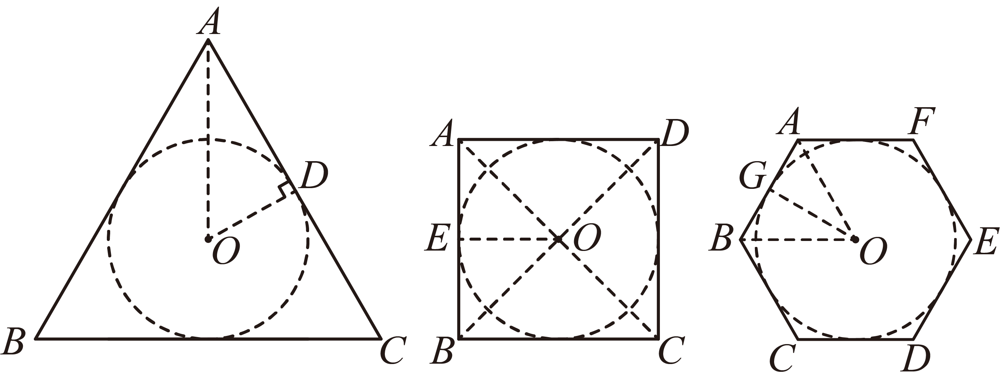

探究一：若只用一种正多边形，哪些正多边形可以密铺？

<table border="1">
  <thead>
    <tr>
      <th>平面图形</th>
      <th>每个内角度数</th>
      <th>能否整除</th>
      <th>能否密铺</th>
    </tr>
  </thead>
  <tbody>
    <tr>
      <td>正三角形</td>
      <td></td>
      <td></td>
      <td>能</td>
    </tr>
    <tr>
      <td>正方形</td>
      <td>①________</td>
      <td>②________</td>
      <td>能</td>
    </tr>
    <tr>
      <td>正五边形</td>
      <td></td>
      <td></td>
      <td>不能</td>
    </tr>
    <tr>
      <td>正六边形</td>
      <td></td>
      <td></td>
      <td>能</td>
    </tr>
    <tr>
      <td>正七边形</td>
      <td></td>
      <td></td>
      <td>不能</td>
    </tr>
    <tr>
      <td>正八边形</td>
      <td></td>
      <td>③________</td>
      <td>④________</td>
    </tr>
    <tr>
      <td>．．．</td>
      <td>．．．</td>
      <td>．．．</td>
      <td>．．．</td>
    </tr>
  </tbody>
</table>

（1）请补全上述表格①________；②________；③________；④________．

探究二：在能密铺的正多边形中，哪种形状最省材料？

数学视角：蜜蜂的身体可近似看成圆柱，若圆柱底面半径为1，当蜂房恰好容纳一只蜜蜂即正多边形的内切圆半径均为1时，比较正三角形，正方形和正六边形周长的大小．         

观察图1，发现是正三角形的内切圆，与切于点，，，，在中，，则的周长为．

（2）如图2，正方形的周长为__________；

（3）如图3，求出正六边形的周长（写出求解过程）．

探究三：在能密铺的正多边形中，哪种形状可以使蜜蜂的活动空间最大？

数学视角：假设蜜蜂建造蜂房的材料总量即周长一定，比较正三角形、正方形和正六边形面积的大小．

（4）若正多边形的周长都为12，则正三角形的面积为__________；正方形的面积为__________；正六边形的面积为__________．

【得出结论】

综上所述：在相同条件下，正六边形结构最省材料，能使蜜蜂的活动空间最大，是建造蜂房的最优方案．

【答案】（1）①，②，③，④不能；（2）8；（3）；（4），，

【解析】

【分析】（1）根据正方形，正八边形内角性质解答；

（2）根据正方形内切圆半径为1，得正方形边长为2，即得正方形周长；

（3）根据正六边形内切圆半径为1，得正六边形边长为，即得正六边形周长；

（4）在周长都是12的情况下，得正三角形的边长为4，边心距为，积为；正方形的边长为3，面积为9；正六边形的边长为2，边心距为，面积为．

【详解】（1）∵正方形每个内角为 ，

∴，

∴能密铺；

∵正八边形的每个内角为，

∴，

∴不能密铺；

故答案为：①；② ；③；④不能；

（2）设切于点E，连接，

 则交于点O，，

∵，

∴，

∴，

∴正方形的周长为8；

故答案：8；

 

 （3）设切于点G，连接，

则，

∴，

∵，

∴，

∴，

∵，

∴，

∴，

∴正六边形周长为；

（4）三角形：

∵，

∴，

∵，

∴，

∵，

∴，

∴；

正方形：

∵，

∴，

正六边：

∵，

∴，

∴，

∴，

∴．

【点睛】此题主要考查了平面镶嵌．熟练掌握平面镶嵌的原理，正三角形，正方形，正六边形性质，含30度的直角三角形性质，勾股定理，等腰直角三角形性质，是解题的关键．