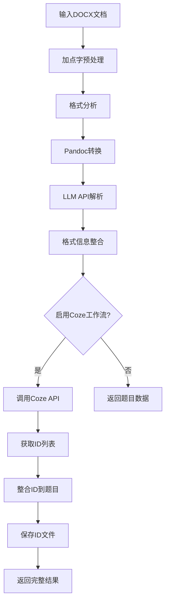

# Coze工作流集成完成 🎉

## 功能概述

已成功将 `call_coze_workflow` 函数集成到 `simple_parser_with_pandoc.py` 中，现在支持完整的文档处理 + Coze工作流调用流程。

## 集成内容

### 1. 新增函数
- **`call_coze_workflow(self, processed_data)`**: 调用Coze工作流API
  - 发送处理后的JSON数据到Coze
  - 返回ID列表
  - 包含完整的错误处理和状态显示

### 2. 功能参数
- **`enable_coze_workflow`**: 新增参数控制是否启用Coze工作流
  - 默认值: `False` (不启用)
  - 通过命令行参数 `--enable-coze` 启用

### 3. 处理流程整合
完整的处理流程现在包括6个步骤：

1. **加点字预处理** (如果启用)
2. **格式分析** (如果启用)  
3. **Pandoc转换**
4. **LLM API调用**
5. **格式信息整合**
6. **🆕 Coze工作流调用** (如果启用)

### 4. 结果处理
- 当启用Coze工作流时，返回结构变更：
  ```python
  {
      'questions': [...],  # 原始题目数据
      'coze_ids': [...]   # Coze返回的ID列表
  }
  ```
- 自动将Coze ID整合到每道题目中：
  ```python
  question['coze_id'] = coze_ids[i]
  ```
- 保存Coze ID列表到独立文件

## 使用方法

### 方法1: 命令行调用

```bash
# 常规处理（不启用Coze工作流）
python3 simple_parser_with_pandoc.py document.docx

# 启用Coze工作流
python3 simple_parser_with_pandoc.py document.docx --enable-coze
```

### 方法2: 程序调用

```python
from simple_parser_with_pandoc import PandocWordProcessor

processor = PandocWordProcessor()

# 启用Coze工作流
result = processor.process_word_document(
    "document.docx",
    enable_coze_workflow=True
)

if result and isinstance(result, dict):
    questions = result['questions']
    coze_ids = result['coze_ids']
    print(f"处理了 {len(questions)} 道题目")
    print(f"获得 {len(coze_ids)} 个Coze ID")
```

### 方法3: 使用演示脚本

```bash
# 运行演示脚本
python3 coze_integration_demo.py

# 只演示启用Coze工作流
python3 coze_integration_demo.py --with-coze

# 只演示常规处理
python3 coze_integration_demo.py --without-coze
```

## 输出文件

当启用Coze工作流时，会生成额外的输出文件：

1. **原有文件**：
   - `json_res/questions_with_pandoc_[文档名].json` - 题目JSON数据
   - `pandoc_res/pandoc转换结果_[时间戳].txt` - Pandoc转换结果
   - `format_analysis/` - 格式分析报告

2. **🆕 新增文件**：
   - `coze_ids_[文档名]_[时间戳].txt` - Coze ID列表文件

## 特性

✅ **完全向后兼容**: 现有的调用方式不受影响  
✅ **可选启用**: 通过参数控制是否使用Coze工作流  
✅ **错误处理**: 完整的异常处理和状态提示  
✅ **数据整合**: 自动将Coze ID整合到题目数据中  
✅ **日志详细**: 详细的处理状态和进度显示  
✅ **文件保存**: 自动保存Coze ID列表到文件  

## 配置信息

- **Coze API端点**: `https://api.coze.cn/v1/workflow/run`
- **工作流ID**: `7540878860784680995`
- **认证Token**: `pat_Z0r3WQNZ435IUDhJCc0bVHDd9mVcIh0Z6tOvYd3HPT3Q6WNfw5KaX7veOhNkqC3N`

## 工作流程



## 示例输出

```
🔗 Coze工作流处理阶段
============================================================
🔗 准备调用Coze工作流...
🚀 调用Coze工作流开始...
📊 发送数据量: 34011 字符
✅ Coze工作流调用成功，返回 12 个ID
📋 ID列表预览: ['id_001', 'id_002', 'id_003', 'id_004', 'id_005']...
📁 Coze ID列表已保存到: coze_ids_精品解析：2025年甘肃省兰州市中考语文真题（解析版）_20250825_020143.txt
✅ Coze ID已整合到题目结果中

🎯 处理结果总结:
  📝 题目数量: 12
  🆔 Coze ID数量: 12
  🔗 Coze ID示例: id_001
```

集成完成！现在您可以在文档处理的基础上，选择性地启用Coze工作流来获取额外的ID数据。
