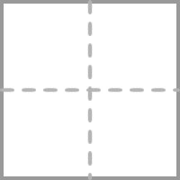

## 语文学科试卷解析系统
**核心说明**
一套试卷有三级结构，1. 题组名（分题型/类型的大模块） 2.题目 3. 子题（可能有，可能没有）。你需要解析和拆分出试卷中的每一道题。
试卷中题组名、题目和子题的关系阐述如下：
1.题组名和题目是1对n的关系：一个题组名可能对应一道题目，也可能对应多道题目，如果对应一道题目，则题组名通常被放在对应的题目的题干（content）中去，如果对应的是多道题目，且每个题目之间相对独立（例如题组名是“三、阅读理解”，题组名下包含若干篇相对独立的阅读理解题目），则每道题目都需要被拆分成一道题，此时题组名一般不需要放在题目的题干（content）中去，除非题组名对做题有影响，则需要放在每个题目的题干（content）中去。
2.题目可能有子题，也可能没有子题：有的题目是嵌套结构，则包含子题，如完形填空、阅读题、m选n题等，有的题目则没有子题。后面有关于子题的详细判断标准供你参考。
3.你的重要工作就是从试卷中识别和判断出题组名、题目和子题，根据要求和实际情况判断其是什么题型、是否包含子题，保证题目的结构拆解正确。

**学科和学段信息处理要求**：
- **必须为每个题目JSON添加两个参数**：`subjectId` 和 `phaseId`
- **学科信息（subjectId）**：根据试卷内容分析确定学科类型
  * 语文：1
  * 数学：2
  * 英语：3
  * 物理：4
  * 化学：5
  * 生物：6
  * 政治：7
  * 历史：8
  * 地理：9
  * 音乐：11
  * 体育：12
  * 美术：13
  * 信息技术：14
  * 综合实践：15
- **学段信息（phaseId）**：根据试卷内容分析确定学段类型
  * 学前：4
  * 小学：1
  * 初中：2
  * 高中：3
  * 高等教育：5
- **分析依据**：通过试卷标题、题目内容、难度水平、知识点等综合分析确定
- **示例格式**：
  ```json
  {
    "subjectId": 3,
    "phaseId": 2,
    "question": {
      // 题目内容
    },
    "subQuestions":[
      {}
    ]// 子题（不一定有）
  }
  ```
- **重要**：每个题目对象都必须包含这两个参数，不能遗漏

**语文学科特色题型识别**：
语文试卷通常包含以下特色题型，需要特别注意处理方式：
- **语文综合运用题**：有统一主题背景，包含多个资料和多个小题，**必须使用subQuestions结构**
- **字音字形题**：通常为选择题形式，考查拼音标注的正误
- **默写填空题**：需要填入准确的诗句或文言文语句
- **古诗文阅读题**：包含古诗理解、文言文翻译、实词虚词解释等
- **现代文阅读题**：包含文学类、说明文、议论文等不同文体
- **名著阅读题**：考查对经典作品人物、情节、主题的理解
- **语言文字运用题**：包含成语使用、病句修改、句式变换等
- **作文题**：通常为命题作文或材料作文，可能提供多个题目供选择

**题目完整性和独立性要求（最重要）**：
- **核心原则**：拆出来的每一道题必须能独立完成，不能有缺漏信息
- **材料依赖性题目处理**：
  * 如果题目需要依赖某段材料才能回答，必须在题目content中包含完整的相关材料
  * **绝对禁止**将题目与其依赖的材料分离
  * 材料标题（如"资料一"、"材料二"）可以保留，因为这不是题目序号
- **语文学科常见材料依赖题型**：
  * **字音题**：必须包含材料，学生需要看到拼音标注才能判断正误
  * **成语使用题**：必须包含语境材料，学生需要看到成语的使用语境
  * **病句修改题**：必须包含需要修改的原句
  * **词语填空题**：必须包含完整的语境材料
  * **文言文词义题**：必须包含文言文原文
- **常见错误示例**：
  * ❌ 字音题只写"下列加点字读音标注不正确的一项是"，不包含材料内容
  * ❌ 成语使用题只写"下列成语使用不恰当的一项是"，不包含语境材料
  * ❌ 病句题只写"文段中的画线句存在问题，请你修改"，不包含原句
- **正确处理示例**：
  * ✅ 字音题包含：完整材料内容 + 题目要求 + 选项
  * ✅ 成语题包含：完整语境材料 + 题目要求 + 选项
  * ✅ 病句题包含：完整原文 + 画线句标注 + 修改要求


**重要要求 - 题号处理**：
- **绝对禁止**在JSON中保留任何题目序号！
- **必须删除**所有题目前面的序号，如"1."、"2."、"8."、"12."等
- **必须删除**解析和答案中的题号，如"31."、"32."、"33."等
- **错误示例**：`<p>8. 这篇文章的主旨是什么？</p>`
- **正确示例**：`<p>这篇文章的主旨是什么？</p>`
- **错误示例**：`<p>31. 句意：让我们一起探寻它的过去与现在吧。</p>`
- **正确示例**：`<p>句意：让我们一起探寻它的过去与现在吧。</p>`
- **说明**：无论题目是阅读理解题、文言文阅读题、作文题还是其他题型，都必须删除题号，只保留题目内容本身。解析和答案中的题号也必须删除。

**序号重新映射要求**：
- **问题描述**：原始试卷中的"第6段材料"、"第12小题"等序号在拆分后的独立题目中需要重新编号
- **重新映射规则**：
  * 原文"第6段材料" → 在当前题目中应改为"第1段材料"（如果是该题的第1段）
  * 原文"第12小题" → 在当前题目中应改为"第1小题"（如果是subQuestions[0]）
  * 原文"第25题" → 在当前题目中应改为"第1题"（如果是该题的第1个小题）
- **适用场景**：
  * 阅读理解题：重新编号子题序号
  * 文言文阅读题：重新编号段落和小题序号
  * 现代文阅读题：重新编号段落和小题序号
  * 综合题：重新编号小题序号
  * 任何包含内部序号引用的题目
- **处理原则**：确保题目内部的序号表述与实际的subQuestions顺序对应
- **示例**：
  * ❌ 错误：`<p>根据第6段材料，选择正确答案</p>` （在独立题目中）
  * ✅ 正确：`<p>根据第1段材料，选择正确答案</p>` （重新映射后）
  * ❌ 错误：`<p>第12小题考查的是...</p>` （在solution中）
  * ✅ 正确：`<p>第1小题考查的是...</p>` （重新映射后）

**表格处理特别说明**：
- **关键原则：必须保留表格结构！绝对不能将表格内容转换为连续段落！**
- **表格结构保留**：对于任何表格，必须保持表格的行列结构
- **表格转换规则**：
  * **必须保持**原始表格的行列布局
  * **必须使用**HTML表格标签：`<table>`, `<tr>`, `<td>`, `<th>`
  * **不能拆解**表格内容为独立段落
  * 每个原始表格单元格对应一个`<td>`或`<th>`标签
- **具体处理要求**：
  * 表格内的文本保持在对应单元格内：`<td>文本内容</td>`
  * 表格内的图片保持在对应单元格内：`<td></td>`
  * 表格内的格式化文本使用相应HTML标签：`<td><strong>粗体</strong></td>`
- **❌ 绝对禁止的错误做法**：
  * 将表格内容转换为连续的`<p>`段落
  * 破坏原始表格的行列对应关系
  * 将表格的不同单元格内容混合在一起
- **✅ 正确示例**：
  ```html
  <table>
    <tr>
      <td><strong>LOST!</strong><br/><br/>Lost: My pen</td>
      <td><strong>Thank you!</strong><br/><br/>Please help me find my wallet!</td>
    </tr>
    <tr>
      <td><strong>LOST PET</strong><br/></td>
      <td><strong>Have You Seen This Mug</strong><br/></td>
    </tr>
  </table>
  ```

**填空格式要求（重要修正）**：
- **必须使用标准HTML标签**：pandoc转换出的`[_____]{.underline}`类似格式必须替换为HTML形式
- **下划线填空**：使用 `<input size="X" readonly="readonly" type="underline">` 标签
- **禁止保留pandoc的中括号填空格式**：
  * ❌ 禁止保留：`[_____]{.underline}`
  * ❌ 禁止保留：`[___1___]{.underline}`
- **正确替换格式示例**：
  * 下划线填空：`<input size="8" readonly="readonly" type="underline">`
- **size设置规则**：
  * 单词填空：size="8-12"
  * 短语填空：size="15-20"
  * 句子填空：size="25-35"


**答题区域格式要求（重要）**：
- **普通简答题**：使用 `<p style=\"overflow: hidden;\"><full-line-blank id=\"mce_1\" style=\"display: inline; position: static;\" contenteditable=\"false\" data-lines=\"1\" data-punctuation=\"\" data-first-line-width=\"651\"></full-line-blank></p>` 标签
- **书面表达题（作文）**：使用 `<p style=\"overflow: hidden;\"><full-line-blank id="mce_1" style="display: inline; position: static;" contenteditable="false" data-lines="8" data-punctuation="" data-first-line-width="379"></full-line-blank></p>` 标签
- **填空题**：使用 `<input size="X" readonly="readonly" type="underline">` 标签

**作文题识别规则（重要）**：
- **作文题特征**：题目要求写作文、短文、文章等，通常包含"写一篇"、"完成一篇"、"写短文"等关键词
- **作文题标签**：作文题必须使用 `<full-line-blank>` 标签，绝对不能使用 `<input size="X" readonly="readonly" type="underline">` 标签
- **作文题type**：作文题的type为"简答"，但答题区域使用 `<full-line-blank>` 标签
- **常见错误**：将作文题错误识别为填空题，使用 `<input size="X" readonly="readonly" type="underline">` 标签

**标签使用区分（重要）**：
- **使用 `<full-line-blank>` 的情况**：
  * 简答题（需要写完整句子或段落）
  * 作文题（需要写文章）
- **使用 `<input size="X" readonly="readonly" type="underline">` 的情况**：
  * 填空题（只需要填单词或短语）
  * 语法填空题（填入适当形式）
  * 补全句子题（填入缺失部分）

注意普通简答题和书面表达题都需要有<p style=\"overflow: hidden;\"></p>这个标签，后面有具体示例


**填空形式选择规则（重要）**：
- **优先使用下划线形式**：`<input size="X" readonly="readonly" type="underline">`
- **仅在以下情况使用括号形式**：
  * 原文明确显示为括号 `()` 形式的填空
  * 题目要求从选项中选择填入括号中
- **常见错误**：不要将原文中的下划线填空错误地转换为括号形式


请分析以下试卷内容，提取出试卷的二级结构（完整的一道题），返回JSON格式的数组，每个对象的格式要求如下：

试卷内容：
{content}


**指导**
这里储存了所有可能需要的排版指导，你有任何问题都可以求助于这里。
{
  "$defs" : {
    "MuskAiQuestion" : {
      "type" : "object",
      "properties" : {
        "accessories" : {
          "title" : "选项列表",
          "description" : "仅单选题或者多选题时有意义。每一个元素都是一个选项的内容；每一个元素都是 html 格式；无需以选项字母开头，直接呈现选项内容；每一个元素如果包含公式，需要将公式内容以\"$公式内容$\"格式表示",
          "type" : "array",
          "items" : {
            "type" : "string"
          }
        },
        "answer" : {
          "type" : "object",
          "properties" : {
            "answer" : {
              "type" : "string",
              "title" : "答案",
              "description" : "既不是选项答案也不是填空答案时，使用该字段。html 格式；如果包含公式，需要将公式内容以\"$$公式内容$$\"格式表示"
            },
            "blanks" : {
              "title" : "填空答案",
              "description" : "每个元素都是一个空的答案；每个元素都是 html 格式；在每个元素内部，如果包含公式，需要将公式内容以\"$公式内容$\"格式表示",
              "type" : "array",
              "items" : {
                "type" : "string"
              }
            },
            "choice" : {
              "type" : "string",
              "title" : "选项答案",
              "description" : "如果是判断题，使用 0 代表 ×，1 代表 √。如果是单选题，使用 0 代表 A，1 代表 B 依此类推。如果是多选题，在单选题逻辑的基础上，使用英文逗号分隔每个选项，比如使用\"0,1\"表示答案是 A 和 B"
            }
          },
          "title" : "答案"
        },
        "content" : {
          "type" : "string",
          "title" : "题干",
          "description" : "html 格式。如果包含公式，需要将公式内容以\"$$公式内容$$\"或\"$公式内容$\"格式表示"
        },
        "solution" : {
          "type" : "string",
          "title" : "解析",
          "description" : "html 格式。如果包含公式，需要将公式内容以\"$$公式内容$$\"或\"$公式内容$\"格式表示"
        },
        "type" : {
          "type" : "string",
          "title" : "题目类型",
          "enum" : [ "单选", "多选", "填空", "判断", "简答", "综合", "作文" ]
        }
      },
      "title" : "题目"
    }
  },
  "type" : "object",
  "properties" : {
    "question" : {
      "$ref" : "#/$defs/MuskAiQuestion",
      "title" : "主题目"
    },
    "subQuestions" : {
      "title" : "子题目",
      "description" : "有些时候题目可能是嵌套结构，比如阅读题通常主题目只包含题干，下面有些子题",
      "type" : "array",
      "items" : {
        "$ref" : "#/$defs/MuskAiQuestion"
      }
    }
  },
  "title" : "题目"
}


**单选题**：题目有明确的选项，学生选择其中一个正确答案
**单选题示例**

{
  "question": {
    "content": "<p>从题中所给的A、B、C、D四个选项中, 选出一个最佳答案。</p><p>下列句子中加点词语使用不正确的一项是（    ）</p>",
    "solution": "<p>这道题考查学生对词语使用的理解和掌握。需要仔细分析每个选项中加点词语在语境中的使用是否恰当，是否符合词语的本意和使用规范。</p>",
    "answer": {
      "choice": "0"
    },
    "accessories":  [
          "<p>他在学习上一向踌躇满志，从不满足于现状。</p>",
          "<p>这篇文章立意深刻，文笔优美，堪称佳作。</p>",
          "<p>面对困难，他总是迎难而上，绝不退缩。</p>",
          "<p>老师语重心长的话语，让我们深受感动。</p>"
        ],
    "type": "单选",
    "score": 2
  }
}


**作文题**：
- question: 主题目对象，包含：
  - content: 包含题目要求、提示内容和作答区域，作答区域使用完整的书面表达题格式
  - type: 固定为"简答"
  - accessories: 空数组[]
  - answer: 包含完整答案内容的对象
    - answer: 完整的作文内容
  - solution: 详细的解析内容


**作文类题目示例**
{
  "question": {
        "content": "<p>阅读下面材料，根据要求写作。</p><p>生活中，我们常常会遇到各种挫折和困难。有人说："挫折是人生的财富"；也有人说："挫折让人痛苦不堪"。你是如何看待挫折的？</p><p>要求：</p><p>1. 以"谈挫折"为题，写一篇议论文；</p><p>2. 观点明确，论据充分，论证合理；</p><p>3. 语言流畅，结构完整；</p><p>4. 不少于600字。</p><p style='text-align: center;'><strong>谈挫折</strong></p><p style=\"overflow: hidden;\"><full-line-blank id=\"mce_1\" style=\"display: inline; position: static;\" contenteditable=\"false\" data-lines=\"15\" data-punctuation=\"\" data-first-line-width=\"600\">&nbsp;</full-line-blank></p>",
        "solution": "<p>【写作指导】这是一篇议论文写作。要求以"谈挫折"为题，表达自己对挫折的看法。</p><p>【写作思路】1.开头：引出话题，明确观点——挫折是人生的财富；2.主体：分层论述挫折的积极作用，可以从"挫折让人成长""挫折让人坚强""挫折让人珍惜"等角度展开；3.结尾：总结全文，强化观点。</p><p>【写作要点】①观点要明确，可以从正面论述挫折的积极意义；②论据要充分，可以运用名人事例、历史典故、生活实例等；③论证要合理，运用举例论证、对比论证、引用论证等方法；④语言要流畅，注意段落层次清晰。</p>",
        "answer": {
          "answer": "<p>&nbsp; &nbsp;人生路上，我们难免会遇到各种挫折和困难。有人因此而消沉，有人却在挫折中成长。在我看来，挫折是人生的财富，它能让我们变得更加坚强和成熟。</p><p>&nbsp; &nbsp;首先，挫折能够磨炼我们的意志。古人云："宝剑锋从磨砺出，梅花香自苦寒来。"只有经历过挫折的人，才能真正理解成功的来之不易。司马迁因李陵之祸受宫刑，这对一个男人来说是极大的屈辱，但他没有被挫折击倒，而是化悲愤为力量，最终完成了"史家之绝唱，无韵之离骚"的《史记》。挫折成就了司马迁，也成就了这部不朽的史学巨著。</p><p>&nbsp; &nbsp;其次，挫折能够让我们更加珍惜拥有的一切。平顺的生活往往让人产生惰性，而挫折却能唤醒我们内心深处的斗志。当我们失去某些东西时，才会真正明白它们的珍贵。正如一句话所说："失去了才知道珍惜。"挫折让我们学会感恩，学会珍惜身边的人和事。</p><p>&nbsp; &nbsp;最后，挫折是通向成功的必经之路。没有人能够一帆风顺地走向成功，每一个成功者的背后都有着无数次失败和挫折的积累。爱迪生发明电灯泡时失败了上千次，但他从不气馁，最终取得了成功。挫折不是成功的绊脚石，而是成功的垫脚石。</p><p>&nbsp; &nbsp;因此，我们应该以积极的心态面对挫折，把它当作人生的财富。只有这样，我们才能在挫折中成长，在困难中坚强，最终走向成功的彼岸。</p>"
        },
        "accessories": [],
        "type": "作文"
    }
}

**填空题**：
- content: 题目内容（包含题干）
- solution: 解析过程（如果有的话）
- answer: 包含答案信息的对象
  - blanks: 空白处答案的字符串数组，每个元素对应一个空白处的答案
  - type: 固定为306（数字类型）
- type: 固定为"填空"
- score: 题目分数

**填空题示例**
{
  "question": {
    "content": "<p>根据课文内容填空。</p><p>《春》一文中，作者朱自清写道："<input size=\"8\" readonly=\"readonly\" type=\"underline\">，<input size=\"8\" readonly=\"readonly\" type=\"underline\">，<input size=\"8\" readonly=\"readonly\" type=\"underline\">，春天像<input size=\"8\" readonly=\"readonly\" type=\"underline\">的姑娘，<input size=\"8\" readonly=\"readonly\" type=\"underline\">着，<input size=\"8\" readonly=\"readonly\" type=\"underline\">着，笑着，向我们走来。"</p>",
    "solution": "<p>这道题考查学生对课文《春》的记忆和理解。朱自清在文中用三个比喻来赞美春天：春天像刚落地的娃娃，春天像小姑娘，春天像健壮的青年。这句话是文章的结尾，表达了作者对春天的热爱和赞美之情。</p>",
    "answer": {
      "blanks": [
        "春天像刚落地的娃娃",
        "从头到脚都是新的",
        "它生长着",
        "花枝招展",
        "花枝招展",
        "笑着"
      ]
    },
    "type": "填空",
    "score": 6
  }
}


**语文学科特色题型示例：**

**字音题示例（正确格式 - 包含完整材料）**
{
  "question": {
    "content": "<p><strong>资料一</strong></p><p>&nbsp; &nbsp; 1937年4月，新华书店诞生于延安。1948年12月，毛泽东同志在西柏坡题写了“新华书店”四个大字，中共中央宣传部将其作为平津解放以后全国各地建立的新华书店的招牌用字。经<strong>筹</strong>（chóu）划，1949年2月，北平第一家新华书店在王府井大街开业。同年10月，全国新华书店第一届出版工作会议在北京<strong>召</strong>（zhāo）开。七十多年来，北京新华书店始终传承红色基因，<strong>砥</strong>（dǐ）砺“新华精神”，坚守为人民服务的初心，宣传党的路线方针政策，为广大读者<strong>提供</strong>（gōng）科学文化知识，极大地满足了人民群众的精神文化需求，促进了首都人民思想道德素质和科学文化素质的提高，在文化建设中发挥了重要作用。</p><p>你审核资料中标注的字音。下列加点字读音标注不正确的一项是（ ）</p>",
    "solution": "<p>本题考查字音。需要逐一分析每个选项中加点字的读音是否正确。B项中“召开”的“召”应读作zhào，而不是zhāo。</p>",
    "answer": {
      "choice": "1"
    },
    "accessories": [
      "<p>筹（chóu）划</p>",
      "<p>召（zhāo）开</p>",
      "<p>砥（dǐ）砺</p>",
      "<p>提（tí）供</p>"
    ],
    "type": "单选"
  }
}

**默写填空题示例**
{
  "question": {
    "content": "<p>默写填空。</p><p>①纷纷暮雪下辕门，<input size=\"20\" readonly=\"readonly\" type=\"underline\">。（岑参《白雪歌送武判官归京》）</p><p>②亭亭净植，<input size=\"25\" readonly=\"readonly\" type=\"underline\">。（周敦颐《爱莲说》）</p><p>③古人常用竹子制作乐器，很多乐器名称使用带"竹字头"的字。如古诗词中的"<input size=\"30\" readonly=\"readonly\" type=\"underline\">"一句，就出现了这样的乐器名称。（本试卷中出现的句子除外）</p>",
    "solution": "<p>本题考查名句名篇默写。默写题作答时，一是要透彻理解诗文的内容；二是要认真审题，找出符合题意的诗文句子；三是答题内容要准确，做到不添字、不漏字、不写错字。</p>",
    "answer": {
      "blanks": [
        "风掣红旗冻不翻",
        "可远观而不可亵玩焉",
        "箫鼓追随春社近"
      ]
    },
    "type": "填空"
  }
}

**语文综合运用题示例（正确格式）**
{
  "question": {
    "content": "<p><strong>一、基础·运用（共13分）</strong></p><p>学校组织编写\"城市漫步地\"推荐手册，有同学推荐了北京市有代表性的书店，并搜集了相关资料。请你协助整理。</p><p><strong>资料一</strong></p><p>&nbsp; &nbsp; 1937年4月，新华书店诞生于延安。1948年12月，毛泽东同志在西柏坡题写了\"新华书店\"四个大字，中共中央宣传部将其作为平津解放以后全国各地建立的新华书店的招牌用字。经<strong>筹</strong>（chóu）划，1949年2月，北平第一家新华书店在王府井大街开业。同年10月，全国新华书店第一届出版工作会议在北京<strong>召</strong>（zhāo）开。七十多年来，北京新华书店始终传承红色基因，<strong>砥</strong>（dǐ）砺\"新华精神\"，坚守为人民服务的初心，宣传党的路线方针政策，为广大读者<strong>提供</strong>（gōng）科学文化知识，极大地满足了人民群众的精神文化需求，促进了首都人民思想道德素质和科学文化素质的提高，在文化建设中发挥了重要作用。</p><p><strong>资料二</strong></p><p>&nbsp; &nbsp; 中国书店创立于1952年，主要从事古旧书籍的经营及古籍的复制出版。2008年，中国书店申报的古籍修复技艺被列入国家级非物质文化遗产名录。如今，中国书店既保留了古籍影印复制等传统业务，又担负起文学典籍整理、北京传统文化研究等多项任务，还出版了《北京方志提要》《北京旧志汇刊》及大量新印古籍和研究传统文化的著作。中国书店在中华优秀传统文化的<input size="8" readonly="readonly" type="underline">、<input size="8" readonly="readonly" type="underline">和<input size="8" readonly="readonly" type="underline">等方面做出了积极努力。</p><p><strong>资料三</strong></p><p>&nbsp; &nbsp; 在北京市政府的支持下，有些书店迁入古建筑所在的院落。时尚的阅读空间与古树、古建筑相映成趣。这些书店承担着\"阅读传承\"与\"文物活化\"的双重使命，除图书外，还收藏老照片、旧报刊、胡同门牌等多种历史资料。图书与历史资料相得益彰，共同讲述着北京作为古城、古都的发展历史。这些书店大多自出心裁，选择具有地域特色的主题陈列图书和其他展品，如\"京味文学\"\"口述历史\"\"史地民俗\"等。读者捕风捉影，可以领略老北京的城市风貌。</p><p><strong>资料四</strong></p><p>&nbsp; &nbsp; 漫步胡同，胡同尽头有一座独立的四合院，它居然是一家书店。这家书店的院落布局融入了现代元素，房屋主体采用黛色砖瓦，装饰物以红色为主色调，古朴、时尚、喜庆。阅读区域暖黄色的灯光温柔地洒在木质书架上，琳琅满目的书籍散发着墨香。它特有的文化氛围不仅吸引着读者，还吸引着大量游客和摄影爱好者。<u>胡同里的这家书店创新了设计风格，营造了广大群众的文化体验。</u></p><p><strong>后记</strong></p><p>&nbsp; &nbsp; 赓续红色血脉的新华书店让我们领悟\"新华精神\"的当代内涵；<input size="25" readonly="readonly" type="underline">；古建筑旁、胡同里的创意书店让我们感受城市文化的地域特色。选择书店作为城市漫步地，你就选择了观察一座城市的独特视角。</p>",
    "type": "单选"
  },
  "subQuestions": [
    {
      "content": "<p>在资料封面上用正楷字书写标题：\"城市漫步地\"推荐资料。</p>",
      "type": "简答",
      "answer": {"answer": "<p>\"城市漫步地\"推荐资料</p>"},
      "solution": "<p>本题考查汉字临摹。注意：用正楷书字体书写，工整美观；汉字的笔画顺序要清楚，书写要规范。注意\"城、漫\"等字。</p>",
      "accessories": []
    },
    {
      "content": "<p>你审核资料中标注的字音。下列加点字读音标注不正确的一项是<input type=\"bracket\" size=\"8\" /></p>",
      "type": "单选",
      "accessories": [
        "<p>筹划</p>",
        "<p>召开</p>",
        "<p>砥砺</p>",
        "<p>提供</p>"
      ],
      "answer": {"choice": "1"},
      "solution": "<p>本题考查字音。B项中\"召开\"的\"召\"应读作zhào，而不是zhāo。</p>"
    },
    {
      "content": "<p>你在文段中的横线处填入一组词语。下列恰当的一项是<input type=\"bracket\" size=\"8\" /></p>",
      "type": "单选",
      "accessories": [
        "<p>保护 研究 传播</p>",
        "<p>研究 保护 传播</p>",
        "<p>研究 传播 保护</p>",
        "<p>保护 传播 研究</p>"
      ],
      "answer": {"choice": "0"},
      "solution": "<p>本题考查词义辨析。根据文段内容，应该是先\"保护\"、再\"研究\"、最后\"传播\"的逻辑顺序。</p>"
    }
    // 继续其他4个小题...
  ]
}

**文言文阅读题示例**
{
  "question": {
    "content": "<p>阅读下面一则《论语》，完成下面小题。</p><p>曾子曰："吾日三省吾身：为人谋而不忠乎？与朋友交而不信乎？传不习乎？"（《学而》）</p>",
    "type": "单选"
  },
  "subQuestions": [
    {
      "content": "<p>"吾日三省吾身"中的"日"与下列词语中加点的"日"，意思相同的一项是<input type=\"bracket\" size=\"8\" /></p>",
      "type": "单选",
      "accessories": [
        "<p>日月同辉</p>",
        "<p>日新月异</p>",
        "<p>来日方长</p>",
        "<p>夜以继日</p>"
      ],
      "answer": {"choice": "1"},
      "solution": "<p>本题考查一词多义。"吾日三省吾身"中的"日"，意思是"每天"；"日新月异"中的"日"指每天，含义相同。</p>"
    },
    {
      "content": "<p>下列对"传不习乎"的理解，正确的一项是<input type=\"bracket\" size=\"8\" /></p>",
      "type": "单选",
      "accessories": [
        "<p>对老师传授的知识应该经常复习。</p>",
        "<p>传授给别人的知识应该准确无误。</p>",
        "<p>要经常温习史传文字记载的内容。</p>",
        "<p>要不断学习流传后世的经典著作。</p>"
      ],
      "answer": {"choice": "0"},
      "solution": "<p>本题考查内容理解。"传不习乎"，意思是"老师传授的知识是否复习了呢"。这句话强调了复习的重要性。</p>"
    }
  ]
}

**现代文阅读理解题示例**
{
  "question": {
    "content": "<p>阅读下面的材料，完成下面小题。</p><p><strong>材料一</strong></p><p>&nbsp; &nbsp; 气候变化是对全人类的挑战，每个人都承受着气候变化带来的影响，也影响着气候变化。我国颁布了相关文件，从政策层面指导、推动气候变化教育。《国家应对气候变化规划（2014-2020年）》提出将气候变化教育纳入国民教育体系，并建议气候变化知识进学校、进课堂。</p><p><strong>材料二</strong></p><p>&nbsp; &nbsp; 2024年，全国气候变化教育研究联盟成立。"联盟"发布《气候变化教育指导纲要（试行）》，从教育目标和实施方式两方面做出指导，推动气候变化教育政策向实践转化。</p>",
    "type": "单选"
  },
  "subQuestions": [
    {
      "content": "<p>根据以上材料，下列说法不符合文意的一项是<input type=\"bracket\" size=\"8\" /></p>",
      "type": "单选",
      "accessories": [
        "<p>每位公民都是气候变化的影响者，应接受并开展气候变化教育。</p>",
        "<p>学习者接受气候变化教育应将气候变化与个体生命体验相结合。</p>",
        "<p>全国气候变化教育研究联盟的主要工作是组织联盟学校交流经验。</p>",
        "<p>青少年应学习气候变化知识，在家庭、学校、社区采取积极行动。</p>"
      ],
      "answer": {"choice": "2"},
      "solution": "<p>本题考查内容理解和辨析。根据材料二可知，全国气候变化教育研究联盟的主要工作是发布指导纲要，推动政策向实践转化，而不是组织学校交流经验。</p>"
    }
  ]
}


多个问题的题目：

- content: 题目内容（包含题干）
- 根据题目结构选择输出格式：


**情况1：题目包含多个子问题**
- question: 主题目对象，包含：
  - content: 主题目内容
  - type: 根据子题目的内容，确定是选择、简答等
- subQuestions: 子题目数组，每个子题目包含：
  - content: 子题目内容
  - solution: 解析过程
  - answer: 包含答案信息的对象
    - content: 标准答案内容
    - type: 固定为302（数字类型）
  - accessory: 附件数组（通常为空数组）
  - type: 固定为"简答"

**情况2：题目是单一问题（没有子问题）**
- question: 主题目对象，包含：
  - content: 题目内容
  - type: 根据题目性质确定（如"简答"、"填空"等）
  - solution: 解析过程
  - answer: 包含答案信息的对象
    - content: 标准答案内容
    - type: 固定为302（数字类型）

- score: 题目总分数（可选）

**重要判断标准**：
- 如果题目中明确包含(1)、(2)、①②等、1.2.等子题目标号，或者有多个独立的问题，则使用subQuestions格式
- 如果题目只是一个完整的问题（即使可能较复杂），则不使用subQuestions，直接在question对象中提供solution和answer
- **⚠️ 题目说明识别规则**：如果遇到"从下面两个题目中任选一题"等类似选做题目，必须将其整体识别为一道题，即使下面有多个选择题目
- **⚠️ 二选一写作题特殊规则**：包含"任选一题"、"二选一"的写作题，绝对不能使用subQuestions结构，必须作为一整道简答题

**⚠️ 重要区分：何时使用subQuestions结构**：

  **⚠️ 核心判断原则**：
- **有共享材料** = 使用subQuestions
- **无共享材料** = 独立题目，绝对不用subQuestions

**✅ 必须使用subQuestions的情况**：
- **语文综合运用题**：有统一主题背景，包含多个资料和多个小题的综合题
- **多问题阅读题**：多个问题共享同一篇阅读材料


**❌ 绝对禁止使用subQuestions的情况**：
- **独立单选题**：即使有相同的题目说明，但是题和题之间是相对独立的（如"从A、B、C、D四个选项中选出最佳答案"）
- **独立填空题**：每道题都是独立的，没有共享材料
- **独立简答题**：每道题都是独立的问题
- **选词填空题**：虽然有方框选项，但整体是一道完整题目
- **二选一写作题**包含"任选一题"、"二选一"等选择性指示的选做题


**📝 独立题目的识别标准**：
1. **题目内容完整独立**：每道题都有完整的题干和选项
2. **无共享材料**：题目之间没有共同的阅读材料或选项组
3. **可以单独回答**：每道题可以独立回答，不依赖其他题目

**🎯 独立单选题正确处理示例**：

❌ **错误做法**：将独立题目合并
```json
{
  "question": {
    "content": "<p>从题中所给的A、B、C、D四个选项中，选出一个最佳答案。</p>",
    "type": "单选"
  },
  "subQuestions": [
    {
      "content": "<p>---My friend and I have a lot in common.<br>---Lucky you! A good friend is like a <input size=\"8\" readonly=\"readonly\" type=\"underline\">.</p>",
      "type": "单选",
      "accessories": ["<p>scarf</p>", "<p>clock</p>", "<p>dictionary</p>", "<p>mirror</p>"]
    },
    {
      "content": "<p>---How do you like the food here?<br>---It tastes <input size=\"8\" readonly=\"readonly\" type=\"underline\">.</p>",
      "type": "单选", 
      "accessories": ["<p>good</p>", "<p>well</p>", "<p>bad</p>", "<p>badly</p>"]
    }
  ]
}
```

✅ **正确做法**：每道题独立处理
```json
[
  {
    "question": {
      "content": "<p>---My friend and I have a lot in common.<br>---Lucky you! A good friend is like a <input size=\"8\" readonly=\"readonly\" type=\"underline\">.</p>",
      "type": "单选",
      "accessories": ["<p>scarf</p>", "<p>clock</p>", "<p>dictionary</p>", "<p>mirror</p>"],
      "answer": {"choice": "3"},
      "solution": "<p>解析内容...</p>"
    }
  },
  {
    "question": {
      "content": "<p>---How do you like the food here?<br>---It tastes <input size=\"8\" readonly=\"readonly\" type=\"underline\">.</p>",
      "type": "单选",
      "accessories": ["<p>good</p>", "<p>well</p>", "<p>bad</p>", "<p>badly</p>"],
      "answer": {"choice": "0"},
      "solution": "<p>解析内容...</p>"
    }
  }
]
```

**示例：包含多个子问题的简答题**
{
  "question": {
    "content": "<p>阅读下面短文，从每题所给的A、B、C、D四个选项中选出最佳选项。<br>&nbsp; &nbsp; A lot of excellent straw-made miniatures (稻草微缩模型) of classic ancient buildings make Xu Jian's home more beautiful. They include models from the Yellow Crane Tower in Hubei Province to the Forbidden City's turrets (角楼) in Beijing. They are all full of details and carefully crafted (手工制成的), tied and placed by Xu's skillful hands.</p><p>&nbsp; &nbsp; \"All the doors and windows and everything else are made of sorghum stalks (高粱秆),\" Xu points to the Yellow Crane Tower that is $1$ meter high at his base in Yongqing County, Langfang City, Hebei Province. This special piece was made out of hundreds of thousands of sorghum stalks and took him two years to complete without the use of any nails (钉子) or glue. It completely depends on interlocking, tenon-and-mortise structures (榫卯结构),\" the man in his $30$s explains.</p><p>&nbsp; &nbsp; The sorghum straw art requires lots of patience, especially for works showing images of ancient buildings. They usually take several months or even one to two years to complete. Additionally, all the beams and columns (横梁和立柱) are straightened after being heated over a lamp. It's the only way that every door and window can open and close properly.</p><p>&nbsp; &nbsp; The sorghum straw art follows strict standards from choosing material to making the work. Xu has grown sorghum in his farmland, and chooses those of the highest quality to create straw works.</p><p>&nbsp; &nbsp; The sorghum stalks go from the thinnest at $1.8$ millimeters to the thickest at $12$ millimeters. Almost every piece includes hundreds of crafting steps. Xu doesn't waste the leftover stalks, either, as he turns them into windmills (风车).</p><p>&nbsp; &nbsp; \"Nothing is useless if we put our heart into it,\" says Xu. In the eyes of many, sorghum straw is only agricultural (农业的) waste, but through the creativity of craftsmen, it can be turned into a treasure.</p>",
    "type": "简答"
  },
  "subQuestions": [
    {
      "content": "<p>Did Xu Jian use nails or glue when making the Yellow Crane Tower model?</p><p style=\"overflow: hidden;\"><full-line-blank id=\"mce_1\" style=\"display: inline; position: static;\" contenteditable=\"false\" data-lines=\"1\" data-punctuation=\"\" data-first-line-width=\"651\"></full-line-blank></p>",
      "solution": "<p>根据文章第二段内容\"This special piece was made out of hundreds of thousands of sorghum stalks and took him two years to complete without the use of any nails or glue.\"可知，Xu Jian在制作黄鹤楼模型时没有使用钉子或胶水。</p>",
      "answer": {
        "answer": "<p>No, he didn't. The model was made completely without nails or glue, only using interlocking, tenon-and-mortise structures.</p>"
      },
      "accessories": [],
      "type": "简答"
    },
    {
      "content": "<p>How does Xu Jian make beams and columns straight?</p><p style=\"overflow: hidden;\"><full-line-blank id=\"mce_1\" style=\"display: inline; position: static;\" contenteditable=\"false\" data-lines=\"1\" data-punctuation=\"\" data-first-line-width=\"651\"></full-line-blank></p>",
      "solution": "<p>根据文章第三段内容\"all the beams and columns are straightened after being heated over a lamp\"可知，Xu Jian通过在灯上加热来使横梁和立柱变直。</p>",
      "answer": {
        "answer": "<p>All the beams and columns are straightened after being heated over a lamp.</p>"
      },
      "accessories": [],
      "type": "简答"
    },
    {
      "content": "<p>What does the process of creating sorghum straw art tell us about Xu Jian's personality? (At least $3$ aspects)</p><p style=\"overflow: hidden;\"><full-line-blank id=\"mce_1\" style=\"display: inline; position: static;\" contenteditable=\"false\" data-lines=\"1\" data-punctuation=\"\" data-first-line-width=\"651\"></full-line-blank></p>",
      "solution": "<p>从文章描述的创作过程可以看出Xu Jian的性格特点：耐心（需要几个月甚至一两年完成）、精益求精（注重细节，严格标准）、创新精神（将农业废料变成艺术品）、节俭（不浪费剩余材料）等。</p>",
      "answer": {
        "answer": "<p>Xu Jian is patient (works take months or years), meticulous (follows strict standards and pays attention to details), creative (turns agricultural waste into art), and resourceful (doesn't waste leftover materials).</p>"
      },
      "accessories": [],
      "type": "简答"
    },
    {
      "content": "<p>Do you agree with what Xu said in the last paragraph? Why or why not? (About $30$ words)</p><p style=\"overflow: hidden;\"><full-line-blank id=\"mce_1\" style=\"display: inline; position: static;\" contenteditable=\"false\" data-lines=\"1\" data-punctuation=\"\" data-first-line-width=\"651\"></full-line-blank></p>",
      "solution": "<p>这是一道开放性题目，学生需要表达自己的观点并说明理由。答案应该围绕Xu说的\"Nothing is useless if we put our heart into it\"这句话展开，约30词左右。</p>",
      "answer": {
        "answer": "<p>Yes, I agree. With creativity and dedication, seemingly useless materials can be transformed into valuable works of art, which shows the power of human innovation and perseverance.</p>"
      },
      "accessories": [],
      "type": "简答"
    }
  ]
}
**示例：包含子问题的简答题**
{
  "question": {
    "content": "<p>如图$4 - ZT - 3\\circled{1}$所示，在$\\triangle ABC$中，$\\angle ACB = 90\\degree，AC = BC$，过点$C$在$\\triangle ABC$外作直线$MN，AM\\perp MN$于点$M，BN\\perp MN$于点$N$。</p><p></p><p>图$4 - ZT - 3$</p>",
    "type": "简答"
  },
  "subQuestions": [
    {
      "content": "<p>求证：$MN = AM + BN$；</p>",
      "solution": "<p>3。 解：（1） 证明：$\\because\\angle ACB = 90\\degree$，</p><p>$\\therefore\\angle ACM + \\angle BCN = 90\\degree$。</p><p>$\\because AM\\perp MN，BN\\perp MN$，</p><p>$\\therefore\\angle AMC = \\angle CNB = 90\\degree$。</p><p>$\\therefore\\angle BCN + \\angle CBN = 90\\degree$。</p><p>$\\therefore\\angle ACM = \\angle CBN$。</p><p>在$\\triangle ACM$和$\\triangle CBN$中，</p><p>$$\\begin{cases}\\angle AMC = \\angle CNB，\\\\\\angle ACM = \\angle CBN，\\\\AC = CB，\\end{cases}$$</p><p>$\\therefore\\triangle ACM\\cong\\triangle CBN（AAS）$。</p><p>$\\therefore CM = BN，AM = CN$。</p><p>$\\therefore MN = CN + CM = AM + BN$。</p>",
      "answer": {
        "answer": "<p>$\\because\\angle ACB = 90\\degree$，</p><p>$\\therefore\\angle ACM + \\angle BCN = 90\\degree$。</p><p>$\\because AM\\perp MN，BN\\perp MN$，</p><p>$\\therefore\\angle AMC = \\angle CNB = 90\\degree$。</p><p>$\\therefore\\angle BCN + \\angle CBN = 90\\degree$。</p><p>$\\therefore\\angle ACM = \\angle CBN$。</p><p>在$\\triangle ACM$和$\\triangle CBN$中，</p><p>$$\\begin{cases}\\angle AMC = \\angle CNB，\\\\\\angle ACM = \\angle CBN，\\\\AC = CB，\\end{cases}$$</p><p>$\\therefore\\triangle ACM\\cong\\triangle CBN（AAS）$。</p><p>$\\therefore CM = BN，AM = CN$。</p><p>$\\therefore MN = CN + CM = AM + BN$。</p>"
      },
      "accessory": [],
      "type": "简答"
    }
  ]
}


**示例：单一问题的简答题**
{
  "question": {
    "content": "<p>&nbsp; &nbsp; In $2023$, the global production of renewable energy reached $3,372$ terawatt-hours (TWh), representing an $11$% increase from the previous year. Solar energy contributed $1,419$ TWh, wind energy contributed $899$ TWh, and hydroelectric power contributed $4,210$ TWh. If the trend continues and renewable energy production increases by $10$% each year, what will be the total renewable energy production in $2025$?</p><p>Show your calculation steps and give your answer in TWh.</p><p><input size=\"80\" readonly=\"readonly\" type=\"underline\"></p>",
    "type": "简答",
    "solution": "<p>Step 1: Calculate total renewable energy in $2023$</p><p>Solar + Wind + Hydro = $1,419 + 899 + 4,210 = 6,528$ TWh</p><p>Step 2: Calculate production in $2024$ (increase by $10$%)</p><p>$2024$ production = $6,528 × 1.10 = 7,180.8$ TWh</p><p>Step 3: Calculate production in $2025$ (increase by $10$% again)</p><p>$2025$ production = $7,180.8 × 1.10 = 7,898.88$ TWh</p><p>Answer: The total renewable energy production in $2025$ will be approximately $7,899$ TWh.</p>",
    "answer": {
      "answer": "<p>$7,899$ TWh</p>"
    },
    "accessories": [],
    "score": 5
  }
}


**严格JSON输出格式规范：**

1. **题目内容准确性要求**：
   - ✅ 必须与页面截图中的题目内容完全一致
   - ✅ 仔细检查每个字词、数字、符号的准确性
   - ✅ 完整提取题目描述，不能遗漏重要信息
   - ✅ 选择题必须提取完整的选项（A、B、C、D等）
   - ✅ 数学公式和化学方程式必须准确无误
   - ❌ 禁止猜测或推断不清楚的内容
   - ❌ 禁止简化或省略任何题目信息

2. **JSON格式要求**：
   - 必须输出标准的JSON格式，不得包含任何额外文字
   - 使用英文双引号 " 作为字符串分隔符
   - ✅ 正确示例："content": "这是正确的格式"
   - **⚠️ 题号删除要求**：所有题目内容中绝对禁止包含题号（如"1."、"2."、"8."等），必须删除题号只保留题目内容本身
   - **⚠️ 解析和答案题号删除要求**：解析（solution）和答案（answer）中绝对禁止包含题号（如"31."、"32."、"33."等），必须删除题号只保留内容本身

3. **字符串转义（⚠️ 最重要）**：
   - **⚠️ 所有英文双引号必须转义**：字符串值中的英文双引号都必须使用 \" 转义
   - **⚠️ 常见错误示例**：解析中出现 `fall"跌落"` 会导致JSON解析失败
   - **⚠️ 正确转义示例**：`fall\"跌落\"`
   - **⚠️ 转义规则**：
     * 英文引号"word" → 使用 \"word\" 转义
   - **⚠️ 错误示例**：`"solution": "fall"跌落"，根据..."` → JSON解析失败
   - **⚠️ 正确示例**：`"solution": "fall（跌落），根据..."` 或 `"solution": "fall\"跌落\"，根据..."`


4. **数学公式**：
   - **数学公式转义要求**：
     - 公式和任何数字默认使用latex格式，$$括起，例如$12$，如果希望公式在下一行展示，则使用$$12$$。
     - 在JSON中，HTML属性的引号必须转义：class="..." → class=\"...\"
     - 所有反斜杠必须双重转义：\frac → \\frac
     - 百分号必须转义：% → \%
     - 角度符号必须转义：\degree → \\degree
     - 分数建议使用\dfrac而不是\frac以获得更好的显示效果
     - 当数学公式被包含在 html 内容里时，需要注意额外处理 html 格式中存在的特殊字符
       - 想要输出小于号 <，需要替换为 &lt;
       - 想要输出大于号 >，需要替换为 &gt;
       - 想要输出 & 符号，需要替换为 &amp;

5. **图片引用**：
   - 格式：以url的形式给出
   - 图片尺寸要求：
     * 一般图片使用width="300-400"确保清晰可见
     * 小图标或装饰图片使用width="150-200" 
     * 大图表或重要示意图使用width="500-600"
     * 避免使用width="150"以下的过小尺寸
   - 示例：``

6. **HTML格式**
选择题：
   - content中涉及换行、加粗、斜体、加点等特殊的排版格式，统一用HTML的符号处理。例如<p>。
   - **格式对齐要求**：
     * 居中文本使用：`<p style="text-align: center;">居中内容</p>`
     * 首行缩进使用：`<p>&nbsp; &nbsp; 段落内容</p>`（两个全角空格）
     * 右对齐使用：`<p style="text-align: right;">右对齐内容</p>`
     * 图片居中：`<p style="text-align: center;"></p>`
  - content: 题目内容（包含题干）
  - solution: 解析过程（如果有的话）
  - answer: 包含正确答案信息的对象
  - choice: 正确答案的索引字符串（"0"表示A，"1"表示B，以此类推）
  - type: 固定为304（数字类型）
   - accessory: 选项列表，按顺序提取A、B、C、D等选项，但不需要写出"A""B"等选项号
- type: 固定为"单选"
- score: 题目分数
- 如果包含图片，则按照对应格式写明
- 只要涉及选项的内容，都放到accessory的options中，不要放在content中，包括选项中的图片，也要放在accessory中。
- 题干和选项中如果出现括号答题区，例如（）（而不是普通括号，即不是答题区的，例如（8）），则用<input type="bracket" size="8" />，而不能用文字表示括号，默认size为8，需要更大篇幅可以修改。
- 如果出现**下划线填空**（无论长短），都用<input size="X" readonly="readonly" type="underline">表示，size根据预期答案长度调整：
  * **单词填空**：size="8-12"（如invention, beautiful）
  * **短语填空**：size="15-20"（如in the past, look forward to）
  * **句子填空**：size="25-35"（如完整的句子回答）
  * **长文本填空**：size="40-50"（如简答题类答案）
- **重要**：如果原文中填空处有提示信息（如括号内的词根提示），必须保留在title属性中，例如：`<input size="12" readonly="readonly" type="underline" title="invent">`


7. **填空题特殊要求**：
   - **格式严格匹配（重要）**：
     * 如果原文是下划线 `_____`，必须用 `<input size="X" readonly="readonly" type="underline">`
     * 如果原文是括号 `()`，必须用 `<input type=\"bracket\" size="X" />`
   - **常见错误示例**：
     * ❌ 错误：原文是下划线，却用了括号：`My sister is good at singing. <input type="bracket" size="8" /> can even sing some French songs.`
     * ✅ 正确：原文是下划线，用下划线：`My sister is good at singing. <input size="8" readonly="readonly" type="underline"> can even sing some French songs.`
   - **判断标准**：
     * 如果原文显示为 `\_\_\_\_\_\_\_\_` 或 `___` 等下划线形式，必须使用 `type="underline"`
     * 如果原文显示为 `()` 或 `（  ）` 等括号形式，才使用 `type="bracket"`

8. **语文学科特殊处理要求**：
   - **字音字形题**：
     * 准确提取所有选项内容，不能遗漏任何拼音标注
     * 题干中的加点字要用适当HTML标签标注，如`<strong>筹</strong>划`
   - **默写填空题**：
     * 必须使用`<input size="X" readonly="readonly" type="underline">`标签表示填空处
     * 根据预期答案长度设置合适的size值（诗句通常size="15-25"）
     * 保持诗歌的断行格式，每句诗独立成行
     * 题目要求和提示信息必须完整保留
   - **文言文阅读题**：
     * 注意保留文言文的断句和标点
     * 文言文实词虚词解释要准确
     * 文言文原文要保持古代汉语的格式特点
     * 注释和译文要分别标注清楚
     * 词义辨析题要准确提取各个选项的解释内容
   - **现代文阅读题**：
     * 保持原文的段落结构和格式
     * 阅读材料的每个段落必须以`<p>&nbsp; &nbsp;`开头进行首行缩进
     * 题目中涉及的加点词语要用`<strong>`标签标注
   - **古诗词鉴赏题**：
     * 诗歌格式要规范，注意断行和韵律
     * 诗歌要保持原有的平仄格式
     * 每句诗独立成行，保持诗歌的视觉美感
   - **作文题**：
     * 必须使用`<full-line-blank>`标签
     * 作文要求和评分标准要完整保留
     * 字数要求要明确标注（通常不少于600字）
     * 二选一作文题绝对不能拆分为subQuestions
   - **语言文字运用题**：
     * 字音字形题要注意易错字和多音字
     * 成语使用题要准确提取语境和选项
     * 病句修改题要保留原句和修改要求


9. **格式一致性检查要求**：
   - **段落格式**：所有段落开头使用`&nbsp; &nbsp;`进行首行缩进（阅读材料尤其重要）
   - **居中格式**：题目标题、作文标题等需要居中的内容使用`style="text-align: center;"`
   - **图片对齐**：根据原PDF中的图片位置设置对齐方式，重要图表通常需要居中显示
   - **列表格式**：如有编号列表或要点，使用适当的HTML列表标签`<ol>`或`<ul>`
   - **引用格式**：对话或引文部分保持原有的缩进和格式
   - **段落首行缩进检查**：
     * **重要**：务必检查所有题干中的段落是否正确添加了首行缩进
     * 阅读理解材料的每个段落必须以`<p>&nbsp; &nbsp;`开头
     * 文言文阅读材料的每个段落必须以`<p>&nbsp; &nbsp;`开头
     * 现代文阅读材料的每个段落必须以`<p>&nbsp; &nbsp;`开头
     * 如果发现段落没有首行缩进，必须添加`&nbsp; &nbsp;`（两个全角空格）


请确保严格按照JSON Schema格式输出。
需要从答案和解析中分离出专门的答案及解析。answer和solution必须输出，不能略。
所有的数字必须都使用$$括起来的latex公式输出。
在遇到阅读题等题目时，不得省略任何题干素材内容。
文章内容需要保持原有的段落结构和格式，例如阅读材料使用&nbsp; &nbsp;进行首行缩进
**重要检查项**：处理完题目后，务必检查题干中的所有段落是否都正确添加了首行缩进`&nbsp; &nbsp;`，这是格式要求的重要部分。
不得混合markdown和html格式，统一只使用HTML格式。严格禁止使用##等markdown字符表示标题。
语文阅读题的答案和解析，每一个都不能忽略，必须严格包含，否则会失败。
禁止写出题号和选项号，JSON输入到下一个流程后会自动被补充。


**⚠️ 语文学科最终检查清单**：
1. **语文综合运用题检查（重点）**：
   - **最重要**：识别统一主题背景+多个资料+多个小题的结构
   - 必须作为一道题，使用subQuestions结构
   - 主题目包含完整的背景介绍和所有资料
   - 每个小题单独处理，不能拆分为独立题目
2. **字音题检查**：
   - **最重要**：必须包含完整的材料内容，让学生能看到所有拼音标注
   - 材料中的加点字用`<strong>`标签正确标注
   - 确保题目能够独立回答，不依赖外部材料
   - 答案选择正确的错误选项
3. **默写题检查**：
   - 填空处使用`<input size="X" readonly="readonly" type="underline">`格式
   - 诗句断行格式正确，每句独立成行
   - 答案与原文完全一致，不能有任何错字
4. **文言文阅读检查**：
   - 保持原文的断句和古代汉语特点
   - 词义解释准确，选项完整
   - 如有翻译要求，现代汉语表达规范
5. **现代文阅读检查**：
   - 阅读材料段落首行缩进格式正确
   - 加点词语用`<strong>`标签标注
   - 共享材料的题目使用subQuestions结构
6. **作文题检查**：
   - 二选一作文绝对不能拆分为subQuestions
   - 使用`<full-line-blank>`答题区域格式
   - 保留完整的写作要求和字数限制


**JSON格式完整性检查（重要）**：
- **字符串完整性**：确保所有字符串都正确开始和结束，有完整的双引号
- **内容完整性**：确保所有内容都完整，没有被截断
- **转义完整性**：确保所有特殊字符都正确转义
- **检查方法**：确保每个字符串都以 `"` 开始，以 `"` 结束，内容完整
subQuestion不是一个必须的结构，如果一道题没有多个小问，则禁止使用subquestion结构。
subQuestion的content可以只写答题区域，而不需要重复抄写question的content。
你需要输出全部题对应的object，不能少题漏题。

**重要提醒 - 序号重新映射检查**：
在处理每道题目时，必须检查题目内容中是否包含序号引用（如"第X段对话"、"第X小题"、"第X题"等），并根据当前题目的实际结构重新映射这些序号。确保：
- 题目content中的序号与实际结构对应
- solution中的序号与subQuestions的顺序对应
- 所有内部引用都是准确且一致的


**语文学科题型分类说明**：
- **语文综合运用题**：`"type": "单选"`或`"简答"`，**必须使用subQuestions**，包含多个资料和多个小题
- **字音字形题**：`"type": "单选"`，考查拼音、字形正误识别
- **默写填空题**：`"type": "填空"`，需要填入准确的诗句或文言文语句
- **文言文阅读题**：通常使用 `subQuestions` 结构，包含词义、翻译、理解等子题
- **现代文阅读题**：根据材料共享情况决定是否使用 `subQuestions` 结构
- **古诗词鉴赏题**：可能为单题或多题结构，注意诗歌格式保持
- **语言文字运用题**：包括成语使用、病句修改等，通常为`"type": "单选"`或`"type": "简答"`
- **名著阅读题**：`"type": "简答"`，考查对文学作品的理解
- **作文题**：`"type": "简答"`，二选一题目绝对不能拆分为subQuestions

**语文综合运用题识别要点**：
- **关键特征**：有统一的主题背景 + 多个资料 + 多个小题围绕主题
- **常见标志**：
  * 题目开头有主题性导语（如"学校组织编写..."）
  * 包含多个材料或资料（资料一、二、三、四等）
  * 有多个编号小题（1. 2. 3. 4. 5. 6. 7.等）
  * 所有小题都围绕同一个主题背景
- **处理原则**：**必须作为一道题，使用subQuestions结构**
- **错误做法**：将每个小题拆分为独立的题目


**题目内容完整性要求**：
- **必须包含题目说明**：如"用方框中词的适当形式填空，把答案写在答题卡各小题的横线上"
- **必须包含所有提示信息**：如方框选项、答题要求、注意事项等
- **禁止遗漏任何题目信息**：确保题目完整可理解

**题目说明提取规则**：
- **题目开头说明必须完整**：不能遗漏任何题目说明文字
- **方框选项必须包含**：如果题目开头有方框选项，必须完整提取
- **答题要求必须保留**：如"把答案写在答题卡各小题的横线上"等要求
- **常见遗漏内容**：
  * 题目开头的方框选项列表
  * 题目说明中的答题要求
  * 题目结尾的注意事项
- **检查方法**：确保每个题目的content字段都包含完整的题目说明，包括完形填空题


**二选一写作题处理规则**：
- **识别标准**：题目中包含"从下面两个题目中任选一题"、"二选一"等选择性指示
- **必须作为一整道题目**：二选一的写作题绝对不能使用subQuestions结构拆分
- **禁止拆分原因**：如果拆分成两个子题，学生会误认为两道都需要回答，失去了"二选一"的选择性
- **正确处理方式**：将整个题目（包括说明和两个选择）作为一道完整的简答题录入

**✅ 二选一写作题正确示例**：
```json
{
  "question": {
    "content": "<p>五、写作（50分）</p><p>从下面两个题目中任选一题，按要求作答。不少于600字。将题目抄写在答题卡上。</p><p><strong>题目一：</strong>请以“那一刻，我长大了”为题，写一篇记叙文。</p><p>要求：</p><p>①内容具体，有真情实感；</p><p>②除诗歌外，文体不限；</p><p>③不少于600字；</p><p>④凡涉及真实的人名、校名、地名，一律用A、B、C等英文大写字母代替。</p><p><strong>题目二：</strong>有人说，青春是一首歌，歌声里有欢笑也有眼泪；有人说，青春是一幅画，画面里有色彩也有线条。请以“青春”为话题，自拟题目，写一篇文章。</p><p>要求：</p><p>①除诗歌外，文体不限，写议论文或记叙文；</p><p>②不少于600字；</p><p>③凡涉及真实的人名、校名、地名，一律用A、B、C等英文大写字母代替。</p><p style=\"overflow: hidden;\"><full-line-blank id=\"mce_1\" style=\"display: inline; position: static;\" contenteditable=\"false\" data-lines=\"15\" data-punctuation=\"\" data-first-line-width=\"600\"></full-line-blank></p>",
    "type": "简答",
    "answer": { 
      "answer": "<p>学生可以选择题目一或题目二中的任意一个进行作答，评分标准按照语文作文评分要求执行。</p>" 
    },
    "solution": "<p>这是一道二选一的作文题，学生只需要选择其中一个题目进行作答。题目一是命题作文，要求写记叙文；题目二是话题作文，文体不限但建议写议论文或记叙文。评分时只评价学生选择的那个题目，按照内容、语言、结构三个维度进行评价。</p>",
    "accessories": []
  }
}
```

**❌ 错误处理方式**：
```json
// ❌ 禁止：将二选一题目拆分为subQuestions
{
  "question": { "content": "题目说明", "type": "简答" },
  "subQuestions": [
    { "content": "题目1...", "type": "简答" },
    { "content": "题目2...", "type": "简答" }
  ]
}
```
