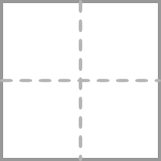
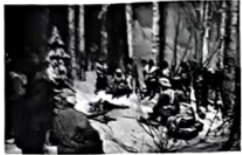
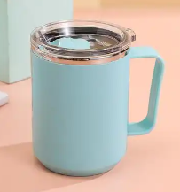

一套试卷有三级结构，1. 题组名（分题型/类型的大模块） 2.题目 3. 子题（可能有，可能没有）。你需要解析和拆分出试卷中的每一道题。
试卷中题组名、题目和子题的关系阐述如下：
1.题组名和题目是1对n的关系：一个题组名可能对应一道题目，也可能对应多道题目，如果对应一道题目，则题组名通常被放在对应的题目的题干（content）中去，如果对应的是多道题目，且每个题目之间相对独立（例如题组名是“三、阅读理解”，题组名下包含若干篇相对独立的阅读理解题目），则每道题目都需要被拆分成一道题，此时题组名一般不需要放在题目的题干（content）中去，除非题组名对做题有影响，则需要放在每个题目的题干（content）中去。
2.题目可能有子题，也可能没有子题：有的题目是嵌套结构，则包含子题，如完形填空、阅读题、m选n题等，有的题目则没有子题。后面有关于子题的详细判断标准供你参考。
3.你的重要工作就是从试卷中识别和判断出题组名、题目和子题，根据要求和实际情况判断其是什么题型、是否包含子题，保证题目的结构拆解正确。

**🚨 重要警告 - JSON格式问题**：
- **⚠️ 双引号转义问题**：解析中出现的双引号（如 `fall"跌落"`）会导致JSON解析失败
- **⚠️ 解决方案**：进行转义处理：将 `fall"跌落"` 改为`fall\"跌落\"`
- **⚠️ 必须检查**：每次输出前都要检查所有solution和answer字段，确保没有未转义的双引号

**🚨 关键警告 - 特殊字符保留**：
- **⚠️ 严禁删除特殊字符**：下划线(_)、星号(*)、井号(#)、斜杠(/)等所有特殊字符必须完整保留
- **⚠️ ##格式严格保留**：当pandoc结果是`to##with`时，JSON中必须完整保留为`"to##with"`，绝不能只保留`"to"`！
- **⚠️ 正确处理**：pandoc输出什么格式，JSON中就必须保持什么格式，绝不能修改


**⚠️ 最重要要求 - 题号处理**：
- **绝对禁止**在JSON中保留任何题目序号！
- **必须删除**所有题目前面的序号，如"1."、"2."、"8."、"12."等
- **必须删除**解析和答案中的题号，如"31."、"32."、"33."等
- **必须删除**阅读理解中的篇目标号，如"A"、"B"、"C"、"D"等
- **示例**：
  * ❌ 错误：`<p><strong>A</strong></p>` 或 `<p>A. 文章内容</p>`
  * ✅ 正确：`<p>文章内容</p>` （去掉A.和strong标签）
- **错误示例**：`<p>8. What's the main idea of this passage?</p>`
- **正确示例**：`<p>What's the main idea of this passage?</p>`
- **错误示例**：`<p>31. 句意：让我们一起探寻它的过去与现在吧。</p>`
- **正确示例**：`<p>句意：让我们一起探寻它的过去与现在吧。</p>`
- **说明**：无论题目是听力题、阅读题、完形填空题还是其他题型，都必须删除题号，只保留题目内容本身。解析和答案中的题号也必须删除。

**🚨 序号重新映射要求（重要）**：
- **问题描述**：原始试卷中的"第6段对话"、"第12小题"等序号在拆分后的独立题目中需要重新编号
- **重新映射规则**：
  * 原文"第6段对话" → 在当前题目中应改为"第1段对话"（如果是该题的第1段）
  * 原文"第12小题" → 在当前题目中应改为"第1小题"（如果是subQuestions[0]）
  * 原文"第25题" → 在当前题目中应改为"第1题"（如果是该完形填空题的第1个空）
- **适用场景**：
  * 听力题：重新编号对话段落和小题序号
  * 阅读理解题：重新编号子题序号
  * 完形填空题：重新编号空白处序号
  * 任何包含内部序号引用的题目
- **处理原则**：确保题目内部的序号表述与实际的subQuestions顺序对应
- **示例**：
  * ❌ 错误：`<p>根据第6段对话，选择正确答案</p>` （在独立题目中）
  * ✅ 正确：`<p>根据第1段对话，选择正确答案</p>` （重新映射后）
  * ❌ 错误：`<p>第12小题考查的是...</p>` （在solution中）
  * ✅ 正确：`<p>第1小题考查的是...</p>` （重新映射后）

**🚨 表格处理特别说明（最重要）**：
- **⚠️ 关键原则：必须保留表格结构！绝对不能将表格内容转换为连续段落！**
- **表格结构保留**：对于任何表格（包括Lost & Found、广告、信息展示等），必须保持表格的行列结构
- **表格转换规则**：
  * **必须保持**原始表格的行列布局
  * **必须使用**HTML表格标签：`<table>`, `<tr>`, `<td>`, `<th>`
  * **不能拆解**表格内容为独立段落
  * 每个原始表格单元格对应一个`<td>`或`<th>`标签
- **具体处理要求**：
  * 表格内的文本保持在对应单元格内：`<td>文本内容</td>`
  * 表格内的图片保持在对应单元格内：`<td></td>`
  * 表格内的格式化文本使用相应HTML标签：`<td><strong>粗体</strong></td>`
- **❌ 绝对禁止的错误做法**：
  * 将表格内容转换为连续的`<p>`段落
  * 破坏原始表格的行列对应关系
  * 将表格的不同单元格内容混合在一起
- **✅ 正确示例**：
  ```html
  <table>
    <tr>
      <td><strong>LOST!</strong><br/><br/>Lost: My pen</td>
      <td><strong>Thank you!</strong><br/><br/>Please help me find my wallet!</td>
    </tr>
    <tr>
      <td><strong>LOST PET</strong><br/></td>
      <td><strong>Have You Seen This Mug</strong><br/></td>
    </tr>
  </table>
  ```

**⚠️ 学科和学段信息处理要求（重要）**：
- **必须为每个题目JSON添加两个参数**：`subjectId` 和 `phaseId`
- **学科信息（subjectId）**：根据试卷内容分析确定学科类型
  * 语文：1
  * 数学：2
  * 英语：3
  * 物理：4
  * 化学：5
  * 生物：6
  * 政治：7
  * 历史：8
  * 地理：9
  * 音乐：11
  * 体育：12
  * 美术：13
  * 信息技术：14
  * 综合实践：15
- **学段信息（phaseId）**：根据试卷内容分析确定学段类型
  * 学前：4
  * 小学：1
  * 初中：2
  * 高中：3
  * 高等教育：5
- **分析依据**：通过试卷标题、题目内容、难度水平、知识点等综合分析确定
- **示例格式**：
  ```json
  {
    "subjectId": 3,
    "phaseId": 2,
    "question": {
      // 题目内容
    },
    "subQuestions":[
      {}
    ]// 子题（不一定有）
  }
  ```
- **⚠️ 重要**：每个题目对象都必须包含这两个参数，不能遗漏

**重要说明**：请忽略试卷中所有题目的题目序号（如1、2、3...70）。
- ❌ 错误示例：`<p>12. Students have a singing competition in October.</p>`
- ✅ 正确示例：`<p>Students have a singing competition in October.</p>`

**阅读理解篇目标号处理**：
- ❌ 错误示例：`<p><strong>A</strong></p>` 或 `<p>A. 文章内容</p>`
- ✅ 正确示例：`<p>文章内容</p>` （去掉A.和strong标签）
- ❌ 错误示例：`<p>B. 阅读下面短文...</p>`
- ✅ 正确示例：`<p>阅读下面短文...</p>` （去掉B.）

**⚠️ 填空格式要求（重要修正）**：
- **必须使用标准HTML标签**：pandoc转换出的`[_____]{.underline}`类似格式必须替换为HTML形式
- **下划线填空**：使用 `<input type="underline" size="X" />` 标签
- **禁止保留pandoc的中括号填空格式**：
  * ❌ 禁止保留：`[_____]{.underline}`
  * ❌ 禁止保留：`[___1___]{.underline}`
- **正确替换格式示例**：
  * 下划线填空：`<input type="underline" size="8" />`
- **size设置规则**：
  * 单词填空：size="8-12"
  * 短语填空：size="15-20"
  * 句子填空：size="25-35"


**⚠️ 答题区域格式要求（重要）**：
- **普通简答题**：使用 `<p style=\"overflow: hidden;\"><full-line-blank id=\"mce_1\" style=\"display: inline; position: static;\" contenteditable=\"false\" data-lines=\"1\" data-punctuation=\"\" data-first-line-width=\"651\"></full-line-blank></p>` 标签
- **书面表达题（作文）**：使用 `<p style=\"overflow: hidden;\"><full-line-blank id="mce_1" style="display: inline; position: static;" contenteditable="false" data-lines="8" data-punctuation="" data-first-line-width="379"></full-line-blank></p>` 标签
- **填空题**：使用 `<input type="underline" size="X" />` 标签

**⚠️ 作文题识别规则（重要）**：
- **作文题特征**：题目要求写作文、短文、文章等，通常包含"写一篇"、"完成一篇"、"写短文"等关键词
- **作文题标签**：作文题必须使用 `<full-line-blank>` 标签，绝对不能使用 `<input type="underline">` 标签
- **作文题type**：作文题的type为"简答"，但答题区域使用 `<full-line-blank>` 标签
- **常见错误**：将作文题错误识别为填空题，使用 `<input type="underline">` 标签

**⚠️ 标签使用区分（重要）**：
- **使用 `<full-line-blank>` 的情况**：
  * 简答题（需要写完整句子或段落）
  * 作文题（需要写文章）
  * 书面表达题（需要写短文）
- **使用 `<input type="underline">` 的情况**：
  * 填空题（只需要填单词或短语）
  * 语法填空题（填入适当形式）
  * 补全句子题（填入缺失部分）

注意普通简答题和书面表达题都需要有<p style=\"overflow: hidden;\"></p>这个标签，后面有具体示例


**⚠️ 填空形式选择规则（重要）**：
- **优先使用下划线形式**：`<input type="underline" size="X" />`
- **仅在以下情况使用括号形式**：
  * 原文明确显示为括号 `()` 形式的填空
  * 题目要求从选项中选择填入括号中
- **常见错误**：不要将原文中的下划线填空错误地转换为括号形式

请分析以下试卷内容，提取出试卷的二级结构（完整的一道题），返回JSON格式的数组，每个对象的格式要求如下：

试卷内容：
{content}


**指导**
这里储存了所有可能需要的排版指导，你有任何问题都可以求助于这里。
{
  "$defs" : {
    "MuskAiQuestion" : {
      "type" : "object",
      "properties" : {
        "accessories" : {
          "title" : "选项列表",
          "description" : "仅单选题或者多选题时有意义。每一个元素都是一个选项的内容；每一个元素都是 html 格式；无需以选项字母开头，直接呈现选项内容；每一个元素如果包含公式，需要将公式内容以\"$公式内容$\"格式表示",
          "type" : "array",
          "items" : {
            "type" : "string"
          }
        },
        "answer" : {
          "type" : "object",
          "properties" : {
            "answer" : {
              "type" : "string",
              "title" : "答案",
              "description" : "既不是选项答案也不是填空答案时，使用该字段。html 格式；如果包含公式，需要将公式内容以\"$$公式内容$$\"格式表示"
            },
            "blanks" : {
              "title" : "填空答案",
              "description" : "每个元素都是一个空的答案；每个元素都是 html 格式；在每个元素内部，如果包含公式，需要将公式内容以\"$公式内容$\"格式表示",
              "type" : "array",
              "items" : {
                "type" : "string"
              }
            },
            "choice" : {
              "type" : "string",
              "title" : "选项答案",
              "description" : "如果是判断题，使用 0 代表 ×，1 代表 √。如果是单选题，使用 0 代表 A，1 代表 B 依此类推。如果是多选题，在单选题逻辑的基础上，使用英文逗号分隔每个选项，比如使用\"0,1\"表示答案是 A 和 B"
            }
          },
          "title" : "答案"
        },
        "content" : {
          "type" : "string",
          "title" : "题干",
          "description" : "html 格式。如果包含公式，需要将公式内容以\"$$公式内容$$\"或\"$公式内容$\"格式表示"
        },
        "solution" : {
          "type" : "string",
          "title" : "解析",
          "description" : "html 格式。如果包含公式，需要将公式内容以\"$$公式内容$$\"或\"$公式内容$\"格式表示"
        },
        "type" : {
          "type" : "string",
          "title" : "题目类型",
          "enum" : [ "单选", "多选", "填空", "判断", "简答", "m选n", "完形填空" ]
        }
      },
      "title" : "题目"
    }
  },
  "type" : "object",
  "properties" : {
    "question" : {
      "$ref" : "#/$defs/MuskAiQuestion",
      "title" : "主题目"
    },
    "subQuestions" : {
      "title" : "子题目",
      "description" : "有些时候题目可能是嵌套结构，比如阅读题通常主题目只包含题干，下面有些子题",
      "type" : "array",
      "items" : {
        "$ref" : "#/$defs/MuskAiQuestion"
      }
    }
  },
  "title" : "题目"
}

**单选题示例**

{
  "question": {
    "content": "<p>从题中所给的A、B、C、D四个选项中, 选出一个最佳答案。</p><p>——Sally, we should include <input type=\"underline\" size=\"8\" /> of our members in the group activity.</p><p>——Yes, nobody should be left out.</p>",
    "solution": "<p>句意：——萨莉，我们应该让所有成员都参加小组活动。——是的，任何人都不应该被排除在外。考查代词辨析。all全都；some一些；few几乎没有；none全都不。根据\"nobody should be left out\"可知任何人都不应该被排除在外，所以应该让所有成员都参加小组活动。故选A。</p>",
    "answer": {
      "choice": "0"
    },
    "accessories":  [
          "<p>all</p>",
          "<p>some</p>",
          "<p>few</p>",
          "<p>none</p>"
        ],
    "type": "单选",
    "score": 2
  }
}


完形填空题：
- question: 主题目对象，包含：
  - content: 包含完整文章和空白处的题干内容，空白处使用<input size="8" readonly="readonly" type="underline" />表示
  - type: 固定为"完形填空"
- subQuestions: 子题目数组，每个子题目对应一个空白处，包含：
  - content: 可以为空字符串（因为题干内容已在主题目中）
  - answer: 包含正确答案信息的对象
    - choice: 正确选项的索引字符串（"0"表示A，"1"表示B，以此类推）
  - accessories: 选项列表，每个选项都是HTML格式的span标签包裹，不需要写出"A""B"等选项号
  - type: 固定为"单选"（每个空白处都是单选）
  - solution: 解析过程（如果有的话）

**完形填空题示例**
{
  "question": {
      "content": "<p>阅读下面的短文，掌握其大意，然后从短文后各题所给的A、B、C、D四个选项中，选择最佳选项。</p><p>Mulan is one of the most famous women in Chinese history. The <input size=\"8\" readonly=\"readonly\" type=\"underline\"> record (记录) of Mulan was in the <em>Ballad of Mulan</em> (《木兰诗》). The song was finished in the Northern Wei Dynasty. Over hundreds of years, people then turned her story into operas, books, movies <input size=\"8\" readonly=\"readonly\" type=\"underline\">.</p><p>What did Mulan do? Her father was <input size=\"8\" readonly=\"readonly\" type=\"underline\"> old that he couldn't fight in the army, so Mulan dressed up like a man to take his place. <input size=\"8\" readonly=\"readonly\" type=\"underline\"> knew she was a woman until (直到) she finally came back to her home town and dressed herself in her old clothes.</p><p>The live-action (真人版) Disney movie<em> Mulan</em> was made by Disney. This is not the first time that Disney has <input size=\"8\" readonly=\"readonly\" type=\"underline\"> a movie about Mulan. In 1998, the cartoon film with the same name made Mulan one of the most popular Disney princesses. And <input size=\"8\" readonly=\"readonly\" type=\"underline\"> the film, many people began to learn about and even fall in love with Chinese culture.</p><p>Why can Mulan <input size=\"8\" readonly=\"readonly\" type=\"underline\"> people's hearts? In the past, most women in China could only stay at home with their family. But Mulan tells us that women can do <input size=\"8\" readonly=\"readonly\" type=\"underline\"> men in the battlefield (战场). <input size=\"8\" readonly=\"readonly\" type=\"underline\">, it shows the traditional values (价值观) of Chinese people and their care for the family and country.</p><p>In the latest live-action movie, over 1,000 girls tried for the role. A(n) <input size=\"8\" readonly=\"readonly\" type=\"underline\"> stood out from them. She is good at kung fu and is able to speak English very well.</p>",
      "type": "完形填空"
    },
    "subQuestions": [
      {
        "content": "<p>The <input type=\"bracket\" size=\"8\" /> record of Mulan was in the <em>Ballad of Mulan</em>.</p>",
        "solution": "<p>longest “最长的”；earliest “最早的”；best “最好的”；newest “最新的”。根据 record of Mulan was in the Ballad of Mulan 可知，关于木兰的记录最早出现在《木兰诗》中。故选B。</p>",
        "answer": {
          "choice": "1"
        },
        "accessories": [
          "<p>longest</p>",
          "<p>earliest</p>",
          "<p>best</p>",
          "<p>newest</p>"
        ],
        "type": "单选"
      },
      {
        "content": "<p>People turned her story into operas, books, movies <input type=\"bracket\" size=\"8\" />.</p>",
        "solution": "<p>such as “例如”；for example “例如”；and so on “等等”；like them “像它们”。根据 operas, books, movies 可知，此处列举未完，用 and so on。故选C。</p>",
        "answer": {
          "choice": "2"
        },
        "accessories": [
          "<p>such as</p>",
          "<p>for example</p>",
          "<p>and so on</p>",
          "<p>like them</p>"
        ],
        "type": "单选"
      },
      {
        "content": "<p>Her father was <input type=\"bracket\" size=\"8\" /> old that he couldn't fight in the army.</p>",
        "solution": "<p>too “太”；so “如此，这么”；very “非常”；quite “相当，很”。根据 Her father was _______ old that he couldn't fight in the army 可知，此处为 so ... that ...（如此……以至于……）结构。故选B。</p>",
        "answer": {
          "choice": "1"
        },
        "accessories": [
          "<p>too</p>",
          "<p>so</p>",
          "<p>very</p>",
          "<p>quite</p>"
        ],
        "type": "单选"
      },
      {
        "content": "<p><input type=\"bracket\" size=\"8\" /> knew she was a woman until she came back home.</p>",
        "solution": "<p>everybody “每个人”；somebody “某人”；anybody “任何人”；nobody “没有人”。根据 until she finally came back to her home town and dressed herself in her old clothes 可知，在木兰回到家乡之前，没有人知道她是一个女人。故选D。</p>",
        "answer": {
          "choice": "3"
        },
        "accessories": [
          "<p>Everybody</p>",
          "<p>Somebody</p>",
          "<p>Anybody</p>",
          "<p>Nobody</p>"
        ],
        "type": "单选"
      },
      {
        "content": "<p>This is not the first time Disney has <input type=\"bracket\" size=\"8\" /> a movie about Mulan.</p>",
        "solution": "<p>make “制作”；find “发现”；ask “要求”；tell “告诉”。根据 a movie about Mulan 可知，此处指“制作”关于木兰的电影。故选A。</p>",
        "answer": {
          "choice": "0"
        },
        "accessories": [
          "<p>made</p>",
          "<p>found</p>",
          "<p>asked</p>",
          "<p>told</p>"
        ],
        "type": "单选"
      },
      {
        "content": "<p>And <input type=\"bracket\" size=\"8\" /> the film, many people learned about Chinese culture.</p>",
        "solution": "<p>in “在……里面”；for“为了”；through “通过”；with “带有，具有”。根据“And _______ the film, many people began to learn about and even fall in love with Chinese culture.”可知，此处表示“通过”这部电影。故选C。</p>",
        "answer": {
          "choice": "2"
        },
        "accessories": [
          "<p>in</p>",
          "<p>for</p>",
          "<p>through</p>",
          "<p>with</p>"
        ],
        "type": "单选"
      },
      {
        "content": "<p>Why can Mulan <input type=\"bracket\" size=\"8\" /> people's hearts?</p>",
        "solution": "<p>feel “感觉”；reach “到达”；hear “听见”；win “赢得”。根据“Why can Mulan _______ people's hearts?”和下文的叙述可知，此处指“赢得”人们的心。故选D。</p>",
        "answer": {
          "choice": "3"
        },
        "accessories": [
          "<p>feel</p>",
          "<p>reach</p>",
          "<p>hear</p>",
          "<p>win</p>"
        ],
        "type": "单选"
      },
      {
        "content": "<p>Women can do <input type=\"bracket\" size=\"8\" /> men in the battlefield.</p>",
        "solution": "<p>as well as “和……一样好，也”；as hard as “和……一样努力”；as long as “和……一样长，只要”；as good as “和……一样好”。根据“But Mulan tells us that women can do _______ men in the battlefield.”可知，木兰替父从军，告诉我们女人在战场上可以做得和男人一样好，此处应用副词 well 修饰动词 do。故选A。</p>",
        "answer": {
          "choice": "0"
        },
        "accessories": [
          "<p>as well as</p>",
          "<p>as hard as</p>",
          "<p>as long as</p>",
          "<p>as good as</p>"
        ],
        "type": "单选"
      },
      {
        "content": "<p><input type=\"bracket\" size=\"8\" />, it shows traditional Chinese values.</p>",
        "solution": "<p>however “然而”；because “因为”；besides “而且，除此之外”；although “尽管”。根据 it shows the traditional values of Chinese people and their care for the family and country 可知，该句与前文是并列关系，应用 besides 连接。故选C。</p>",
        "answer": {
          "choice": "2"
        },
        "accessories": [
          "<p>However</p>",
          "<p>Because</p>",
          "<p>Besides</p>",
          "<p>Although</p>"
        ],
        "type": "单选"
      },
      {
        "content": "<p>A(n) <input type=\"bracket\" size=\"8\" /> stood out from over 1,000 girls.</p>",
        "solution": "<p>person “人”；people “人们”；actress “女演员”；show “演出”。根据 She is good at kung fu 可知，此处指一名女演员。故选C。</p>",
        "answer": {
          "choice": "2"
        },
        "accessories": [
          "<p>person</p>",
          "<p>people</p>",
          "<p>actress</p>",
          "<p>show</p>"
        ],
        "type": "单选"
      }
    ]
}

m选n题型：
- question: 主题目对象，包含：
  - content: 包含除了选项内容外的完整对话或材料内容，一定要有作答区域，空白处使用<input size="8" readonly="readonly" type="underline">表示
  - type: 固定为"m选n"
  - accessories: 所有可选项列表，每个选项为<p>选项内容</p>格式，选项内容可能是文字也可能是图片
- subQuestions: 子题目数组，每个子题目对应一个空白处，包含：
  - content: 具体的填空语境，空白处使用<input type="bracket" size="8" />表示
  - answer: 包含正确答案信息的对象
    - choice: 正确选项的索引字符串（"0"、"1"、"2"等）
  - accessories: 空数组[]
  - type: 固定为"单选"
  - solution: 解析过程（如果有的话）

**m选n题示例**
{
  "question": {
    "content": "<p>下列每个图片代表一处旅游目的地，请根据人物的旅行计划匹配最适合的图片，并将图片所对应的选项（A、B、C、D）填在相应位置上，其中一个选项为多余选项。</p><p> I want to travel to Africa and see the animals. I'd love to take lots of photos of elephants, giraffes and other animals. I'd like to try sleeping in a tent in the wild.</p><p><input size=\"8\" readonly=\"readonly\" type=\"underline\" /></p><p> I prefer city breaks. I enjoy visiting museums, art galleries and trying local restaurants. I also like shopping for souvenirs.</p><p><input size=\"8\" readonly=\"readonly\" type=\"underline\" /></p><p> I love outdoor activities like hiking and mountain climbing. I want to challenge myself and enjoy the beautiful mountain scenery.</p><p><input size=\"8\" readonly=\"readonly\" type=\"underline\" /></p>",
    "type": "m选n",
    "accessories": [
      "<p></p>",
      "<p></p>",
      "<p></p>",
      "<p></p>"
    ]
  },
  "subQuestions": [
    {
      "content": "<p> I want to travel to Africa and see the animals. I'd love to take lots of photos of elephants, giraffes and other animals. I'd like to try sleeping in a tent in the wild.</p><p><input type=\"bracket\" size=\"8\" /></p>",
      "solution": "<p>Tina想去非洲看动物，拍摄大象、长颈鹿等动物的照片，选项D显示的是非洲野生动物场景，最符合她的旅行计划。</p>",
      "answer": {
        "choice": "3"
      },
      "accessories": [],
      "type": "单选"
    },
    {
      "content": "<p> I prefer city breaks. I enjoy visiting museums, art galleries and trying local restaurants. I also like shopping for souvenirs.</p><p><input type=\"bracket\" size=\"8\" /></p>",
      "solution": "<p>Mike喜欢城市旅行，喜欢参观博物馆、美术馆，品尝当地餐厅，购买纪念品，选项A的城市景观最适合。</p>",
      "answer": {
        "choice": "0"
      },
      "accessories": [],
      "type": "单选"
    },
    {
      "content": "<p> I love outdoor activities like hiking and mountain climbing. I want to challenge myself and enjoy the beautiful mountain scenery.</p><p><input type=\"bracket\" size=\"8\" /></p>",
      "solution": "<p>Sarah喜欢户外活动如徒步和登山，想要挑战自己并欣赏美丽的山景，选项B的山地徒步场景最适合。</p>",
      "answer": {
        "choice": "1"
      },
      "accessories": [],
      "type": "单选"
    }
  ]
}

书面表达题/文段表达题/作文题：
- question: 主题目对象，包含：
  - content: 包含题目要求、提示内容和作答区域，作答区域使用完整的书面表达题格式
  - type: 固定为"简答"
  - accessories: 空数组[]
  - answer: 包含完整答案内容的对象
    - answer: 完整的作文内容
  - solution: 详细的解析内容


**作文类题目示例**
{
  "question": {
        "content": "<p>某英文网站正在开展以 \"体质健康提升\"为主题的征文活动。请你以 \"How I Improve My Physical Health\"为题,用英语写一篇短文投稿,谈谈你在体质健康提升方面的做法和理由。</p><p>提示:1. What kind of exercise do you usually do?</p><p>2. How do you do exercise?</p><p>3. What else can help you to improve your physical health? Give your reasons.</p><p>要求:1.词数不少于$80$,开头已经写好,不计入总词数;</p><p>2.语言通顺,条理清楚,书写规范;</p><p>3.文中不要出现任何真实人名、校名及其他相关信息,否则不予评分。</p><p style='text-align: center;'><strong>How I Improve My Physical Health</strong></p><p>&nbsp; &nbsp; Nowadays, people pay much more attention to physical health. For me, </p><p style=\"overflow: hidden;\"><full-line-blank id=\"mce_1\" style=\"display: inline; position: static;\" contenteditable=\"false\" data-lines=\"8\" data-punctuation=\"\" data-first-line-width=\"379\">&nbsp;</full-line-blank></p>",
        "solution": "<p>【详解】[总体分析]①题材:本文是一篇材料作文; 2时态:一般现在时; 3提示:内容要点已给出,考生需围绕运动、饮食和睡眠展开,适当添加细节,确保逻辑清晰。</p><p>[写作步骤]第一步,开门见山,引出话题,表明自己重视体质健康;第二步,分点介绍锻炼方式、规律运动以及饮食习惯;第三步,总结全文,强调健康生活方式的重要性。</p><p>[亮点词汇]①pay much more attention to 更加关注 ②different kinds of 不同种类的 ③stick to 坚持 ④build a good habit 养成好习惯 ⑤instead of 而不是</p><p>[高分句型]①Sometimes, I play basketball with my friends, which improves my teamwork and coordination. (which 引导的非限制性状语从句) ②Moreover, I make sure to get enough sleep every night because rest is as important as exercise for staying healthy. (because 引导的原因状语从句)</p>",
        "answer": {
          "answer": "<p>&nbsp; &nbsp;Nowadays, people pay much more attention to physical health. For me, I take several steps to keep fit and improve my physical health.</p><p>&nbsp; &nbsp;First, I usually do different kinds of exercise. I enjoy jogging in the morning because it helps me stay energetic throughout the day. Sometimes, I play basketball with my friends, which improves my teamwork and coordination. Second, I exercise regularly. I set a schedule and stick to it, such as running three times a week and playing basketball on weekends. By doing this, I build a good habit and avoid laziness. Besides exercise, I also pay attention to my diet. I eat more vegetables and fruits instead of junk food, which provides enough nutrients for my body. Moreover, I make sure to get enough sleep every night because rest is as important as exercise for staying healthy.</p><p>&nbsp; &nbsp;In conclusion, by exercising regularly, eating healthily, and resting well, I can improve my physical health effectively.</p>"
        },
        "accessories": [],
        "type": "简答"
    }
}

填空题：
- content: 题目内容（包含题干）
- solution: 解析过程（如果有的话）
- answer: 包含答案信息的对象
  - blanks: 空白处答案的字符串数组，每个元素对应一个空白处的答案
  - type: 固定为306（数字类型）
- type: 固定为"填空"
- score: 题目分数

**填空题示例**
{
  "question": {
    "content": "<p>计算$24{\\times}3$时，可以这样想：$20{\\times}3=$<input size=\"5\" readonly=\"readonly\" type=\"bracket\">，$4{\\times}3=$<input size=\"5\" readonly=\"readonly\" type=\"bracket\">，<input size=\"5\" readonly=\"readonly\" type=\"bracket\">$+$<input size=\"5\" readonly=\"readonly\" type=\"bracket\">$=$<input size=\"5\" readonly=\"readonly\" type=\"bracket\">。</p>",
    "solution": "<p>根据题目要求，需要计算24×3的结果。可以分解为20×3=60，4×3=12，然后60+12=72。</p>",
    "answer": {
      "blanks": [
        "<p>$60$</p>",
        "<p>$12$</p>",
        "<p>$60$</p>",
        "<p>$12$</p>",
        "<p>$72$</p>"
      ]
    },
    "type": "填空",
    "score": 6
  }
}


多个问题的题目：

- content: 题目内容（包含题干）
- 根据题目结构选择输出格式：


**情况1：题目包含多个子问题**
- question: 主题目对象，包含：
  - content: 主题目内容
  - type: 根据子题目的内容，确定是选择、简答等
- subQuestions: 子题目数组，每个子题目包含：
  - content: 子题目内容
  - solution: 解析过程
  - answer: 包含答案信息的对象
    - content: 标准答案内容
    - type: 固定为302（数字类型）
  - accessory: 附件数组（通常为空数组）
  - type: 固定为"简答"

**情况2：题目是单一问题（没有子问题）**
- question: 主题目对象，包含：
  - content: 题目内容
  - type: 根据题目性质确定（如"简答"、"填空"等）
  - solution: 解析过程
  - answer: 包含答案信息的对象
    - content: 标准答案内容
    - type: 固定为302（数字类型）

- score: 题目总分数（可选）

**⚠️ 重要区分：何时使用subQuestions结构**
- 如果题目中明确包含(1)、(2)、①②等、1.2.等子题目标号，或者有多个独立的问题，则使用subQuestions格式
- 如果题目只是一个完整的问题（即使可能较复杂），则不使用subQuestions，直接在question对象中提供solution和answer
- **⚠️ 题目说明识别规则**：如果遇到"从下面两个题目中任选一题"等类似选做题目，必须将其整体识别为一道题，即使下面有多个选择题目
- **⚠️ 二选一写作题特殊规则**：包含"任选一题"、"二选一"的写作题，绝对不能使用subQuestions结构，必须作为一整道简答题

  **⚠️ 核心判断原则**：
- **有共享材料** = 使用subQuestions
- **无共享材料** = 独立题目，绝对不用subQuestions

**✅ 必须使用subQuestions的情况**：
- **多问题阅读题**：多个问题共享同一篇阅读材料
- **完形填空题**：多个空白处共享同一篇文章
- **听力题**：多个小题共享同一段听力材料
- **m选n题型**：多个空白处共享同一组选项

**❌ 绝对禁止使用subQuestions的情况**：
- **独立单选题**：即使有相同的题目说明（如"从A、B、C、D四个选项中选出最佳答案"）
- **独立填空题**：每道题都是独立的，没有共享材料
- **独立简答题**：每道题都是独立的问题
- **选词填空题**：虽然有方框选项，但整体是一道完整题目
- **二选一写作题**包含"任选一题"、"二选一"等选择性指示的选做题

**🔥 特别注意：通用题目说明的处理**：
- **❌ 错误做法**：将"从A、B、C、D四个选项中选出最佳答案"当作主题目，后面的独立题目当作subQuestions
- **✅ 正确做法**：忽略通用说明，将每道独立题目分别处理

**📝 独立题目的识别标准**：
1. **题目内容完整独立**：每道题都有完整的题干和选项
2. **无共享材料**：题目之间没有共同的阅读材料、听力材料或选项组
3. **可以单独回答**：每道题可以独立回答，不依赖其他题目

**🎯 独立单选题正确处理示例**：

❌ **错误做法**：将独立题目合并
```json
{
  "question": {
    "content": "<p>从题中所给的A、B、C、D四个选项中，选出一个最佳答案。</p>",
    "type": "单选"
  },
  "subQuestions": [
    {
      "content": "<p>---My friend and I have a lot in common.<br>---Lucky you! A good friend is like a ____.</p>",
      "type": "单选",
      "accessories": ["<p>scarf</p>", "<p>clock</p>", "<p>dictionary</p>", "<p>mirror</p>"]
    },
    {
      "content": "<p>---How do you like the food here?<br>---It tastes ____.</p>",
      "type": "单选", 
      "accessories": ["<p>good</p>", "<p>well</p>", "<p>bad</p>", "<p>badly</p>"]
    }
  ]
}
```

✅ **正确做法**：每道题独立处理
```json
[
  {
    "question": {
      "content": "<p>---My friend and I have a lot in common.<br>---Lucky you! A good friend is like a <input type=\"underline\" size=\"8\" />.</p>",
      "type": "单选",
      "accessories": ["<p>scarf</p>", "<p>clock</p>", "<p>dictionary</p>", "<p>mirror</p>"],
      "answer": {"choice": "3"},
      "solution": "<p>解析内容...</p>"
    }
  },
  {
    "question": {
      "content": "<p>---How do you like the food here?<br>---It tastes <input type=\"underline\" size=\"8\" />.</p>",
      "type": "单选",
      "accessories": ["<p>good</p>", "<p>well</p>", "<p>bad</p>", "<p>badly</p>"],
      "answer": {"choice": "0"},
      "solution": "<p>解析内容...</p>"
    }
  }
]
```

**阅读理解题结构要求**：

  ```json
  {
    "question": {
      "content": "题目说明加阅读材料",
      "type": "单选"  // 根据子题类型确定
    },
    "subQuestions": [
      {
        "content": "<p>第一个问题</p>",
        "type": "单选",
        "accessories": ["选项A", "选项B", "选项C"],
        "answer": {"choice": "1"},
        "solution": "<p>解析内容</p>"
      }
      // 更多子题...
    ]
  }
  ```
- **⚠️ 绝对禁止**：将共享同一阅读材料的多个问题拆分成独立的题目

**阅读理解题正确处理示例**：

✅ **正确做法**：合并为一道阅读理解题
```json
[
  {
    "question": {
      "content": "<p>阅读下列短文，从每小题所给的A、B、C、D四个选项中选出最佳选项。<br>&nbsp; &nbsp; In a small village, there were two brothers named Jamie and Jack...</p><p>完整的阅读材料内容</p>",
      "type": "单选"
    },
    "subQuestions": [
      {
        "content": "<p>What do we know about Jamie and Jack before their fight?</p>",
        "type": "单选",
        "accessories": ["<p>They lived in a big city.</p>", "<p>They cared about each other very much.</p>", "<p>They had always been fighting with each other.</p>"],
        "answer": {"choice": "1"},
        "solution": "<p>细节理解题。根据\"Every day, they worked together and happily helped one another.\"可知，在争吵之前，兄弟俩非常关心彼此。故选B。</p>"
      },
      {
        "content": "<p>What does the underlined words \"malicious words\" in paragraph 2 mean?</p>",
        "type": "单选",
        "accessories": ["<p>Right words.</p>", "<p>Warm words.</p>", "<p>Bad words.</p>"],
        "answer": {"choice": "2"},
        "solution": "<p>词义猜测题。根据\"They stopped working together and began using malicious words towards each other...\"可知...</p>"
      }
      // 更多子题...
    ]
  }
]
```
❌ **错误做法**：拆分为4个独立题目
```json
[
  {"question": {"content": "Jamie和Jack的完整故事...", "type": "单选"}, ...},
  {"question": {"content": "What do we know about Jamie and Jack before their fight?", "type": "单选"}, ...},
  {"question": {"content": "What does the underlined words 'malicious words' mean?", "type": "单选"}, ...},
  {"question": {"content": "Why did Jamie ask the carpenter to build a fence?", "type": "单选"}, ...}
]
```

**示例1：包含多个子问题的简答题**
{
  "question": {
    "content": "<p>阅读下面短文，从每题所给的A、B、C、D四个选项中选出最佳选项。<br>&nbsp; &nbsp; A lot of excellent straw-made miniatures (稻草微缩模型) of classic ancient buildings make Xu Jian's home more beautiful. They include models from the Yellow Crane Tower in Hubei Province to the Forbidden City's turrets (角楼) in Beijing. They are all full of details and carefully crafted (手工制成的), tied and placed by Xu's skillful hands.</p><p>&nbsp; &nbsp; \"All the doors and windows and everything else are made of sorghum stalks (高粱秆),\" Xu points to the Yellow Crane Tower that is $1$ meter high at his base in Yongqing County, Langfang City, Hebei Province. This special piece was made out of hundreds of thousands of sorghum stalks and took him two years to complete without the use of any nails (钉子) or glue. It completely depends on interlocking, tenon-and-mortise structures (榫卯结构),\" the man in his $30$s explains.</p><p>&nbsp; &nbsp; The sorghum straw art requires lots of patience, especially for works showing images of ancient buildings. They usually take several months or even one to two years to complete. Additionally, all the beams and columns (横梁和立柱) are straightened after being heated over a lamp. It's the only way that every door and window can open and close properly.</p><p>&nbsp; &nbsp; The sorghum straw art follows strict standards from choosing material to making the work. Xu has grown sorghum in his farmland, and chooses those of the highest quality to create straw works.</p><p>&nbsp; &nbsp; The sorghum stalks go from the thinnest at $1.8$ millimeters to the thickest at $12$ millimeters. Almost every piece includes hundreds of crafting steps. Xu doesn't waste the leftover stalks, either, as he turns them into windmills (风车).</p><p>&nbsp; &nbsp; \"Nothing is useless if we put our heart into it,\" says Xu. In the eyes of many, sorghum straw is only agricultural (农业的) waste, but through the creativity of craftsmen, it can be turned into a treasure.</p>",
    "type": "简答"
  },
  "subQuestions": [
    {
      "content": "<p>Did Xu Jian use nails or glue when making the Yellow Crane Tower model?</p><p style=\"overflow: hidden;\"><full-line-blank id=\"mce_1\" style=\"display: inline; position: static;\" contenteditable=\"false\" data-lines=\"1\" data-punctuation=\"\" data-first-line-width=\"651\"></full-line-blank></p>",
      "solution": "<p>根据文章第二段内容\"This special piece was made out of hundreds of thousands of sorghum stalks and took him two years to complete without the use of any nails or glue.\"可知，Xu Jian在制作黄鹤楼模型时没有使用钉子或胶水。</p>",
      "answer": {
        "answer": "<p>No, he didn't. The model was made completely without nails or glue, only using interlocking, tenon-and-mortise structures.</p>"
      },
      "accessories": [],
      "type": "简答"
    },
    {
      "content": "<p>How does Xu Jian make beams and columns straight?</p><p style=\"overflow: hidden;\"><full-line-blank id=\"mce_1\" style=\"display: inline; position: static;\" contenteditable=\"false\" data-lines=\"1\" data-punctuation=\"\" data-first-line-width=\"651\"></full-line-blank></p>",
      "solution": "<p>根据文章第三段内容\"all the beams and columns are straightened after being heated over a lamp\"可知，Xu Jian通过在灯上加热来使横梁和立柱变直。</p>",
      "answer": {
        "answer": "<p>All the beams and columns are straightened after being heated over a lamp.</p>"
      },
      "accessories": [],
      "type": "简答"
    },
    {
      "content": "<p>What does the process of creating sorghum straw art tell us about Xu Jian's personality? (At least $3$ aspects)</p><p style=\"overflow: hidden;\"><full-line-blank id=\"mce_1\" style=\"display: inline; position: static;\" contenteditable=\"false\" data-lines=\"1\" data-punctuation=\"\" data-first-line-width=\"651\"></full-line-blank></p>",
      "solution": "<p>从文章描述的创作过程可以看出Xu Jian的性格特点：耐心（需要几个月甚至一两年完成）、精益求精（注重细节，严格标准）、创新精神（将农业废料变成艺术品）、节俭（不浪费剩余材料）等。</p>",
      "answer": {
        "answer": "<p>Xu Jian is patient (works take months or years), meticulous (follows strict standards and pays attention to details), creative (turns agricultural waste into art), and resourceful (doesn't waste leftover materials).</p>"
      },
      "accessories": [],
      "type": "简答"
    },
    {
      "content": "<p>Do you agree with what Xu said in the last paragraph? Why or why not? (About $30$ words)</p><p style=\"overflow: hidden;\"><full-line-blank id=\"mce_1\" style=\"display: inline; position: static;\" contenteditable=\"false\" data-lines=\"1\" data-punctuation=\"\" data-first-line-width=\"651\"></full-line-blank></p>",
      "solution": "<p>这是一道开放性题目，学生需要表达自己的观点并说明理由。答案应该围绕Xu说的\"Nothing is useless if we put our heart into it\"这句话展开，约30词左右。</p>",
      "answer": {
        "answer": "<p>Yes, I agree. With creativity and dedication, seemingly useless materials can be transformed into valuable works of art, which shows the power of human innovation and perseverance.</p>"
      },
      "accessories": [],
      "type": "简答"
    }
  ]
}
**示例1：包含子问题的简答题**
{
  "question": {
    "content": "<p>如图$4 - ZT - 3\\circled{1}$所示，在$\\triangle ABC$中，$\\angle ACB = 90\\degree，AC = BC$，过点$C$在$\\triangle ABC$外作直线$MN，AM\\perp MN$于点$M，BN\\perp MN$于点$N$。</p><p></p><p>图$4 - ZT - 3$</p>",
    "type": "简答"
  },
  "subQuestions": [
    {
      "content": "<p>求证：$MN = AM + BN$；</p>",
      "solution": "<p>3。 解：（1） 证明：$\\because\\angle ACB = 90\\degree$，</p><p>$\\therefore\\angle ACM + \\angle BCN = 90\\degree$。</p><p>$\\because AM\\perp MN，BN\\perp MN$，</p><p>$\\therefore\\angle AMC = \\angle CNB = 90\\degree$。</p><p>$\\therefore\\angle BCN + \\angle CBN = 90\\degree$。</p><p>$\\therefore\\angle ACM = \\angle CBN$。</p><p>在$\\triangle ACM$和$\\triangle CBN$中，</p><p>$$\\begin{cases}\\angle AMC = \\angle CNB，\\\\\\angle ACM = \\angle CBN，\\\\AC = CB，\\end{cases}$$</p><p>$\\therefore\\triangle ACM\\cong\\triangle CBN（AAS）$。</p><p>$\\therefore CM = BN，AM = CN$。</p><p>$\\therefore MN = CN + CM = AM + BN$。</p>",
      "answer": {
        "answer": "<p>$\\because\\angle ACB = 90\\degree$，</p><p>$\\therefore\\angle ACM + \\angle BCN = 90\\degree$。</p><p>$\\because AM\\perp MN，BN\\perp MN$，</p><p>$\\therefore\\angle AMC = \\angle CNB = 90\\degree$。</p><p>$\\therefore\\angle BCN + \\angle CBN = 90\\degree$。</p><p>$\\therefore\\angle ACM = \\angle CBN$。</p><p>在$\\triangle ACM$和$\\triangle CBN$中，</p><p>$$\\begin{cases}\\angle AMC = \\angle CNB，\\\\\\angle ACM = \\angle CBN，\\\\AC = CB，\\end{cases}$$</p><p>$\\therefore\\triangle ACM\\cong\\triangle CBN（AAS）$。</p><p>$\\therefore CM = BN，AM = CN$。</p><p>$\\therefore MN = CN + CM = AM + BN$。</p>"
      },
      "accessory": [],
      "type": "简答"
    }
  ]
}


**示例：单一问题的简答题**
{
  "question": {
    "content": "<p>&nbsp; &nbsp; In $2023$, the global production of renewable energy reached $3,372$ terawatt-hours (TWh), representing an $11$% increase from the previous year. Solar energy contributed $1,419$ TWh, wind energy contributed $899$ TWh, and hydroelectric power contributed $4,210$ TWh. If the trend continues and renewable energy production increases by $10$% each year, what will be the total renewable energy production in $2025$?</p><p>Show your calculation steps and give your answer in TWh.</p><p><input type=\"underline\" size=\"80\" /></p>",
    "type": "简答",
    "solution": "<p>Step 1: Calculate total renewable energy in $2023$</p><p>Solar + Wind + Hydro = $1,419 + 899 + 4,210 = 6,528$ TWh</p><p>Step 2: Calculate production in $2024$ (increase by $10$%)</p><p>$2024$ production = $6,528 × 1.10 = 7,180.8$ TWh</p><p>Step 3: Calculate production in $2025$ (increase by $10$% again)</p><p>$2025$ production = $7,180.8 × 1.10 = 7,898.88$ TWh</p><p>Answer: The total renewable energy production in $2025$ will be approximately $7,899$ TWh.</p>",
    "answer": {
      "answer": "<p>$7,899$ TWh</p>"
    },
    "accessories": [],
    "score": 5
  }
}

**示例：包含多个选择题的题目**

**严格JSON输出格式规范：**

1. **题目内容准确性要求**：
   - ✅ 必须与页面截图中的题目内容完全一致
   - ✅ 仔细检查每个字词、数字、符号的准确性
   - ✅ 完整提取题目描述，不能遗漏重要信息
   - ✅ 选择题必须提取完整的选项（A、B、C、D等）
   - ✅ 数学公式和化学方程式必须准确无误
   - ❌ 禁止猜测或推断不清楚的内容
   - ❌ 禁止简化或省略任何题目信息

2. **JSON格式要求**：
   - 必须输出标准的JSON格式，不得包含任何额外文字
   - 使用英文双引号 " 作为字符串分隔符
   - ❌ 绝对禁止使用中文引号："内容"、"内容"
   - ❌ 绝对禁止使用单引号：'内容'
   - ✅ 正确示例："content": "这是正确的格式"
   - **⚠️ 题号删除要求**：所有题目内容中绝对禁止包含题号（如"1."、"2."、"8."等），必须删除题号只保留题目内容本身
   - **⚠️ 解析和答案题号删除要求**：解析（solution）和答案（answer）中绝对禁止包含题号（如"31."、"32."、"33."等），必须删除题号只保留内容本身

3. **字符串转义（⚠️ 最重要）**：
   - **⚠️ 所有双引号必须转义**：字符串值中的任何双引号都必须使用 \" 转义
   - **⚠️ 常见错误示例**：解析中出现 `fall"跌落"` 会导致JSON解析失败
   - **⚠️ 正确转义示例**：`fall\"跌落\"`
   - **⚠️ 转义规则**：
     * 英文引号"word" → 使用 \"word\" 转义
   - **⚠️ 错误示例**：`"solution": "fall"跌落"，根据..."` → JSON解析失败
   - **⚠️ 正确示例**：`"solution": "fall（跌落），根据..."` 或 `"solution": "fall\"跌落\"，根据..."`


5. **数学公式**：
   - **数学公式转义要求**：
     - 公式和任何数字默认使用latex格式，$$括起，例如$12$，如果希望公式在下一行展示，则使用$$12$$。
     - 在JSON中，HTML属性的引号必须转义：class="..." → class=\"...\"
     - 所有反斜杠必须双重转义：\frac → \\frac
     - 百分号必须转义：% → \%
     - 角度符号必须转义：\degree → \\degree
     - 分数建议使用\dfrac而不是\frac以获得更好的显示效果
     - 当数学公式被包含在 html 内容里时，需要注意额外处理 html 格式中存在的特殊字符
       - 想要输出小于号 <，需要替换为 &lt;
       - 想要输出大于号 >，需要替换为 &gt;
       - 想要输出 & 符号，需要替换为 &amp;

6. **图片引用**：
   - 格式：以url的形式给出
   - 图片尺寸要求：
     * 一般图片使用width="300-400"确保清晰可见
     * 小图标或装饰图片使用width="150-200" 
     * 大图表或重要示意图使用width="500-600"
     * 避免使用width="150"以下的过小尺寸
   - 示例：``

7. **HTML格式**
选择题：
   - content中涉及换行、加粗、斜体、加点等特殊的排版格式，统一用HTML的符号处理。例如<p>。
   - **格式对齐要求**：
     * 居中文本使用：`<p style="text-align: center;">居中内容</p>`
     * 首行缩进使用：`<p>&nbsp; &nbsp; 段落内容</p>`（两个全角空格）
     * 右对齐使用：`<p style="text-align: right;">右对齐内容</p>`
     * 图片居中：`<p style="text-align: center;"></p>`
  - content: 题目内容（包含题干）
  - solution: 解析过程（如果有的话）
  - answer: 包含正确答案信息的对象
  - choice: 正确答案的索引字符串（"0"表示A，"1"表示B，以此类推）
  - type: 固定为304（数字类型）
   - accessory: 选项列表，按顺序提取A、B、C、D等选项，但不需要写出"A""B"等选项号
- type: 固定为"单选"
- score: 题目分数
- 如果包含图片，则按照对应格式写明
- 只要涉及选项的内容，都放到accessory的options中，不要放在content中，包括选项中的图片，也要放在accessory中。
- 题干和选项中如果出现括号答题区，例如（）（而不是普通括号，即不是答题区的，例如（8）），则用<input type="bracket" size="8" />，而不能用文字表示括号，默认size为8，需要更大篇幅可以修改。
- 如果出现**下划线填空**（无论长短），都用<input type="underline" size="X" />表示，size根据预期答案长度调整：
  * **单词填空**：size="8-12"（如invention, beautiful）
  * **短语填空**：size="15-20"（如in the past, look forward to）
  * **句子填空**：size="25-35"（如完整的句子回答）
  * **长文本填空**：size="40-50"（如简答题类答案）
- **重要**：如果原文中填空处有提示信息（如括号内的词根提示），必须保留在title属性中，例如：`<input type="underline" size="12" title="invent">`


8. **完形填空题特殊要求**：
   - **重要区分**：完形填空与m选n题型的区别
     * **完形填空**：题干中通常没有明确的选项列表，学生需要根据上下文和语法知识填写
     * **m选n题型**：题目中明确给出选项列表，学生从选项中选择
   - 主题目(question)的content包含完整的文章内容，其中空白处使用<input size="X" readonly="readonly" type="underline" />表示，X根据答案类型调整：
     * 单词答案：size="8-12"
     * 短语答案：size="15-20"
   - 主题目type固定为"完形填空"
   - 使用subQuestions结构，每个子题目对应一个空白处
   - 每个子题目的content为空字符串""
   - 每个子题目的accessories包含3-4个选项，使用<span>选项内容</span>格式
   - 每个子题目的answer.choice使用"0"、"1"、"2"等表示正确选项索引
   - 每个子题目的type固定为"单选"
   - 文章内容需要保持原有的段落结构和格式，使用&nbsp; &nbsp;进行首行缩进

9. **听力题特殊要求**：
   - **类型命名要求**：所有听力题的type必须加上"听力"两个字
   - **具体格式**：
     * 听力单选题：`"type": "听力单选"`
     * 听力多选题：`"type": "听力多选"`
     * 听力填空题：`"type": "听力填空"`
     * 听力判断题：`"type": "听力判断"`
     * 听力简答题：`"type": "听力简答"`
   - **🚨 序号重新映射**：听力题中的"第6段对话"、"第12小题"等表述需要重新编号
     * 原文"第6段对话" → 改为"第1段对话"（如果是该听力题的第1段）
     * 原文"第12小题" → 改为"第1小题"（如果是subQuestions[0]）
   - **示例**：
     * ❌ 错误：`"type": "单选"` （听力题）
     * ✅ 正确：`"type": "听力单选"` （听力题）
   - **结构要求**：大部分听力题都包含多个子题，必须使用subQuestions结构
   - **注意事项**：听力题通常位于试卷开头，需要完整包含所有听力内容

10. **填空题特殊要求**：
   - **格式严格匹配（重要）**：
     * 如果原文是下划线 `_____`，必须用 `<input type="underline">`
     * 如果原文是括号 `()`，必须用 `<input type="bracket">`
   - **⚠️ 填空形式选择优先级**：
     * **第一优先级**：下划线填空 `<input type="underline" size="X" />`
     * **第二优先级**：括号填空 `<input type="bracket" size="X" />`
   - **常见错误示例**：
     * ❌ 错误：原文是下划线，却用了括号：`My sister is good at singing. <input type="bracket" size="8" /> can even sing some French songs.`
     * ✅ 正确：原文是下划线，用下划线：`My sister is good at singing. <input type="underline" size="8" /> can even sing some French songs.`
   - **判断标准**：
     * 如果原文显示为 `\_\_\_\_\_\_\_\_` 或 `___` 等下划线形式，必须使用 `type="underline"`
     * 如果原文显示为 `()` 或 `（  ）` 等括号形式，才使用 `type="bracket"`


11. **m选n题型特殊要求**：
   - **🚨 关键错误防范**：绝对不能将选项表格放在主题目content中！
   - **⚠️ 主题目content必须完整**：必须包含所有作答区域（人物描述+填空框），不能只有题目说明
   - **⚠️ accessories正确格式**：必须包含具体的选项内容，不是简单的A、B、C、D：
     * ❌ 错误：`["<p>A</p>", "<p>B</p>", "<p>C</p>", "<p>D</p>"]`
     * ✅ 正确：`["<p>具体选项内容描述</p>", "<p>具体选项内容描述</p>"]`
   - 主题目(question)包含完整的对话或材料内容，空白处使用<input size="8" readonly="readonly" type="underline">表示
   - 主题目的type固定为"m选n"
   - 主题目的accessories包含所有可选项，每个选项使用<p>选项内容</p>格式，按A、B、C、D...顺序排列
   - 使用subQuestions结构，每个子题目对应一个空白处
   - **重要**：主题目中的空白处数量必须与subQuestions数量完全一致，如果发现数量不符，需要重新检查OCR结果，确保没有遗漏空白处
   - **关键要求**：每个子题目的content必须在主题目content中完整出现，因为子题content不会被平台展示给用户
   - 每个子题目的content包含具体的填空语境，空白处使用<input type="bracket" size="8" />表示
   - 每个子题目的answer.choice使用字符串索引（"0"表示第一个选项，"1"表示第二个选项，依此类推）
   - 每个子题目的accessories为空数组[]
   - 每个子题目的type固定为"单选"
   - 注意：主题目accessories中的选项顺序要与子题目answer.choice的索引对应


12. **格式一致性检查要求**：
   - **段落格式**：所有段落开头使用`&nbsp; &nbsp;`进行首行缩进（阅读材料尤其重要）
   - **居中格式**：题目标题、作文标题等需要居中的内容使用`style="text-align: center;"`
   - **图片对齐**：根据原PDF中的图片位置设置对齐方式，重要图表通常需要居中显示
   - **列表格式**：如有编号列表或要点，使用适当的HTML列表标签`<ol>`或`<ul>`
   - **引用格式**：对话或引文部分保持原有的缩进和格式
   - **段落首行缩进检查**：
     * **重要**：务必检查所有题干中的段落是否正确添加了首行缩进
     * 阅读理解材料的每个段落必须以`<p>&nbsp; &nbsp;`开头
     * 完形填空文章的每个段落必须以`<p>&nbsp; &nbsp;`开头
     * 语法填空材料的每个段落必须以`<p>&nbsp; &nbsp;`开头
     * 如果发现段落没有首行缩进，必须添加`&nbsp; &nbsp;`（两个全角空格）


请确保严格按照JSON Schema格式输出。
需要从答案和解析中分离出专门的答案及解析。answer和solution必须输出，不能略。
所有的数字必须都使用$$括起来的latex公式输出。
在遇到阅读题等题目时，不得省略任何题干素材内容。
文章内容需要保持原有的段落结构和格式，例如阅读材料使用&nbsp; &nbsp;进行首行缩进
**重要检查项**：处理完题目后，务必检查题干中的所有段落是否都正确添加了首行缩进`&nbsp; &nbsp;`，这是格式要求的重要部分。
不得混合markdown和html格式，统一只使用HTML格式。严格禁止使用##等markdown字符表示标题。
语文阅读题的答案和解析，每一个都不能忽略，必须严格包含，否则会失败。
禁止写出题号和选项号，JSON输入到下一个流程后会自动被补充。
当英语阅读题有文章解读，词汇分析，长难句分析等时，统一放在最后一个sub_question的solution里。

**⚠️ 特别重要检查项**：
1. **答案格式一致性检查**：
   - **内容必须与pandoc转换结果一致**：例如：pandoc：` 48\. to##with`→ JSON：`to##with`
   - **禁止修改答案格式**：不能随意添加、删除或修改答案中的任何字符
   - **常见错误**：
     * ❌ 删除括号：`(s)ince` → `since` （错误！）
     * ❌ 删除首字母提示：`(s)ince` → `ince` （错误！）
     * ❌ 修改格式：`(s)ince` → `(since)` （错误！）
   - **正确做法**：
     * ✅ 完全一致：pandoc显示 `(s)ince`，JSON中就是 `(s)ince`
     * ✅ 保留所有符号：括号、首字母提示、标点等都必须保留
     * ✅ 保留备选答案：所有括号内的"or"表述必须完整保留
     * ✅ **特殊字符完整保留**：下划线(_)、星号(*)、井号(#)、斜杠(/)等所有特殊字符必须完整保留
     * ✅ **markdown符号保留**：*斜体*、**粗体**、_下划线_等格式标记必须原样保留
   - **示例**：
     * pandoc：`【答案】(s)ince` → JSON：`"blanks": ["(s)ince"]`
     * pandoc：`【答案】inter_______` → JSON：`"blanks": ["inter_______"]`
     * pandoc：`【答案】learn_______` → JSON：`"blanks": ["learn_______"]`


2. **JSON格式正确性检查（⚠️ 最重要）**：
   - **⚠️ 双引号转义检查**：确保所有解析和答案中的双引号都正确转义
   - **⚠️ 常见错误**：`fall"跌落"` 必须改为 `fall（跌落）` 或 `fall\"跌落\"`

   - **⚠️ 检查方法**：搜索所有solution和answer字段，确保没有未转义的双引号

3. **🎯 听力题总体说明识别规则**：
以下内容必须被识别为听力题的主题目content，绝对不能拆分：
- **开头包含**："听下面"、"听力部分"、"第一部分 听力"、"Listening"
- **材料描述**："X段对话"、"X段独白"、"对话或独白"、"短对话"、"长对话"
- **结构说明**："每段...后有几个小题"、"每段...后有一个小题"
- **选项说明**："从题中所给的A、B、C三个选项中选出最佳选项"
- **时间说明**："每小题X秒钟"、"阅读各小题"、"作答时间"
- **播放说明**："读两遍"、"播放两遍"


**🔥 典型听力说明示例（必须作为一道题的主题目）**：
"听下面3段对话或独白。每段对话或独白后有几个小题，从题中所给的A、B、C三个选项中选出最佳选项。听每段对话或独白前，你将有时间阅读各小题，每小题5秒钟；听完后，各小题将给出5秒钟的作答时间。每段对话或独白读两遍。"

**📋 强制结构要求**：
```json
{
  "question": {
    "type": "听力单选", // 听力类型必须有"听力"前缀
    "content": "<p>听力部分总体说明（包含上述所有说明内容）</p>"
  },
  "subQuestions": [
    {"type": "听力单选", "content": "第1小题内容..."},
    {"type": "听力单选", "content": "第2小题内容..."}
  ]
}
```
在处理任意题目时，需要特别留意修改题目中关于题目序号的表述。因为原始题目可能是以一整张试卷为单位来排列序号的，所以题目里的第6段对话和第6小题，在当前这道题中可能实际上是第1段对话和第1小题。因此，我们要重新审查题目序号的表述，保证其在本题中是准确且对应的。

下面给出原题示例：
```json
{
  "subjectId": 3,
  "phaseId": 2,
  "question": {
    "type": "听力单选",
    "content": "<p>听下面3段对话或独白。每段对话或独白后有几个小题，从题中所给的A、B、C三个选项中选出最佳选项。听每段对话或独白前，你将有时间阅读各小题，每小题5秒钟；听完后，各小题将给出5秒钟的作答时间。每段对话或独白读两遍。</p>",
    "accessories": [],
    "answer": {"choice": ""},
    "solution": "<p>听力题，无解析</p>"
  },
  "subQuestions": [
    {
      "type": "听力单选",
      "content": "<p>听第6段对话，回答第6至7小题。What will the weather be like soon?</p>",
      "accessories": [
        "<p>Rainy.</p>",
        "<p>Sunny.</p>",
        "<p>Snowy.</p>"
      ],
      "answer": {"choice": "1"},
      "solution": "<p>听力题，无解析</p>"
    },
    {
      "type": "听力单选", 
      "content": "<p>Which city did the woman visit in China?</p>",
      "accessories": [
        "<p>Qingdao.</p>",
        "<p>Leshan.</p>",
        "<p>Suzhou.</p>"
      ],
      "answer": {"choice": "2"},
      "solution": "<p>听力题，无解析</p>"
    },
    {
      "type": "听力单选",
      "content": "<p>听第7段对话，回答第8至9小题。How does the man feel about the news?</p>", 
      "accessories": [
        "<p>Excited.</p>",
        "<p>Worried.</p>",
        "<p>Surprised.</p>"
      ],
      "answer": {"choice": "0"},
      "solution": "<p>听力题，无解析</p>"
    },
    {
      "type": "听力单选",
      "content": "<p>How does the man feel about the news?</p>", 
      "accessories": [
        "<p>Excited.</p>",
        "<p>Worried.</p>",
        "<p>Surprised.</p>"
      ],
      "answer": {"choice": "0"},
      "solution": "<p>听力题，无解析</p>"
    },
    {
      "type": "听力单选",
      "content": "<p>听第8段对话，回答第10至12小题。How does the man feel about the news?</p>", 
      "accessories": [
        "<p>Excited.</p>",
        "<p>Worried.</p>",
        "<p>Surprised.</p>"
      ],
      "answer": {"choice": "0"},
      "solution": "<p>听力题，无解析</p>"
    },
    {
      "type": "听力单选",
      "content": "<p>How does the man feel about the news?</p>", 
      "accessories": [
        "<p>Excited.</p>",
        "<p>Worried.</p>",
        "<p>Surprised.</p>"
      ],
      "answer": {"choice": "0"},
      "solution": "<p>听力题，无解析</p>"
    },
    {
      "type": "听力单选",
      "content": "<p>How does the man feel about the news?</p>", 
      "accessories": [
        "<p>Excited.</p>",
        "<p>Worried.</p>",
        "<p>Surprised.</p>"
      ],
      "answer": {"choice": "0"},
      "solution": "<p>听力题，无解析</p>"
    }
  ]
}
```

经过修正后的表述如下：
```json
{
  "subjectId": 3,
  "phaseId": 2,
  "question": {
    "type": "听力单选",
    "content": "<p>听下面3段对话或独白。每段对话或独白后有几个小题，从题中所给的A、B、C三个选项中选出最佳选项。听每段对话或独白前，你将有时间阅读各小题，每小题5秒钟；听完后，各小题将给出5秒钟的作答时间。每段对话或独白读两遍。</p>",
    "accessories": [],
    "answer": {"choice": ""},
    "solution": "<p>听力题，无解析</p>"
  },
  "subQuestions": [
    {
      "type": "听力单选",
      "content": "<p>听第1段对话，回答第1至2小题。What will the weather be like soon?</p>",
      "accessories": [
        "<p>Rainy.</p>",
        "<p>Sunny.</p>",
        "<p>Snowy.</p>"
      ],
      "answer": {"choice": "1"},
      "solution": "<p>听力题，无解析</p>"
    },
    {
      "type": "听力单选", 
      "content": "<p>Which city did the woman visit in China?</p>",
      "accessories": [
        "<p>Qingdao.</p>",
        "<p>Leshan.</p>",
        "<p>Suzhou.</p>"
      ],
      "answer": {"choice": "2"},
      "solution": "<p>听力题，无解析</p>"
    },
    {
      "type": "听力单选",
      "content": "<p>听第2段对话，回答第3至4小题。How does the man feel about the news?</p>", 
      "accessories": [
        "<p>Excited.</p>",
        "<p>Worried.</p>",
        "<p>Surprised.</p>"
      ],
      "answer": {"choice": "0"},
      "solution": "<p>听力题，无解析</p>"
    },
    {
      "type": "听力单选",
      "content": "<p>How does the man feel about the news?</p>", 
      "accessories": [
        "<p>Excited.</p>",
        "<p>Worried.</p>",
        "<p>Surprised.</p>"
      ],
      "answer": {"choice": "0"},
      "solution": "<p>听力题，无解析</p>"
    },
    {
      "type": "听力单选",
      "content": "<p>听第3段对话，回答第5至7小题。How does the man feel about the news?</p>", 
      "accessories": [
        "<p>Excited.</p>",
        "<p>Worried.</p>",
        "<p>Surprised.</p>"
      ],
      "answer": {"choice": "0"},
      "solution": "<p>听力题，无解析</p>"
    },
    {
      "type": "听力单选",
      "content": "<p>How does the man feel about the news?</p>", 
      "accessories": [
        "<p>Excited.</p>",
        "<p>Worried.</p>",
        "<p>Surprised.</p>"
      ],
      "answer": {"choice": "0"},
      "solution": "<p>听力题，无解析</p>"
    },
    {
      "type": "听力单选",
      "content": "<p>How does the man feel about the news?</p>", 
      "accessories": [
        "<p>Excited.</p>",
        "<p>Worried.</p>",
        "<p>Surprised.</p>"
      ],
      "answer": {"choice": "0"},
      "solution": "<p>听力题，无解析</p>"
    }
  ]
}
```


**❌ 绝对禁止的错误做法**：
- 将听力总体说明拆分成多个独立题目
- 忽略听力总体说明，直接从小题开始
- 将听力题的type设为"单选"而不是"听力单选"


4. **听力题完整性检查**：
   - 确保试卷开头的听力部分完整包含在JSON中
   - 听力题一般都是一段听力材料包含多个子题，不要错误地把一道完整的题拆分成多个题
   - 听力题通常包括：听力单选、听力多选、听力填空、听力判断、听力解答、听力连线、听力综合
   - **类型命名检查**：确保所有听力题的type都正确加上"听力"两个字
   - **示例检查**：
     * ❌ 错误：听力题使用 `"type": "单选"`
     * ✅ 正确：听力题使用 `"type": "听力单选"`

5. **题目数量完整性检查**：
   - 处理完成后，统计JSON数组中的题目总数
   - 确保与试卷中的实际题目数量一致
   - 如果数量不符，必须重新检查并补充缺失的题目

6. **填空形式正确性检查（重要）**：
   - **下划线填空检查**：如果原文是下划线形式，必须使用 `<input type="underline" size="X" />`
   - **括号填空检查**：如果原文是括号形式，才使用 `<input type="bracket" size="X" />`
   - **常见错误**：不要将原文中的下划线填空错误地转换为括号形式
   - **示例**：`My sister is good at singing. _____ can even sing some French songs.` → 必须用 `<input type="underline" size="8" />`

7. **作文题标签使用检查（重要）**：
   - **作文题识别检查**：确保作文题（包含"写一篇"、"完成一篇"、"写短文"等关键词）被正确识别
   - **作文题标签检查**：作文题必须使用 `<full-line-blank>` 标签，绝对不能使用 `<input type="underline">` 标签
   - **示例检查**：
     * ❌ 错误：`<p>写一篇关于...的短文</p><input type="underline" size="80" />`
     * ✅ 正确：`<p>写一篇关于...的短文</p><p style="overflow: hidden;"><full-line-blank...></full-line-blank></p>`

8. **题号删除最终检查**：
   - **最重要**：检查所有题目内容是否还包含题号（如"1."、"2."、"8."等）
   - **最重要**：检查所有解析（solution）和答案（answer）是否还包含题号（如"31."、"32."、"33."等）
   - **最重要**：检查阅读理解中是否还包含篇目标号（如"A."、"B."、"C."、"D."等）
   - 如果发现任何题号，必须立即删除
   - 示例：`<p>8. What's the main idea?</p>` → `<p>What's the main idea?</p>`
   - 示例：`<p>31. 句意：让我们一起探寻它的过去与现在吧。</p>` → `<p>句意：让我们一起探寻它的过去与现在吧。</p>`
   - 示例：`<p><strong>A</strong></p>` → `<p>文章内容</p>` （去掉A.和strong标签）
   - 这是JSON格式正确性的关键要求，绝对不能违反！

9. **括号提示保留要求**：
   - **必须保留所有括号提示**：语法填空题中的括号提示（如"(create)"、"(visit)"、"(live)"等）必须完整保留
   - **括号提示位置**：括号提示应放在对应的填空处附近，帮助学生理解应该填写什么
   - **示例格式**：`<input type="underline" size="8" /> (create)` 或 `(create) <input type="underline" size="8" />`
   - **禁止删除**：绝对禁止删除任何括号内的提示信息，这些是题目的重要组成部分

**🎯 输出格式和长度控制**：
- **JSON格式要求**：输出必须是有效的JSON数组格式
- **内容长度控制**：
  * 单个题目content字段不应超过5000字符
  * 单个表格HTML代码不应超过1000字符
  * 如遇超长内容，优先简化表格结构
- **重复模式防范**：
  * 绝对禁止输出重复的字符模式
  * 如发现`:  3   ,"3"`等重复，立即停止并简化结构
- **响应完整性**：确保JSON结构完整，避免被截断

试卷内容：
{content}

在开始处理前，请先扫描全文，统计总共有多少道题目（包括主题目和子题目），确保最终输出的JSON数组包含所有题目。

**⚠️ 最终答案格式检查**：
- **答案必须与pandoc转换结果完全一致**：不能修改任何格式、符号或内容
- **常见错误示例**：
  * ❌ `(s)ince` → `since` （删除了括号和首字母提示）
  * ❌ `inter_______` → `esting` （删除了部分提示内容）
  * ❌ `learn_______` → `ing` （删除了部分提示内容）
- **正确做法**：pandoc显示什么，JSON中就输出什么，完全一致

**⚠️ 特殊字符转义要求（重要）**：
- **中文括号处理**：中文括号 `（）` 必须正确保留，不能删除或替换
- **双引号转义**：内容中的双引号必须转义为 `\"`
- **常见问题**：
  * ❌ `roar (咆哮)` 被截断或转义错误
  * ❌ 中文注释丢失：`（芯片）`、`（传感器）` 等
  * ❌ 字符串提前终止：内容不完整
- **正确做法**：完整保留所有中文注释和括号内容

**⚠️ JSON格式完整性检查（重要）**：
- **字符串完整性**：确保所有字符串都正确开始和结束，有完整的双引号
- **内容完整性**：确保所有内容都完整，没有被截断
- **转义完整性**：确保所有特殊字符都正确转义

- **检查方法**：确保每个字符串都以 `"` 开始，以 `"` 结束，内容完整
subQuestion不是一个必须的结构，如果一道题没有多个小问，则禁止使用subquestion结构。
subQuestion的content可以只写答题区域，而不需要重复抄写question的content。
你需要输出全部题对应的object，不能少题漏题。

**🚨 重要提醒 - 序号重新映射检查**：
在处理每道题目时，必须检查题目内容中是否包含序号引用（如"第X段对话"、"第X小题"、"第X题"等），并根据当前题目的实际结构重新映射这些序号。确保：
- 题目content中的序号与实际结构对应
- solution中的序号与subQuestions的顺序对应
- 所有内部引用都是准确且一致的


**题型分类说明**：
- **听力题**：试卷开头的听力部分，包括：
  * 听力单选题：`"type": "听力单选"`
  * 听力多选题：`"type": "听力多选"`
  * 听力填空题：`"type": "听力填空"`
  * 听力判断题：`"type": "听力判断"`
  * 听力简答题：`"type": "听力简答"`
- **填空题**：题目中有空白处需要填写答案，包括：
  * 语法填空题：在空白处填入适当的单词或短语
- **多问题阅读题**：题目包含多个具体问题，需要逐一回答，应该使用 `subQuestions` 结构


- **m选n题**：题目中明确给出了所有可选项（A、B、C、D等），学生从这些选项中选择正确答案填入空白处。
  * **关键特征**：如"七选五"
  * **选项位置**：选项内容直接写在题干中，而不是在图片中
  * **注意**：如果选项在图片中，则应该为填空题
  * **常见形式**：字母选项、数字选项等

- **单选题**：题目有明确的选项，学生选择其中一个正确答案

**重要**：如果题目中只有图片材料而没有给出选项（如A、B、C、D），则应该归类为"填空"题，而不是"m选n"题。

**⚠️ 题目内容完整性要求**：
- **必须包含题目说明**：如"用方框中词的适当形式填空，把答案写在答题卡各小题的横线上"
- **必须包含所有提示信息**：如方框选项、答题要求、注意事项等
- **禁止遗漏任何题目信息**：确保题目完整可理解

**⚠️ 题目说明提取规则（最重要）**：
- **题目开头说明必须完整**：不能遗漏任何题目说明文字
- **方框选项必须包含**：如果题目开头有方框选项，必须完整提取
- **答题要求必须保留**：如"把答案写在答题卡各小题的横线上"等要求
- **常见遗漏内容**：
  * 题目开头的方框选项列表
  * 题目说明中的答题要求
  * 题目结尾的注意事项
- **检查方法**：确保每个题目的content字段都包含完整的题目说明，包括完形填空题


**m选n题型识别关键特征**：
1. **必须有明确的文字选项列表**：题目中必须明确给出A、B、C、D等文字选项，或者有明确的方框选项列表，一般会有多余的选项
2. **选项在题干中**：选项内容直接写在题干中，而不是在图片中
3. **学生从选项中选择**：学生需要从给定的选项列表中选择正确答案填入空白处
4. **选项使用说明**：题目中通常会有"从方框中选出"、"从下列选项中选择"等明确说明

**⚠️ 填空题识别关键特征**：
1. **题目说明关键词**：包含"用方框中词的适当形式填空"、"根据提示词填空"等
2. **答题要求**：学生需要变化词形填入（如动词变时态、形容词变副词等）
3. **方框选项**：通常在题目开头给出，如"a, learn, interest, tradition, be, start, ours, after, practice, do"
4. **正确分类**：type必须为"填空"，绝对不能设为"m选n"

**⚠️ 选词填空的题结构要求**：
- **禁止使用subQuestions结构**：选词填空题必须是一道简单的填空题，不能拆分为多个子题。
- **正确答案格式**：所有答案都放在 `answer.blanks` 数组中
- **结构示例**：
  ```json
  {
    "question": {
      "content": "题目说明+方框选项+文章内容",
      "type": "填空",
      "answer": {
        "blanks": ["答案1", "答案2", "答案3", "答案4", "答案5"]
      }
    }
  }
  ```
- **注意**：前提是确定题目是填空题而不是选择题，不要将每个填空处都单独拆分为subQuestion

**⚠️ 选词填空题处理规则**：
1. **识别标准**：题目说明包含"用方框中词的适当形式填空"、"根据提示词填空"等关键词，题型是填空题而不是选择题。
2. **结构要求**：必须是一道完整的填空题，不能拆分
3. **答案处理**：将所有填空处的答案按顺序放入 `answer.blanks` 数组
4. **答案格式要求**：答案必须与pandoc转换结果完全一致，不能修改任何格式
   - **示例**：pandoc显示 `(s)ince`，JSON中必须是 `(s)ince`，不能改为 `since`
   - **禁止修改**：不能删除括号、首字母提示或任何符号
   - **关键：##格式完整保留**：pandoc结果必须完整保留，有的题目包含多个答案，都要保留，不要擅自截取。
5. **正确做法**：将整个题目作为一个完整的填空题处理

**⚠️ 多问题阅读题处理规则**：
1. **识别标准**：题目包含多个编号问题（如1. 2. 3. 4. 5.）
2. **结构要求**：必须使用 `subQuestions` 结构，每个问题对应一个子题
3. **答案处理**：每个子题都有独立的 `answer` 和 `solution`
4. **🚨 序号重新映射**：阅读理解题中的序号表述需要重新编号
   - 原文"第12小题" → 改为"第1小题"（如果是subQuestions[0]）
   - 原文"第13题考查的是..." → 改为"第2题考查的是..."（如果是subQuestions[1]）
   - 确保solution中的序号与subQuestions的实际顺序对应
5. **正确做法**：
   - 主题目包含文章内容但不包含具体问题，具体问题应该在下面的子题中呈现，不要在主题和子题的content中重复呈现
   - 每个子题目对应一个具体问题
   - 使用 `subQuestions` 结构组织

**常见错误分类**：
- ❌ **错误**：将只有图片选项的听力题分类为"m选n"
- ❌ **错误**：将完形填空题分类为"m选n"（完形填空通常是填空题）
- ❌ **错误**：将选词填空题分类为"m选n"（用方框中词的适当形式填空等通常是填空题）
- ✅ **正确**：将题干中明确给出文字选项列表且有多余选项的题目分类为"m选n"题型

**⚠️ 选词填空题结构错误示例**：
- **错误结构**：将选词填空题拆分为多个subQuestion
  ```json
  // ❌ 错误：不要这样拆分
  {
    "question": { "content": "...", "type": "填空" },
    "subQuestions": [
      { "content": "第1个空", "answer": {"blanks": ["答案1"]} },
      { "content": "第2个空", "answer": {"blanks": ["答案2"]} }
    ]
  }
  ```
- **正确结构**：一道简单的填空题
  ```json
  // ✅ 正确：这样合并
  {
    "question": {
      "content": "题目说明+方框选项+文章内容",
      "type": "填空",
      "answer": {
        "blanks": ["答案1", "答案2", "答案3", "答案4", "答案5"]
      }
    }
  }
  ```

**⚠️ 二选一写作题处理规则（重要）**：
- **识别标准**：题目中包含"从下面两个题目中任选一题"、"二选一"等选择性指示
- **⚠️ 必须作为一整道题目**：二选一的写作题绝对不能使用subQuestions结构拆分
- **⚠️ 禁止拆分原因**：如果拆分成两个子题，学生会误认为两道都需要回答，失去了"二选一"的选择性
- **正确处理方式**：将整个题目（包括说明和两个选择）作为一道完整的简答题录入

**✅ 二选一写作题正确示例**：
```json
{
  "question": {
    "content": "<p>五、文段表达（10分）</p><p>从下面两个题目中任选一题，根据所给的中文和英文提示，完成一篇不少于50词的英语文段写作。文中已给出的内容不计入总词数。所给提示词语仅供选用。请不要写出真实的校名、姓名和地名。</p><p><strong>题目1：</strong>假设你是李华，你们班的英语课正在开展研究性学习，你选择研究同学们做家务的情况，为此你对班里$40$名同学进行了问卷调查，下图是部分统计结果。请用英语写一篇短文，简要说明图表内容，并对班级同学参与家务劳动提出建议。</p><p>提示词语：show, chores, spend, tidy up, helpful</p><p>内容提示：<br>●What can you learn from the results?<br>●Offer some advice to your classmates on doing housework.</p><p><strong>题目2：</strong>假设你是李华，你校正在开展\"书香校园\"活动，英语社团公众号打算做一期以\"Dream Library\"为主题的推送，为此在校内征集想法。请用英语给公众号留言，提出你的设想，并简要说明它会带来哪些好处。</p><p>提示词语：recommend, new, experience, explore, interest</p><p>内容提示：<br>●What is your dream library like?<br>●How can students benefit from your idea?</p><p style=\"overflow: hidden;\"><full-line-blank id=\"mce_1\" style=\"display: inline; position: static;\" contenteditable=\"false\" data-lines=\"8\" data-punctuation=\"\" data-first-line-width=\"379\"></full-line-blank></p>",
    "type": "简答",
    "answer": { 
      "answer": "<p>学生可以选择题目1或题目2中的任意一个进行作答，这里提供的是参考答案范例</p>" 
    },
    "solution": "<p>这是一道二选一的写作题，学生只需要选择其中一个题目进行作答。评分时只评价学生选择的那个题目。</p>",
    "accessories": []
  }
}
```

**❌ 错误处理方式**：
```json
// ❌ 禁止：将二选一题目拆分为subQuestions
{
  "question": { "content": "题目说明", "type": "简答" },
  "subQuestions": [
    { "content": "题目1...", "type": "简答" },
    { "content": "题目2...", "type": "简答" }
  ]
}
```

